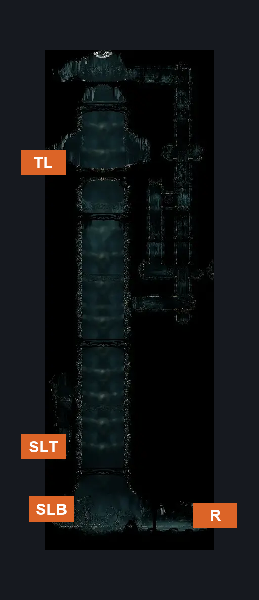
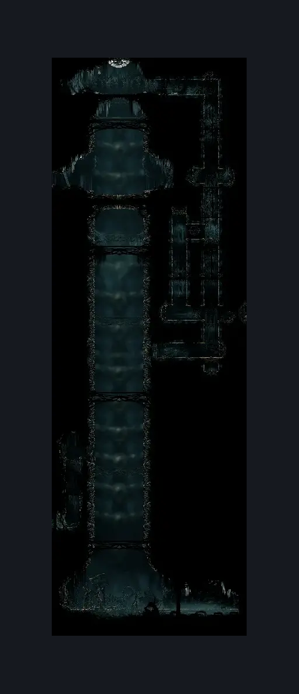

# Grand Elevator (Under_01)

**Game ID:** Under_01

**Contributors:** samupo

## Subrooms

| No. | Subroom | Annotated |
| --- | --- | --- |
| S1 | Top |  |
| S2 | Crash Site |  |

## Room Transitions

| Alias | Name | From subroom | Destination | Destination alias | Requirements | TODO | Verification | Annotated | Notes |
| --- | --- | --- | --- | --- | --- | --- | --- | --- | --- |
| TL | left1 | Top | [Grand Gate Courtroom (Song_19_entrance)](grand-gate-courtroom.md) | R | none |  | Verified | ✓ |  |
| SLB | left3 | Crash Site | [Entrance to Nyleth (Under_27)](entrance-to-nyleth.md) | LR | prereq Vined Up door IN Entrance to Nyleth |  | Verified | ✓ |  |
| SLT | left2 | Crash Site | [Entrance to Nyleth (Under_27)](entrance-to-nyleth.md) | UR | silk soar AND cling grip |  | Verified | ✓ | Either come back from Top for a second time or get access from the crash site. To check if the breakable wall exists both sides |
| R | right1 | Crash Site | [Broken Elevator (Under_01b)](../underworks/broken-elevator.md) | L | none |  | Verified | ✓ |  |

## Subroom Connections

| Alias | Name | Source | Destination | Requirements | TODO | Verification | Annotated | Notes |
| --- | --- | --- | --- | --- | --- | --- | --- | --- |
| F | Falling | Top | Crash Site | none |  | Verified |  | Just once |

## Check Locations

No check locations defined.

## Room Images

### Connections

### Checks

### Scene

