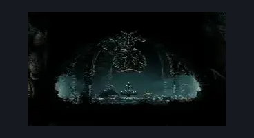

# Greymoor Bellshrine (Bellshrine_02)

**Game ID:** Bellshrine_02

**Contributors:** Isssma

## Subrooms

No subrooms defined.

## Room Transitions

| Alias | Name | From subroom | Destination | Destination alias | Requirements | TODO | Verification | Annotated | Notes |
| --- | --- | --- | --- | --- | --- | --- | --- | --- | --- |
| L | left |  | [Greymoor West Bellshrine Room (Greymoor_01)](greymoor-west-bellshrine-room.md) | MR | ( bellshrinesanity off AND activate bellshrine switch )  OR ( bellshrinesanity on AND have bell greymoor ) |  | Verified | ✓ | need to make sure this stays in sync with the connection on the other side |
| R | right |  | [Greymoor East Bellshrine Room (Greymoor_02)](greymoor-east-bellshrine-room.md) | ML | none |  | Verified | ✓ |  |

## Subroom Connections

No subroom connections defined.

## Check Locations

| No. | Check | Subroom | Requirements | TODO | Verification | Location Type | Annotated | Notes |
| --- | --- | --- | --- | --- | --- | --- | --- | --- |
| 1 | bellshrine switch |  | hit lever: right OR hit lever: left |  | Verified | switch | ✓ |  |
| 2 | bell greymoor |  | activate bellshrine switch |  | Verified | collectible |  |  |

## Room Images

### Scene

### Connections

### Checks

