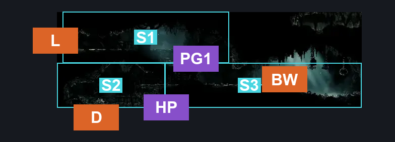
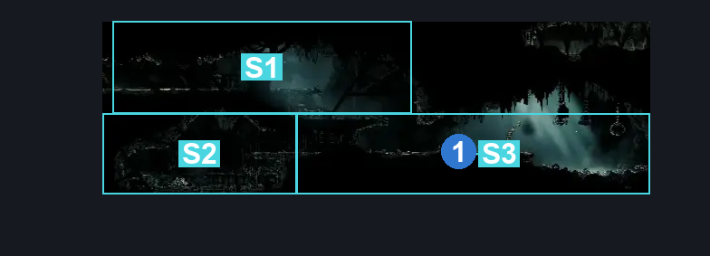
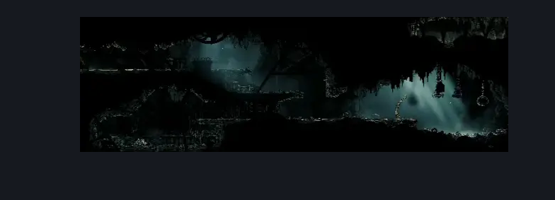

# Greymoor Bellway (Bellway_04)

**Game ID:** Bellway_04

**Contributors:** Isssma

## Subrooms

| No. | Subroom | Annotated |
| --- | --- | --- |
| S1 | upper entrance | ✓ |
| S2 | lower passage | ✓ |
| S3 | bellway zone | ✓ |

## Room Transitions

| Alias | Name | From subroom | Destination | Destination alias | Requirements | TODO | Verification | Annotated | Notes |
| --- | --- | --- | --- | --- | --- | --- | --- | --- | --- |
| L | left | upper entrance | [Greymoor Towers Patio (Greymoor_05)](greymoor-towers-patio.md) | LR | none |  | Verified | ✓ |  |
| BW | Bellway | bellway zone | [Bellway Menu](../fast-travel/bellway-menu.md) | GM | unlock bellway greymoor |  | Verified | ✓ |  |
| D | down | lower passage | [Greymoor Rat Tunnel (Greymoor_16)](greymoor-rat-tunnel.md) | T | none |  | Verified | ✓ |  |

## Subroom Connections

| Alias | Name | Source | Destination | Requirements | TODO | Verification | Annotated | Notes |
| --- | --- | --- | --- | --- | --- | --- | --- | --- |
| PG1 | platform gap 1 | upper entrance | bellway zone | nothing |  | Verified | ✓ |  |
| PG1 | platform gap 1 | bellway zone | upper entrance | ledge grab OR cling grip OR silk soar OR faydown cloak OR easy scuttlebrace |  | Verified | ✓ |  |
| HP | hidden passage | bellway zone | lower passage | break wall left |  | Verified | ✓ |  |
| HP | hidden passage | lower passage | bellway zone | break wall right AND (ledge grab OR faydown cloak OR easy scuttlebrace OR cling grip) |  | Verified | ✓ |  |

## Check Locations

| No. | Check | Subroom | Requirements | TODO | Verification | Location Type | Annotated | Notes |
| --- | --- | --- | --- | --- | --- | --- | --- | --- |
| 1 | Bellway Greymoor | bellway zone | Unlock Bellway Rosary Lock |  | Verified | travel | ✓ |  |
| 2 | Bellway Rosary Lock | bellway zone | Spend 60 Rosaries |  | Verified | lock |  |  |

## Room Images

### Connections

### Checks

### Scene

