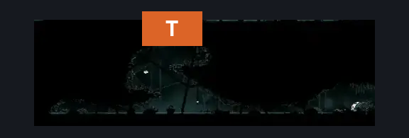
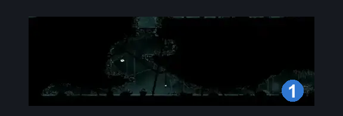
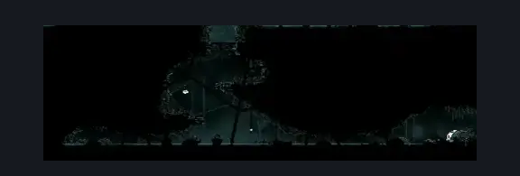

# Greymoor Bone Scroll Room (Greymoor_21)

**Game ID:** Greymoor_21

**Contributors:** Isssma

## Subrooms

No subrooms defined.

## Room Transitions

| Alias | Name | From subroom | Destination | Destination alias | Requirements | TODO | Verification | Annotated | Notes |
| --- | --- | --- | --- | --- | --- | --- | --- | --- | --- |
| T | top |  | [Greymoor Lower Halfway Home Path (Greymoor_13)](greymoor-lower-halfway-home-path.md) | D | Ledge grab OR faydown cloak OR silk soar OR cling grip OR medium shaman pogo |  | Verified | ✓ |  |

## Subroom Connections

No subroom connections defined.

## Check Locations

| No. | Check | Subroom | Requirements | TODO | Verification | Location Type | Annotated | Notes |
| --- | --- | --- | --- | --- | --- | --- | --- | --- |
| 1 | Relic: Bone Scroll (Greymoor) |  | swim |  | Verified | collectible | ✓ |  |
| 2 | import enemies |  |  | TODO | Needs verification |  |  |  |

## Room Images

### Connections

### Checks

### Scene

