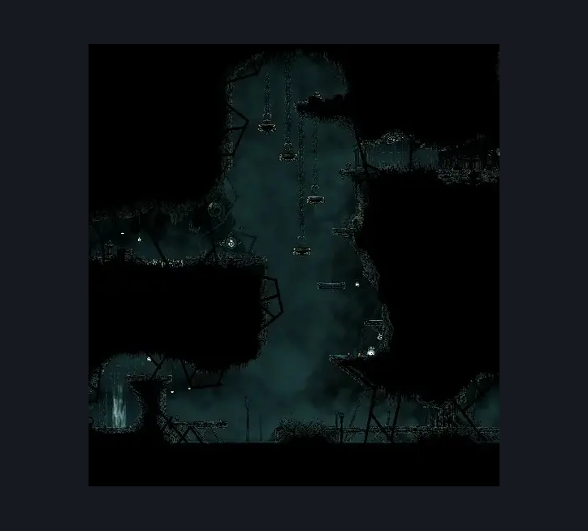
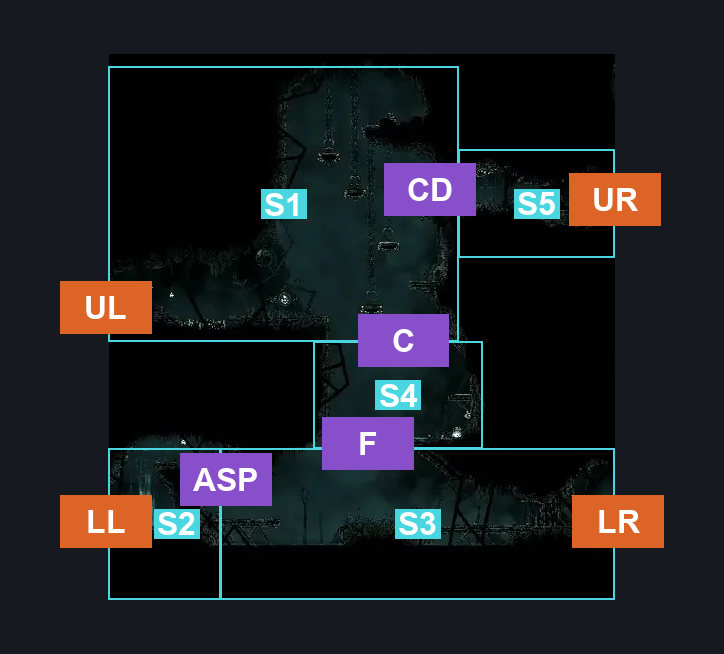
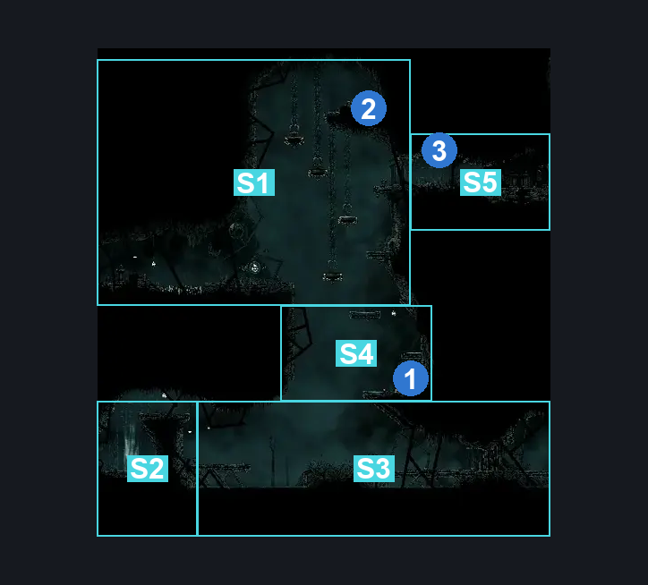

# Greymoor Craw Lake Entrance (Greymoor_15)

**Game ID:** Greymoor_15

**Contributors:** Isssma

## Subrooms

| No. | Subroom | Annotated |
| --- | --- | --- |
| S1 | upper section | ✓ |
| S2 | lower left section | ✓ |
| S3 | lower right section | ✓ |
| S4 | middle section | ✓ |
| S5 | craw lake middle entrance | ✓ |

## Room Transitions

| Alias | Name | From subroom | Destination | Destination alias | Requirements | TODO | Verification | Annotated | Notes |
| --- | --- | --- | --- | --- | --- | --- | --- | --- | --- |
| LL | lower left | lower left section | [Greymoor East Bellshrine Room (Greymoor_02)](greymoor-east-bellshrine-room.md) | LR | none |  | Verified | ✓ |  |
| LR | lower right | lower right section | [Greymoor Craw Lake (Greymoor_15b)](greymoor-craw-lake.md) | LL | swim OR medium enemy pogo OR flea brew OR progressive swift step 1 OR clawline OR sharpdart OR drifters cloak OR faydown cloak |  | Verified | ✓ |  |
| UR | upper right | craw lake middle entrance | [Greymoor Craw Lake (Greymoor_15b)](greymoor-craw-lake.md) | ML | none |  | Verified | ✓ |  |
| UL | upper left | upper section | [Greymoor East Bellshrine Room (Greymoor_02)](greymoor-east-bellshrine-room.md) | MR | none |  | Verified | ✓ |  |

## Subroom Connections

| Alias | Name | Source | Destination | Requirements | TODO | Verification | Annotated | Notes |
| --- | --- | --- | --- | --- | --- | --- | --- | --- |
| ASP | air shaft platform | lower left section | lower right section | drifters cloak OR silk soar OR (faydown cloak AND (cling grip OR ledge grab)) |  | Verified | ✓ |  |
| ASP | air shaft platform | lower right section | lower left section | silk soar OR cling grip OR easy enemy pogo OR (faydown cloak AND ledge grab) |  | Verified | ✓ |  |
| F | fall | lower right section | middle section | silk soar OR hard enemy pogo |  | Verified | ✓ |  |
| F | fall | middle section | lower right section | nothing (just fall) |  | Verified | ✓ |  |
| C | climb | middle section | upper section | ledge grab OR faydown cloak OR silk soar OR cling grip OR scuttlebrace |  | Verified | ✓ |  |
| C | climb | upper section | middle section | nothing (just fall) |  | Verified | ✓ |  |
| CD | closed door | upper section | craw lake middle entrance | prereq crawlake door AND (silk soar OR ledge grab OR faydown cloaK OR medium enemy pogo OR cling grip) |  | Verified | ✓ |  |
| CD | closed door | craw lake middle entrance | upper section | prereq crawlake door |  | Verified | ✓ |  |

## Check Locations

| No. | Check | Subroom | Requirements | TODO | Verification | Location Type | Annotated | Notes |
| --- | --- | --- | --- | --- | --- | --- | --- | --- |
| 1 | Greymoor - Frayed Rosary String #1 | middle section | nothing |  | Verified | resource | ✓ |  |
| 2 | Greymoor - Rosary Cache #18 | upper section | silk soar OR faydown cloak OR hard enemy pogo OR ((medium enemy pogo OR ledge grab OR cling grip) AND (progressive swift step 1 OR sharpdart OR clawline OR drifters cloak)) |  | Verified | resource | ✓ |  |
| 3 | crawlake door | craw lake middle entrance | flip lever up OR flip lever right OR flip lever left |  | Verified | switch | ✓ |  |

## Room Images

### Scene

### Connections

### Checks

