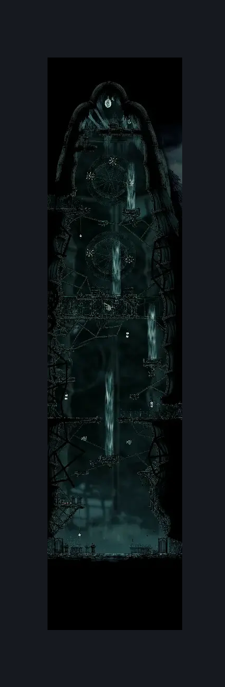
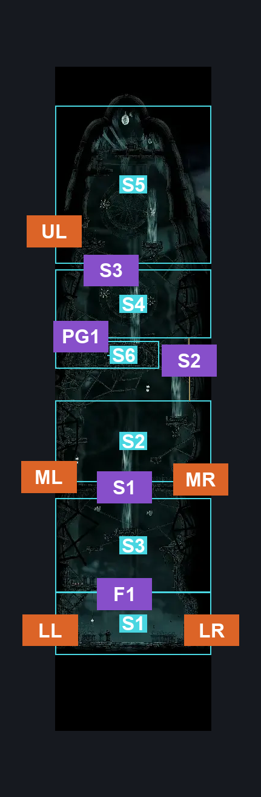
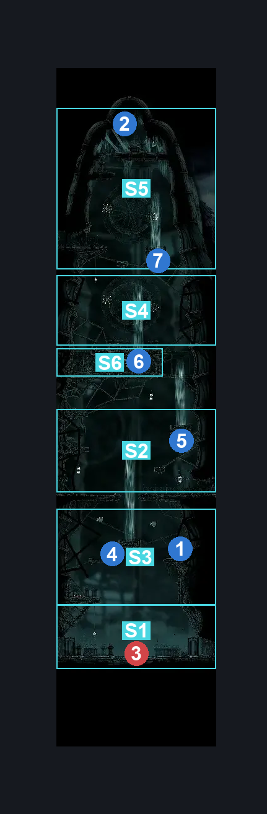

# Greymoor Eastern Tower (Greymoor_04)

**Game ID:** Greymoor_04

**Contributors:** Isssma

## Subrooms

| No. | Subroom | Annotated |
| --- | --- | --- |
| S1 | arena encounter | ✓ |
| S2 | middle section | ✓ |
| S3 | lower airstream section | ✓ |
| S4 | upper section | ✓ |
| S5 | tower top | ✓ |
| S6 | upper airstream section | ✓ |

## Room Transitions

| Alias | Name | From subroom | Destination | Destination alias | Requirements | TODO | Verification | Annotated | Notes |
| --- | --- | --- | --- | --- | --- | --- | --- | --- | --- |
| LR | lower right | arena encounter | [Greymoor Halfway Home Exterior (Greymoor_03)](greymoor-halfway-home-exterior.md) | LL | clear Greymoor Tower Gaunlet |  | Verified | ✓ |  |
| LL | lower left | arena encounter | [Greymoor Towers Patio (Greymoor_05)](greymoor-towers-patio.md) | MR | clear Greymoor Tower Gaunlet |  | Verified | ✓ |  |
| MR | middle right | middle section | [Greymoor Halfway Home Exterior (Greymoor_03)](greymoor-halfway-home-exterior.md) | ML | nothing |  | Verified | ✓ |  |
| ML | middle left | middle section | [Greymoor Middle Passage (Greymoor_10)](greymoor-middle-passage.md) | R | nothing |  | Verified | ✓ |  |
| UL | upper left | tower top | [Greymoor Upper Towers Path (Greymoor_11)](greymoor-upper-towers-path.md) | R | nothing |  | Verified | ✓ |  |

## Subroom Connections

| Alias | Name | Source | Destination | Requirements | TODO | Verification | Annotated | Notes |
| --- | --- | --- | --- | --- | --- | --- | --- | --- |
| F1 | fall 1 | arena encounter | lower airstream section | silk soar |  | Verified | ✓ |  |
| F1 | fall 1 | lower airstream section | arena encounter | nothing (just fall) |  | Verified | ✓ |  |
| S1 | shaft 1 | lower airstream section | middle section | silk soar OR (activate lower airstream AND drifters cloak) |  | Verified | ✓ |  |
| S1 | shaft 1 | middle section | lower airstream section | nothing (just fall) |  | Verified | ✓ |  |
| S2 | shaft 2 | middle section | upper section | silk soar OR (drifters cloak  AND (activate lower airstream OR (faydown cloak AND (ledge grab OR cling grip OR easy scuttlebrace))) AND activate middle airstream) |  | Verified | ✓ |  |
| S2 | shaft 2 | upper section | middle section | nothing (just fall) |  | Verified | ✓ |  |
| PG1 | platform gap 1 | upper section | upper airstream section | nothing (just fall) |  | Verified | ✓ |  |
| PG1 | platform gap 1 | upper airstream section | upper section | ledge grab OR faydown cloak OR silk soar OR medium enemy pogo |  | Verified | ✓ |  |
| S3 | shaft 3 | upper section | tower top | (proficient movement AND spike pogo) OR silk soar OR ((drifters cloak AND (spike pogo OR ledge grab OR progressive swift step 2 OR faydown cloak OR cling grip)) AND activate upper airstream) |  | Verified | ✓ |  |
| S3 | shaft 3 | tower top | upper section | none (just fall) |  | Verified | ✓ |  |

## Check Locations

| No. | Check | Subroom | Requirements | TODO | Verification | Location Type | Annotated | Notes |
| --- | --- | --- | --- | --- | --- | --- | --- | --- |
| 1 | Greymoor - Rosary Cache #6 | lower airstream section | nothing |  | Verified | resource | ✓ |  |
| 2 | Greymoor - Silkeater | tower top | silk soar OR (proficient movement AND spike pogo) OR (drifters cloak AND (spike pogo OR faydown cloak OR (clawline AND cling grip)) AND activate top airstream) |  | Verified | collectible | ✓ |  |
| 3 | Greymoor Tower Gaunlet | arena encounter | nothing |  | Verified | gauntlet | ✓ |  |
| 4 | lower airstream | lower airstream section | hit lever right OR hit lever up OR hit lever down |  | Verified | switch | ✓ |  |
| 5 | middle airstream | middle section | ((drifters cloak AND activate lower airstream) OR ledge grab OR cling grip OR silk soar OR faydown cloak) AND (hit lever right OR hit lever up OR hit lever left) |  | Verified | switch | ✓ |  |
| 6 | upper airstream | upper airstream section | hit lever right OR hit lever down |  | Verified | switch | ✓ |  |
| 7 | top airstream | tower top | (hit lever right OR hit lever up OR hit lever left) AND ((activate upper airstream AND drifters cloak) OR (proficient movement AND spike pogo)) |  | Verified | switch | ✓ |  |

## Room Images

### Scene

### Connections

### Checks

