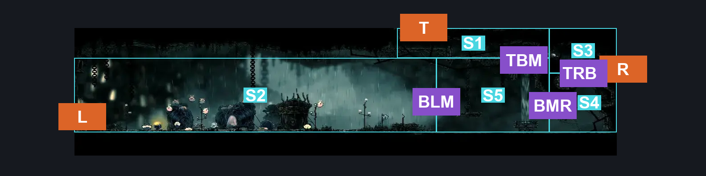
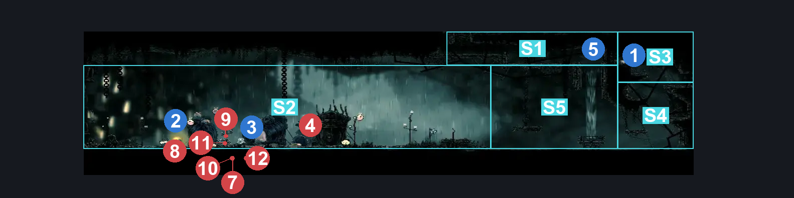
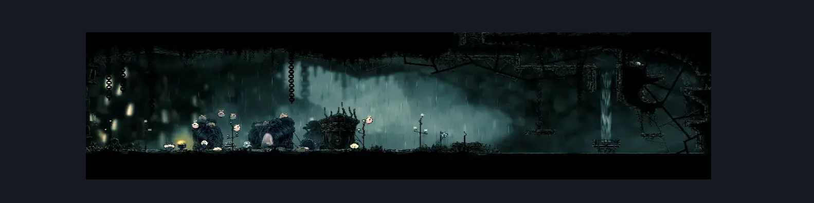

# Greymoor Entry to Bellhart (Greymoor_08)

**Game ID:** Greymoor_08

**Contributors:** skai AND Isssma

## Subrooms

| No. | Subroom | Annotated |
| --- | --- | --- |
| S1 | Top Section | ✓ |
| S2 | Bottom Left Section | ✓ |
| S3 | Top Right Section | ✓ |
| S4 | Bottom Right Section | ✓ |
| S5 | Bottom Middle Section | ✓ |

## Room Transitions

| Alias | Name | From subroom | Destination | Destination alias | Requirements | TODO | Verification | Annotated | Notes |
| --- | --- | --- | --- | --- | --- | --- | --- | --- | --- |
| L | Left | Bottom Left Section | [Bellhart Right Entrance (Belltown_06)](../bellhart/bellhart-right-entrance.md) | R | nothing |  | Verified | ✓ |  |
| T | Top | Top Section | [Greymoor Western Room (Greymoor_07)](greymoor-western-room.md) | D | nothing |  | Verified | ✓ |  |
| R | Right | Top Right Section | [Greymoor Rat Tunnel (Greymoor_16)](greymoor-rat-tunnel.md) | L | nothing |  | Verified | ✓ |  |

## Subroom Connections

| Alias | Name | Source | Destination | Requirements | TODO | Verification | Annotated | Notes |
| --- | --- | --- | --- | --- | --- | --- | --- | --- |
| TBM | Top to Bottom Middle | Top Section | Bottom Middle Section | prereq tied airstream |  | Verified | ✓ |  |
| TBM | Top to Bottom Middle | Bottom Middle Section | Top Section | (Drifters Cloak OR Silk Soar OR (Faydown AND Cling Grip) OR (Faydown AND medium Scuttlebrace)) AND prereq tied airstream |  | Verified | ✓ |  |
| TRB | Top Right to Bottom Right | Bottom Right Section | Top Right Section | Ledge Grab OR Silk Soar OR Faydown OR Clawline OR Scuttlebrace OR (Flea Brew) |  | Verified | ✓ |  |
| TRB | Top Right to Bottom Right | Top Right Section | Bottom Right Section | nothing (Fall) |  | Verified | ✓ |  |
| BLM | Bottom Left to Middle | Bottom Left Section | Bottom Middle Section | Dash OR Sprint OR Ledge Grab OR Silk Soar OR Faydown OR Clawline OR Cling Grip OR (Flea Brew) |  | Verified | ✓ |  |
| BLM | Bottom Left to Middle | Bottom Middle Section | Bottom Left Section | nothing |  | Verified | ✓ |  |
| BMR | Bottom Middle to Right | Bottom Middle Section | Bottom Right Section | nothing (Jump) |  | Verified | ✓ |  |
| BMR | Bottom Middle to Right | Bottom Right Section | Bottom Middle Section | nothing (Fall) |  | Verified | ✓ |  |

## Check Locations

| No. | Check | Subroom | Requirements | TODO | Verification | Location Type | Annotated | Notes |
| --- | --- | --- | --- | --- | --- | --- | --- | --- |
| 1 | Greymoor - Rosary Cache #14 | Top Right Section | nothing |  | Verified | resource | ✓ |  |
| 2 | Flea Brew | Bottom Left Section | complete THE The Lost Fleas Wish Granted |  | Verified | collectible | ✓ |  |
| 3 | Flea Caravan - Spool fragment | Bottom Left Section | after flea caravan move to blasted steps |  | Verified | collectible | ✓ | reward for the move is the spool fragment |
| 4 | Boss: Moorwing | Bottom Left Section | invalid |  | Verified | boss | ✓ | randomizer should always force moorwing at other spot for consitent logic - hero, 9/26 |
| 5 | tied airstream | Top Section | break switch left OR break switch up OR break switch right |  | Verified | blockade | ✓ |  |
| 6 | flea caravan move to blasted steps | Bottom Left Section | after THE flea caravan move to greymoor AND get 12 fleas AND defeat THE boss last judge |  | Verified | event |  | per the wiki |
| 7 | Elder Pilgrim 1 |  | Black Thread World Spawn |  |  | enemy | ✓ |  |
| 8 | Winged Pilgrim 1 |  | Black Thread World Spawn |  |  | enemy | ✓ |  |
| 9 | Winged Pilgrim 2 |  | Black Thread World Spawn |  |  | enemy | ✓ |  |
| 10 | Pilgrim Hornfly 1 |  | Black Thread World Spawn |  |  | enemy | ✓ |  |
| 11 | Winged Pilgrim 3 |  | Black Thread World Spawn |  |  | enemy | ✓ |  |
| 12 | Elder Pilgrim 2 |  | Black Thread World Spawn |  |  | enemy | ✓ |  |

## Room Images

### Connections

### Checks

### Scene

