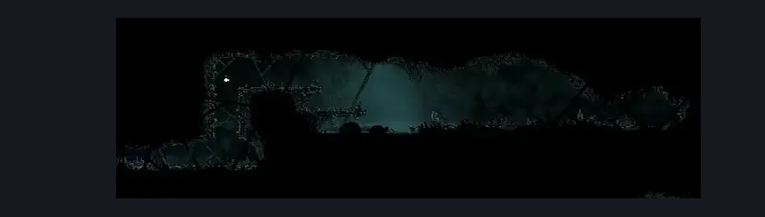

# Greymoor Kraft Room (Greymoor_24)

**Game ID:** Greymoor_24

**Contributors:** Isssma

## Subrooms

No subrooms defined.

## Room Transitions

| Alias | Name | From subroom | Destination | Destination alias | Requirements | TODO | Verification | Annotated | Notes |
| --- | --- | --- | --- | --- | --- | --- | --- | --- | --- |
| L | left |  | [Greymoor Halfway Home Exterior (Greymoor_03)](greymoor-halfway-home-exterior.md) | HR | nothing |  | Verified | ✓ |  |

## Subroom Connections

No subroom connections defined.

## Check Locations

| No. | Check | Subroom | Requirements | TODO | Verification | Location Type | Annotated | Notes |
| --- | --- | --- | --- | --- | --- | --- | --- | --- |
| 1 | Flea Greymoor - Kraft |  | silk soar OR cling grip OR easy scuttlebrace |  | Verified | collectible | ✓ |  |

## Room Images

### Scene

### Connections

### Checks

