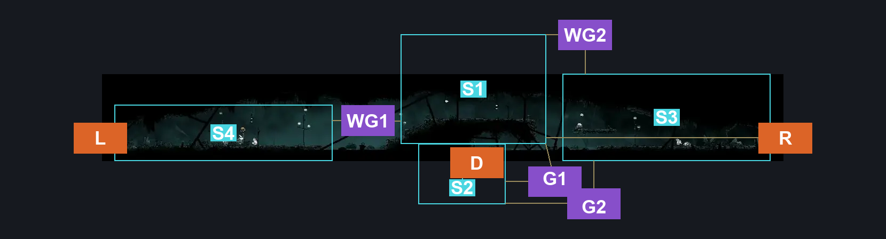
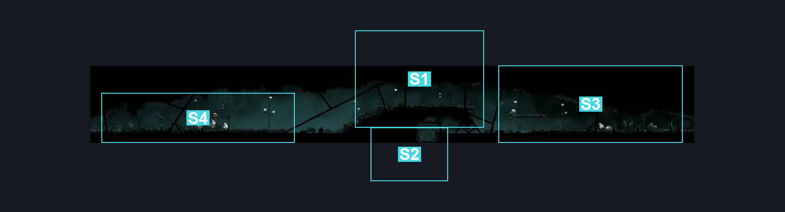
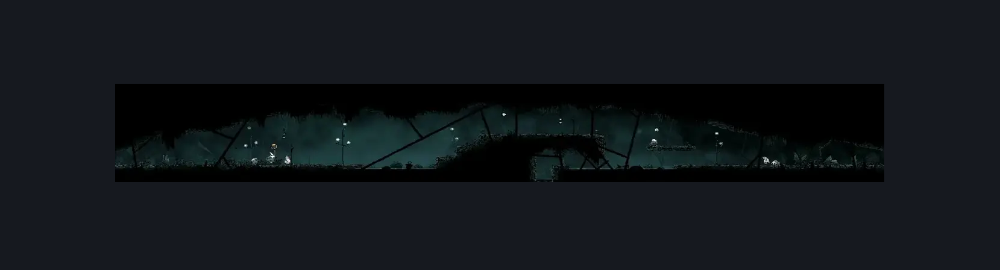

# Greymoor Lower Halfway Home Path (Greymoor_13)

**Game ID:** Greymoor_13

**Contributors:** Isssma

## Subrooms

| No. | Subroom | Annotated |
| --- | --- | --- |
| S1 | center section | ✓ |
| S2 | down and under | ✓ |
| S3 | right section | ✓ |
| S4 | left section | ✓ |

## Room Transitions

| Alias | Name | From subroom | Destination | Destination alias | Requirements | TODO | Verification | Annotated | Notes |
| --- | --- | --- | --- | --- | --- | --- | --- | --- | --- |
| L | left | left section | [Greymoor Halfway Home Exterior (Greymoor_03)](greymoor-halfway-home-exterior.md) | LR | nothing |  | Verified | ✓ |  |
| R | right | center section | [Greymoor West Bellshrine Room (Greymoor_01)](greymoor-west-bellshrine-room.md) | LL | nothing |  | Verified | ✓ |  |
| D | down | down and under | [Greymoor Bone Scroll Room (Greymoor_21)](greymoor-bone-scroll-room.md) | T | nothing |  | Verified | ✓ |  |

## Subroom Connections

| Alias | Name | Source | Destination | Requirements | TODO | Verification | Annotated | Notes |
| --- | --- | --- | --- | --- | --- | --- | --- | --- |
| G1 | gap 1 | center section | down and under | swim OR (clawline AND (ledge grab OR faydown cloak OR cling grip)) |  | Verified | ✓ |  |
| G1 | gap 1 | down and under | center section | swim OR (clawline AND faydown cloak AND cling grip) |  | Verified | ✓ |  |
| WG1 | water gap 1 | center section | left section | clawline OR faydown cloak OR drifters cloak OR sharpdart OR progressive swift step 2 OR ((progressive swift step 1 OR flea brew) AND faydown cloak) OR swim |  | Verified | ✓ |  |
| WG1 | water gap 1 | left section | center section | swim OR progressive swift step 2 OR clawline OR sharpdart OR (drifters cloak AND (ledge grab OR progressive swift step 1 OR faydown cloak)) OR ((faydown cloak OR (flea brew AND cling grip)) AND progressive swift step 1) |  | Verified | ✓ |  |
| WG2 | water gap 2 | right section | center section | progressive swift step 1 OR clawline OR faydown cloak OR drifters cloak OR sharpdart OR easy beast pogo OR flea brew OR easy architect needle strike OR (cling grip AND (easy hunter pogo OR easy reaper pogo OR easy witch pogo OR easy architect pogo OR easy shaman pogo OR swim)) |  | Verified | ✓ |  |
| WG2 | water gap 2 | center section | right section | swim OR ((easy hunter pogo OR cling grip) AND ledge grab) OR easy beast pogo  OR easy architect pogo OR clawline OR sharpdart OR drifters cloak OR progressive swift step 1 OR faydown cloak |  | Verified | ✓ |  |
| G2 | gap 2 | down and under | right section | swim OR (clawline AND (ledge grab OR faydown cloak OR cling grip)) |  | Verified | ✓ |  |
| G2 | gap 2 | right section | down and under | swim OR (clawline AND (faydown cloak AND progressive swift step 2 AND ledge grab)) |  | Verified | ✓ |  |

## Check Locations

No check locations defined.

## Room Images

### Connections

### Checks

### Scene

