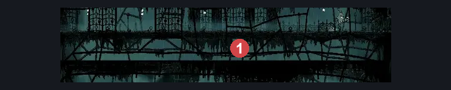
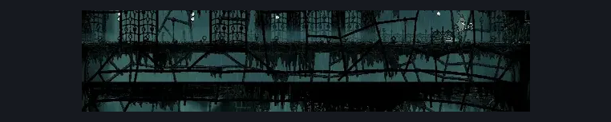

# Greymoor Middle Passage (Greymoor_10)

**Game ID:** Greymoor_10

## Subrooms

No subrooms defined.

## Room Transitions

| Alias | Name | From subroom | Destination | Destination alias | Requirements | TODO | Verification | Annotated | Notes |
| --- | --- | --- | --- | --- | --- | --- | --- | --- | --- |
| L | left |  | [Greymoor Western Tower (Greymoor_06)](greymoor-western-tower.md) | MR | nothing |  | Verified | ✓ |  |
| R | right |  | [Greymoor Eastern Tower (Greymoor_04)](greymoor-eastern-tower.md) | ML | nothing |  | Verified | ✓ |  |

## Subroom Connections

No subroom connections defined.

## Check Locations

| No. | Check | Subroom | Requirements | TODO | Verification | Location Type | Annotated | Notes |
| --- | --- | --- | --- | --- | --- | --- | --- | --- |
| 1 | Thread Raker 1 |  |  |  |  | enemy | ✓ |  |

## Room Images

### Connections

### Checks

### Scene

