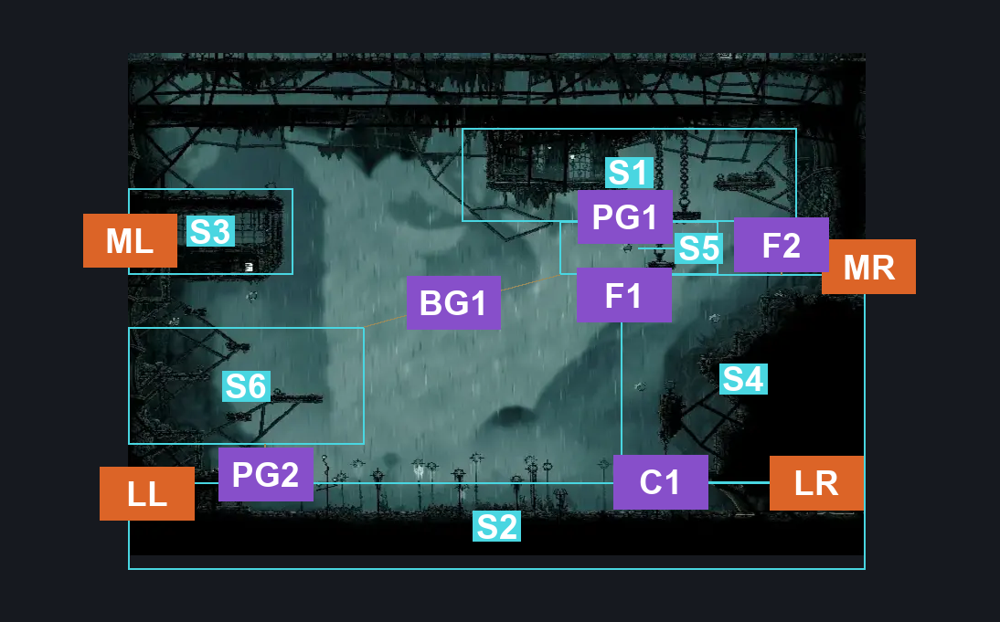
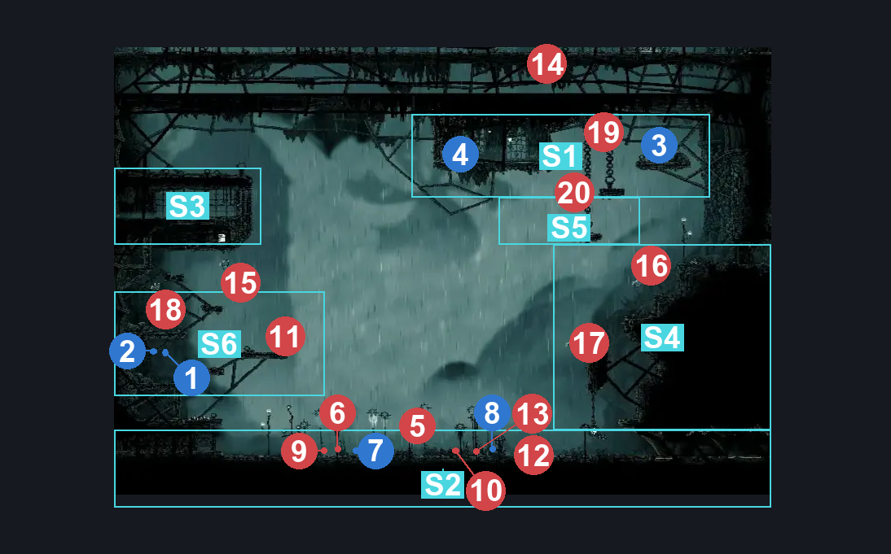
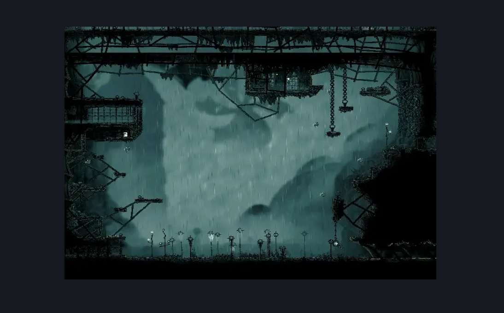

# Greymoor Towers Patio (Greymoor_05)

**Game ID:** Greymoor_05

**Contributors:** Isssma

## Subrooms

| No. | Subroom | Annotated |
| --- | --- | --- |
| S1 | upper area | ✓ |
| S2 | lower section | ✓ |
| S3 | garmond room | ✓ |
| S4 | east tower entrance | ✓ |
| S5 | lower hanging platforms | ✓ |
| S6 | left middle section | ✓ |

## Room Transitions

| Alias | Name | From subroom | Destination | Destination alias | Requirements | TODO | Verification | Annotated | Notes |
| --- | --- | --- | --- | --- | --- | --- | --- | --- | --- |
| LR | lower right | lower section | [Greymoor Bellway (Bellway_04)](greymoor-bellway.md) | L | nothing |  | Verified | ✓ |  |
| LL | lower left | lower section | [Greymoor Western Tower (Greymoor_06)](greymoor-western-tower.md) | LR | nothing |  | Verified | ✓ |  |
| ML | middle left | garmond room | [Greymoor Western Tower (Greymoor_06)](greymoor-western-tower.md) | GR | nothing |  | Verified | ✓ |  |
| MR | middle right | east tower entrance | [Greymoor Eastern Tower (Greymoor_04)](greymoor-eastern-tower.md) | LL | ledge grab OR cling grip OR silk soar OR hard scuttlebrace |  | Verified | ✓ |  |
| SC | slab capture | lower section | [Slab Capture](../fast-travel/slab-capture.md) | GM | after Get Kidnapped |  | Verified |  |  |

## Subroom Connections

| Alias | Name | Source | Destination | Requirements | TODO | Verification | Annotated | Notes |
| --- | --- | --- | --- | --- | --- | --- | --- | --- |
| F1 | fall 1 | east tower entrance | lower hanging platforms | clawline OR (progressive swift step 1 AND (faydown cloak OR (sharpdart AND ledge grab))) OR (faydown cloak AND  flea brew) OR (medium enemy pogo AND (progressive swift step 2 OR drifters cloak OR faydown cloak OR sharpdart)) OR (medium scuttlebrace AND (drifters cloak OR sharpdart)) |  | Verified | ✓ |  |
| F1 | fall 1 | lower hanging platforms | east tower entrance | nothing (just fall) |  | Verified | ✓ |  |
| C1 | climb 1 | lower section | east tower entrance | silk soar OR ledge grab OR easy enemy pogo OR faydown cloak |  | Verified | ✓ |  |
| C1 | climb 1 | east tower entrance | lower section | nothing (just fall) |  | Verified | ✓ |  |
| PG1 | platform gap 1 | lower hanging platforms | upper area | faydown cloak OR (medium enemy pogo AND (progressive swift step 2 OR drifters cloak OR faydown cloak OR sharpdart)) OR silk soar |  | Verified | ✓ |  |
| PG1 | platform gap 1 | upper area | lower hanging platforms | nothing (just fall) |  | Verified | ✓ |  |
| F2 | fall 2 | upper area | east tower entrance | nothing (just fall) |  | Verified | ✓ |  |
| F2 | fall 2 | east tower entrance | upper area | cling grip OR silk soar |  | Verified | ✓ |  |
| BG1 | big gap 1 | lower hanging platforms | left middle section | drifters cloak |  | Verified | ✓ |  |
| PG2 | platform gap 2 | lower section | left middle section | ledge grab OR medium enemy pogo OR silk soar OR faydown cloak OR cling grip |  | Verified | ✓ |  |
| PG2 | platform gap 2 | left middle section | lower section | nothing (just fall) |  | Verified | ✓ |  |

## Check Locations

| No. | Check | Subroom | Requirements | TODO | Verification | Location Type | Annotated | Notes |
| --- | --- | --- | --- | --- | --- | --- | --- | --- |
| 1 | Greymoor - Rosary Cache #7 | left middle section | nothing |  | Verified | resource | ✓ |  |
| 2 | Greymoor - Rosary Cache #8 | left middle section | nothing |  | Verified | resource | ✓ |  |
| 3 | Greymoor - Rosary Cache #9 | upper area | nothing |  | Verified | resource | ✓ |  |
| 4 | Greymor - Shard Bundle #1 | upper area | faydown cloak OR progressive swift step 1 OR easy enemy pogo OR silk soar OR sharpdart OR clawline |  | Verified | resource | ✓ |  |
| 5 | Boos: MoorWing | lower section | Act 2 AND complete THE the lost fleas wish granted |  | Verified | boss | ✓ | maybe just change the wqish to moorwing spkipped ion the other room |
| 6 | Wardenfly | lower section | ( act 1 AND act 2 ) AND defeat THE bell beast boss fight |  | Verified | enemy | ✓ | per the wiki |
| 7 | Get Kidnapped | lower section | after wardenfly |  | Verified | event | ✓ |  |
| 8 | Garmond and Zaza Act 3 Meeting Greymoor | lower section | Act 3 |  | Verified | event | ✓ |  |
| 9 | Thread Raker 1 |  | Normal World Spawn |  |  | enemy | ✓ |  |
| 10 | Thread Raker 2 |  | Black Thread World Spawn |  |  | enemy | ✓ |  |
| 11 | Dreg Catcher 1 |  | Normal World Spawn |  |  | enemy | ✓ |  |
| 12 | Dreg Catcher 2 |  |  |  |  | enemy | ✓ |  |
| 13 | Wardenfly 1 |  |  |  |  | enemy | ✓ |  |
| 14 | Silk Snipper 1 |  |  |  |  | enemy | ✓ |  |
| 15 | Fluttermite 1 |  |  |  |  | enemy | ✓ |  |
| 16 | Fluttermite 2 |  |  |  |  | enemy | ✓ |  |
| 17 | Fluttermite 3 |  |  |  |  | enemy | ✓ |  |
| 18 | Fluttermite 4 |  |  |  |  | enemy | ✓ |  |
| 19 | Fluttermite 5 |  |  |  |  | enemy | ✓ |  |
| 20 | Fluttermite 6 |  | Normal World Spawn |  |  | enemy | ✓ |  |

## Room Images

### Connections

### Checks

### Scene

