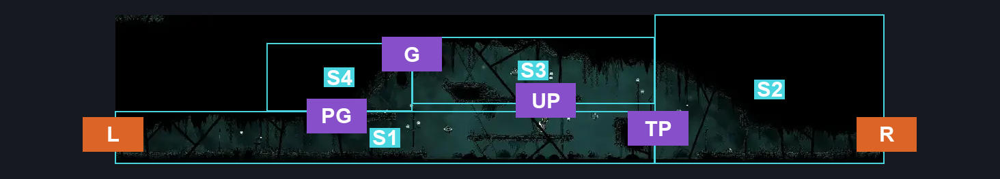
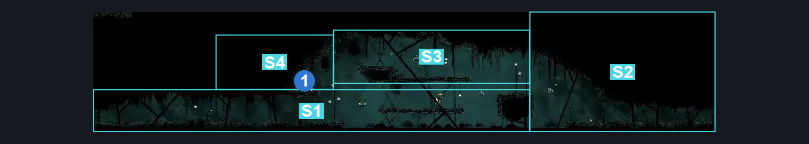
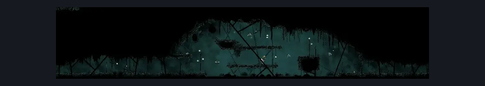

# Greymoor Upper Halfway Home Path (Greymoor_12)

**Game ID:** Greymoor_12

**Contributors:** Isssma

## Subrooms

| No. | Subroom | Annotated |
| --- | --- | --- |
| S1 | left section | ✓ |
| S2 | right section | ✓ |
| S3 | upper platform section | ✓ |
| S4 | check platform | ✓ |

## Room Transitions

| Alias | Name | From subroom | Destination | Destination alias | Requirements | TODO | Verification | Annotated | Notes |
| --- | --- | --- | --- | --- | --- | --- | --- | --- | --- |
| L | left | left section | [Greymoor Halfway Home Exterior (Greymoor_03)](greymoor-halfway-home-exterior.md) | MR | swim OR medium enemy pogo OR progressive swift step 1 OR clawline OR sharpdart OR flea brew OR faydown cloak OR drifters cloak OR easy hunter pogo OR easy reaper pogo OR easy beast pogo OR easy witch pogo OR easy architect pogo OR (medium shaman pogo AND ledge grab) |  | Verified | ✓ |  |
| R | right | right section | [Greymoor West Bellshrine Room (Greymoor_01)](greymoor-west-bellshrine-room.md) | TL | none |  | Verified | ✓ |  |

## Subroom Connections

| Alias | Name | Source | Destination | Requirements | TODO | Verification | Annotated | Notes |
| --- | --- | --- | --- | --- | --- | --- | --- | --- |
| TP | tall platform | left section | right section | swim OR faydown cloak OR medium scuttlebrace OR medium enemy pogo OR ((easy enemy pogo OR flea brew) AND (ledge grab OR cling grip OR clawline OR progressive swift step 1 OR sharpdart OR easy hunter pogo OR easy reaper pogo OR easy beast pogo OR easy witch pogo OR easy architect pogo OR easy shaman pogo)) |  | Verified | ✓ |  |
| TP | tall platform | right section | left section | swim OR faydown cloak OR medium scuttlebrace OR medium enemy pogo OR (easy enemy pogo AND (cling grip OR ledge grab)) OR (cling grip AND (progressive swift step 1 OR clawline OR sharpdart)) OR (silk soar AND (clawline OR progressive swift step 2 OR sharpdart)) |  | Verified | ✓ |  |
| UP | upper platform | left section | upper platform section | silk soar OR easy enemy pogo OR progressive swift step 1 OR faydown cloak OR sharpdart OR clawline OR flea brew OR (drifters cloak AND (cling grip OR ledge grab)) |  | Verified | ✓ |  |
| UP | upper platform | upper platform section | left section | none (just fall) |  | Verified | ✓ |  |
| G | gap | check platform | upper platform section | faydown cloak OR (cling grip AND (clawline OR progressive swift step 1)) |  | Verified | ✓ |  |
| G | gap | upper platform section | check platform | faydown cloak OR drifters cloak OR progressive swift step 1 OR sharpdart OR clawline OR easy hunter pogo OR easy reaper pogo OR easy beast pogo OR easy witch pogo OR easy architect pogo OR easy shaman pogo |  | Verified | ✓ |  |
| PG | pogo skip | left section | check platform | faydown cloak OR silk soar OR (hard enemy pogo AND ledge grab) |  | Verified | ✓ |  |
| PG | pogo skip | check platform | left section | none (fall) |  | Verified | ✓ |  |

## Check Locations

| No. | Check | Subroom | Requirements | TODO | Verification | Location Type | Annotated | Notes |
| --- | --- | --- | --- | --- | --- | --- | --- | --- |
| 1 | Greymoor #2 - Shard Bundle: | check platform | none |  | Verified | resource | ✓ |  |
| 2 | import enemies |  |  | TODO | Needs verification |  |  |  |

## Room Images

### Connections

### Checks

### Scene

