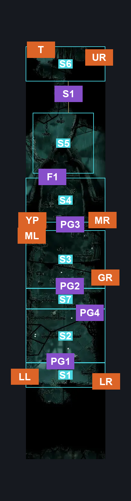
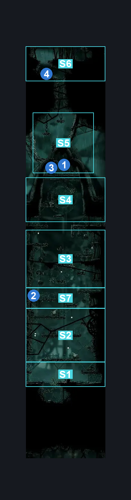
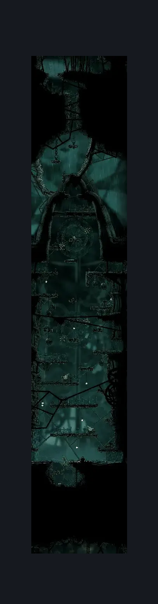

# Greymoor Western Tower (Greymoor_06)

**Game ID:** Greymoor_06

**Contributors:** Isssma

## Subrooms

| No. | Subroom | Annotated |
| --- | --- | --- |
| S1 | lower section | ✓ |
| S2 | guarded platforms | ✓ |
| S3 | lower spike wheel | ✓ |
| S4 | upper spike wheel | ✓ |
| S5 | tower top section | ✓ |
| S6 | whisp thicket entrance | ✓ |
| S7 | middle section | ✓ |

## Room Transitions

| Alias | Name | From subroom | Destination | Destination alias | Requirements | TODO | Verification | Annotated | Notes |
| --- | --- | --- | --- | --- | --- | --- | --- | --- | --- |
| LR | lower right | lower section | [Greymoor Towers Patio (Greymoor_05)](greymoor-towers-patio.md) | LL | none |  | Verified | ✓ |  |
| LL | lower left | lower section | [Greymoor Western Room (Greymoor_07)](greymoor-western-room.md) | LT | none |  | Verified | ✓ |  |
| ML | middle left | lower spike wheel | [Greymoor Western Room (Greymoor_07)](greymoor-western-room.md) | UT | none |  | Verified | ✓ |  |
| MR | middle right | upper spike wheel | [Greymoor Middle Passage (Greymoor_10)](greymoor-middle-passage.md) | L | none |  | Verified | ✓ |  |
| YP | Yanarby Path | upper spike wheel | [Yarnaby Place (Wisp_03)](yarnaby-place.md) | R | none |  | Verified | ✓ |  |
| GR | garmon room | lower spike wheel | [Greymoor Towers Patio (Greymoor_05)](greymoor-towers-patio.md) | ML | none |  | Verified | ✓ |  |
| UR | upper right | whisp thicket entrance | [Greymoor Upper Towers Path (Greymoor_11)](greymoor-upper-towers-path.md) | U | none |  | Verified | ✓ |  |
| T | Top | whisp thicket entrance | [Wisp Thicket Bench (Wisp_04)](../wisp-thicket/wisp-thicket-bench.md) | B | faydown cloak |  | Verified | ✓ |  |

## Subroom Connections

| Alias | Name | Source | Destination | Requirements | TODO | Verification | Annotated | Notes |
| --- | --- | --- | --- | --- | --- | --- | --- | --- |
| PG1 | plartform gap 1 | lower section | guarded platforms | ledge grab OR silk soar OR cling grip OR progressive swift step 2 OR medium shaman pogo  OR easy beast needle strike OR faydown cloak |  | Verified | ✓ |  |
| PG1 | plartform gap 1 | guarded platforms | lower section | none (just fall) |  | Verified | ✓ |  |
| PG2 | platform gap 2 | middle section | lower spike wheel | ledge grab OR silk soar OR cling grip OR progressive swift step 1 OR easy beast needle strike OR faydown cloak |  | Verified | ✓ |  |
| PG2 | platform gap 2 | lower spike wheel | middle section | none (just fall) |  | Verified | ✓ |  |
| PG3 | platform gap 3 | lower spike wheel | upper spike wheel | cling grip OR silk soar OR (faydown cloak AND (easy scuttlebrace OR progressive swift step 1 OR ledge grab)) |  | Verified | ✓ |  |
| PG3 | platform gap 3 | upper spike wheel | lower spike wheel | none (just fall) |  | Verified | ✓ |  |
| F1 | fall 1 | upper spike wheel | tower top section | unlock top trapdoor AND spike pogo AND (faydown cloak OR ledge grab OR cling grip) |  | Verified | ✓ |  |
| F1 | fall 1 | tower top section | upper spike wheel | unlock top trapdoor |  | Verified | ✓ |  |
| S1 | shaft 1 | tower top section | whisp thicket entrance | silk soar OR cling grip OR medium scuttlebrace OR (easy scuttlebrace AND (faydown cloak OR ledge grab)) |  | Verified | ✓ |  |
| S1 | shaft 1 | whisp thicket entrance | tower top section | none (just fall) |  | Verified | ✓ |  |
| PG4 | platform gap 4 | middle section | guarded platforms | nothing |  | Verified | ✓ |  |
| PG4 | platform gap 4 | guarded platforms | middle section | ledge grab OR silk soar OR cling grip  OR easy shaman pogo  OR easy beast needle strike OR faydown cloak |  | Verified | ✓ |  |

## Check Locations

| No. | Check | Subroom | Requirements | TODO | Verification | Location Type | Annotated | Notes |
| --- | --- | --- | --- | --- | --- | --- | --- | --- |
| 1 | Flea: Greymoor - Tower | tower top section | none |  | Verified | collectible | ✓ |  |
| 2 | Greymoor - Rosary Cache #10 | middle section | nothing |  | Verified | resource | ✓ |  |
| 3 | top trapdoor | tower top section | break lever right OR break lever left OR break lever up |  | Verified | blockade | ✓ |  |
| 4 | Mister Mushroom Meeting Greymoor | whisp thicket entrance | after THE Mister Mushroom Meeting Far Fields AND Needolin |  | Verified | event | ✓ |  |

## Room Images

### Connections

### Checks

### Scene

