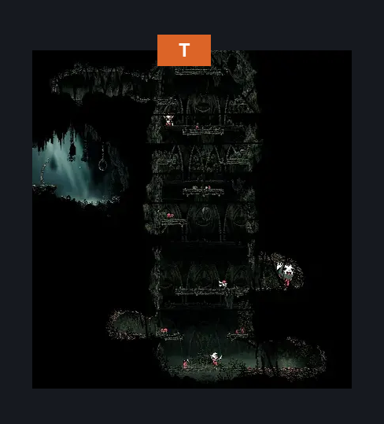
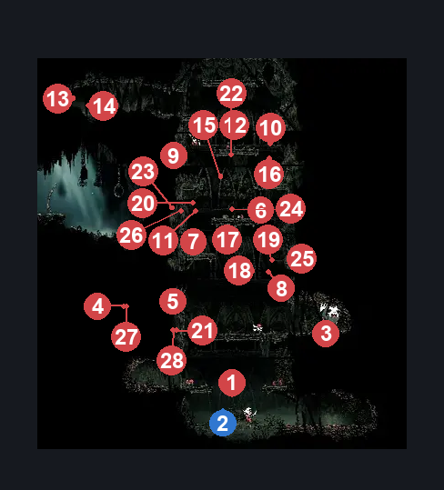
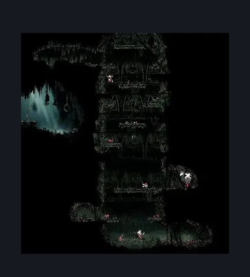

# Halfway Home Cellar (Ant_08)

**Game ID:** Ant_08

**Contributors:** Isssma

## Subrooms

No subrooms defined.

## Room Transitions

| Alias | Name | From subroom | Destination | Destination alias | Requirements | TODO | Verification | Annotated | Notes |
| --- | --- | --- | --- | --- | --- | --- | --- | --- | --- |
| T | Top |  | [Greymoor Halfway Home (Halfway_01)](greymoor-halfway-home.md) | B | (silk soar OR cling grip) AND complete Halfway Home Gauntlet |  | Verified | ✓ |  |

## Subroom Connections

No subroom connections defined.

## Check Locations

| No. | Check | Subroom | Requirements | TODO | Verification | Location Type | Annotated | Notes |
| --- | --- | --- | --- | --- | --- | --- | --- | --- |
| 1 | Halfway Home Gauntlet |  | silk soar OR cling grip OR (faydown cloak AND ledge grab) |  | Verified | gauntlet | ✓ | completing the gauntlet requires defeating all enemies stationed across the room |
| 2 | vintage nectar |  | complete Halfway Home Gauntlet |  | Verified | event | ✓ |  |
| 3 | Skarr Stalker 1 |  |  |  |  | enemy | ✓ |  |
| 4 | Skarrlid 1 |  |  |  |  | enemy | ✓ |  |
| 5 | Skarr Scout 1 |  |  |  |  | enemy | ✓ |  |
| 6 | Spear Skarr 1 |  |  |  |  | enemy | ✓ |  |
| 7 | Skarrwing 1 |  |  |  |  | enemy | ✓ |  |
| 8 | Skarrlid 2 |  |  |  |  | enemy | ✓ |  |
| 9 | Skarr Scout 2 |  |  |  |  | enemy | ✓ |  |
| 10 | Skarrwing 2 |  |  |  |  | enemy | ✓ |  |
| 11 | Skarrlid 3 |  |  |  |  | enemy | ✓ |  |
| 12 | Skarrlid 4 |  |  |  |  | enemy | ✓ |  |
| 13 | Skarr Stalker 2 |  |  |  |  | enemy | ✓ |  |
| 14 | Mite 1 |  |  |  |  | enemy | ✓ |  |
| 15 | Fluttermite 1 |  |  |  |  | enemy | ✓ |  |
| 16 | Mite 2 |  |  |  |  | enemy | ✓ |  |
| 17 | Mite 3 |  |  |  |  | enemy | ✓ |  |
| 18 | Mite 4 |  |  |  |  | enemy | ✓ |  |
| 19 | Fluttermite 2 |  |  |  |  | enemy | ✓ |  |
| 20 | Fluttermite 3 |  |  |  |  | enemy | ✓ |  |
| 21 | Skarr Stalker 3 |  |  |  |  | enemy | ✓ |  |
| 22 | Spear Skarr 2 |  |  |  |  | enemy | ✓ |  |
| 23 | Skarr Scout 3 |  |  |  |  | enemy | ✓ |  |
| 24 | Skarrwing 3 |  |  |  |  | enemy | ✓ |  |
| 25 | Skarrgard 1 |  |  |  |  | enemy | ✓ |  |
| 26 | Skarrlid 5 |  |  |  |  | enemy | ✓ |  |
| 27 | Skarrlid 6 |  |  |  |  | enemy | ✓ |  |
| 28 | Skarr Stalker 4 |  |  |  |  | enemy | ✓ |  |

## Room Images

### Connections

### Checks

### Scene

