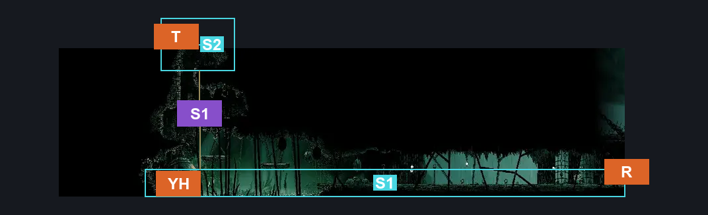
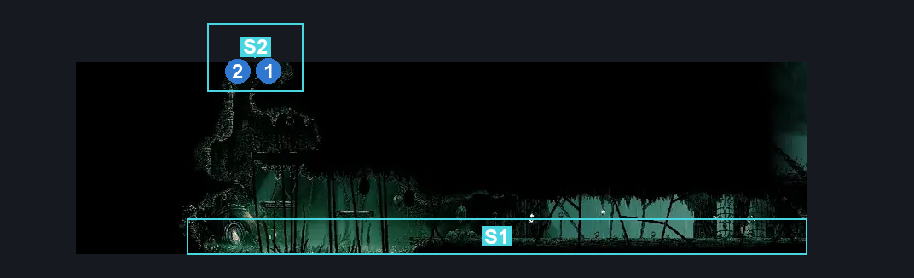
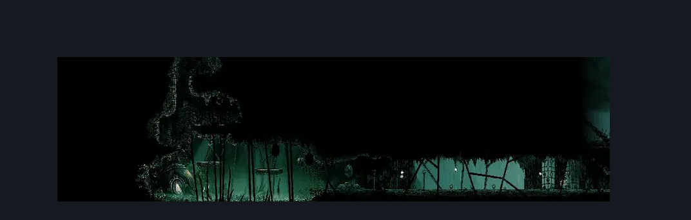

# Yarnaby Place (Wisp_03)

**Game ID:** Wisp_03

**Contributors:** Isssma

## Subrooms

| No. | Subroom | Annotated |
| --- | --- | --- |
| S1 | lower section | ✓ |
| S2 | upper shaft | ✓ |

## Room Transitions

| Alias | Name | From subroom | Destination | Destination alias | Requirements | TODO | Verification | Annotated | Notes |
| --- | --- | --- | --- | --- | --- | --- | --- | --- | --- |
| YH | yanarby house | lower section | [Greymoor Yarnaby Room (Belltown_Room_doctor)](greymoor-yarnaby-room.md) | L | have cursed crest trap |  | Verified | ✓ |  |
| R | right | lower section | [Greymoor Western Tower (Greymoor_06)](greymoor-western-tower.md) | YP | nothing |  | Verified | ✓ |  |
| T | top | upper shaft | [Pimpillo Room (Wisp_06)](pimpillo-room.md) | D | prereq vine wall AND (silk soar OR cling grip OR easy scuttlebrace) |  | Verified | ✓ |  |

## Subroom Connections

| Alias | Name | Source | Destination | Requirements | TODO | Verification | Annotated | Notes |
| --- | --- | --- | --- | --- | --- | --- | --- | --- |
| S1 | shaft 1 | lower section | upper shaft | silk soar OR ((cling grip OR easy scuttlebrace) AND (faydown cloak OR progressive swift step 1 OR clawline OR sharpdart OR easy architect needle strike OR easy beast pogo OR ((flea brew OR drifters cloak) AND cling grip))) |  | Verified | ✓ |  |
| S1 | shaft 1 | upper shaft | lower section | nothing (just fall) |  | Verified | ✓ |  |

## Check Locations

| No. | Check | Subroom | Requirements | TODO | Verification | Location Type | Annotated | Notes |
| --- | --- | --- | --- | --- | --- | --- | --- | --- |
| 1 | Greymoor - Frayed Rosary String #3 | upper shaft | nothing |  | Verified | resource | ✓ |  |
| 2 | vine wall | upper shaft | break wall: up |  | Verified | blockade | ✓ | if not broken the vine wall bounces you back |

## Room Images

### Connections

### Checks

### Scene

