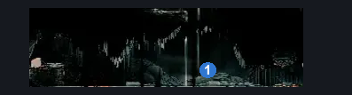
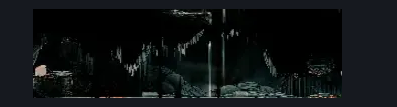

# High Halls Baby Room (Hang_16)

**Game ID:** Hang_16

**Contributors:** samupo

## Subrooms

No subrooms defined.

## Room Transitions

| Alias | Name | From subroom | Destination | Destination alias | Requirements | TODO | Verification | Annotated | Notes |
| --- | --- | --- | --- | --- | --- | --- | --- | --- | --- |
| R | right1 |  | [High Halls Big Shaft (Hang_08)](high-halls-big-shaft.md) | L | none |  | Verified | ✓ |  |
| S | door1 |  | TODO |  | faydown cloak AND cling grip | TODO |  | ✓ | Secret door to Hang_14 (not in the map, doesn't have any checks) |

## Subroom Connections

No subroom connections defined.

## Check Locations

| No. | Check | Subroom | Requirements | TODO | Verification | Location Type | Annotated | Notes |
| --- | --- | --- | --- | --- | --- | --- | --- | --- |
| 1 | Relic Psalm Cylinder (High Halls) |  | none |  | Verified | collectible | ✓ |  |

## Room Images

### Connections

### Checks

### Scene

