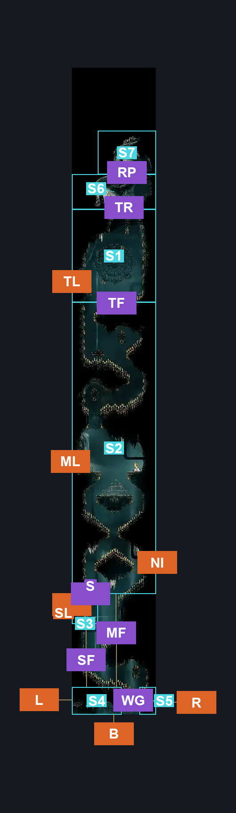
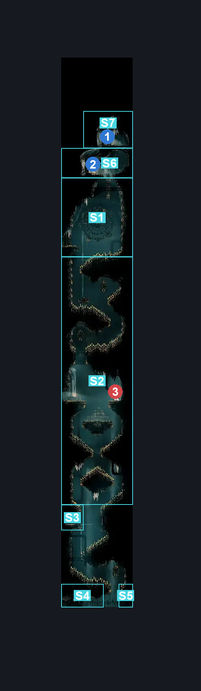
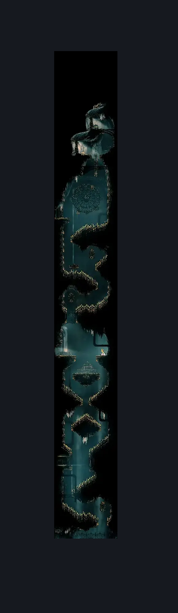

# High Halls Big Shaft (Hang_08)

**Game ID:** Hang_08

**Contributors:** samupo

## Subrooms

| No. | Subroom | Annotated |
| --- | --- | --- |
| S1 | Top | ✓ |
| S2 | Middle | ✓ |
| S3 | Left Spike Exit | ✓ |
| S4 | Bottom | ✓ |
| S5 | Behind Sentinel Gate | ✓ |
| S6 | Resting Site Ledge | ✓ |
| S7 | Penthouse | ✓ |

## Room Transitions

| Alias | Name | From subroom | Destination | Destination alias | Requirements | TODO | Verification | Annotated | Notes |
| --- | --- | --- | --- | --- | --- | --- | --- | --- | --- |
| SL | left3 | Left Spike Exit | [High Halls Flooded Room (Hang_10)](high-halls-flooded-room.md) | R | none |  | Verified | ✓ |  |
| B | bot1 | Bottom | [High Halls Vault (Hang_06)](high-halls-vault.md) | T | none |  | Verified | ✓ | One way only (opened from this side) |
| L | left4 | Bottom | [High Halls Baby Room (Hang_16)](high-halls-baby-room.md) | R | none |  | Verified | ✓ |  |
| NI | right2 | Middle | [High Halls Not Implemented Room (Cog_11)](high-halls-not-implemented-room.md) | L | invalid |  | Verified | ✓ | NOT IMPLEMENTED BY DEVS |
| R | right1 | Behind Sentinel Gate | [High Halls Sentinel Graveyard (Hang_17b)](high-halls-sentinel-graveyard.md) | L | none |  | Verified | ✓ |  |
| ML | left2 | Middle | [High Halls Cogfly Room (Hang_09)](high-halls-cogfly-room.md) | R | none |  | Verified | ✓ |  |
| TL | left1 | Top | [High Halls Big Slide (Hang_13)](high-halls-big-slide.md) | R | none |  | Verified | ✓ |  |

## Subroom Connections

| Alias | Name | Source | Destination | Requirements | TODO | Verification | Annotated | Notes |
| --- | --- | --- | --- | --- | --- | --- | --- | --- |
| TF | Falling from Top | Top | Middle | clawline AND drifter's cloak |  | Verified | ✓ |  |
| S | Spiked Secret | Middle | Left Spike Exit | drifter's cloak AND (cling grip OR clawline) AND break wall left |  | Verified | ✓ |  |
| SF | Falling from Secret | Left Spike Exit | Bottom | drifter's cloak AND clawline |  | Verified | ✓ |  |
| MF | Falling from Middle | Middle | Bottom | drifter's cloak AND clawline |  | Verified | ✓ |  |
| WG | wish gate | Bottom | Behind Sentinel Gate | complete THE final audience wish promised |  | Verified | ✓ |  |
| WG | wish gate | Behind Sentinel Gate | Bottom | complete THE final audience wish promised |  | Verified | ✓ |  |
| TR | top to resting site | Top | Resting Site Ledge | clawline |  | Verified | ✓ |  |
| TR | top to resting site | Resting Site Ledge | Top | none (falling) |  | Verified | ✓ |  |
| RP | resting site to penthouse | Resting Site Ledge | Penthouse | silk soar OR cling grip |  | Verified | ✓ |  |
| RP | resting site to penthouse | Penthouse | Resting Site Ledge | none (falling) |  | Verified | ✓ |  |

## Check Locations

| No. | Check | Subroom | Requirements | TODO | Verification | Location Type | Annotated | Notes |
| --- | --- | --- | --- | --- | --- | --- | --- | --- |
| 1 | High Halls - Rosary Cache | Penthouse | none |  | Verified | collectible | ✓ |  |
| 2 | Resting Site: High Halls | Resting Site Ledge | complete THE A Vassal Lost Wish Promised |  | Verified | event | ✓ |  |

## Room Images

### Connections

### Checks

### Scene

