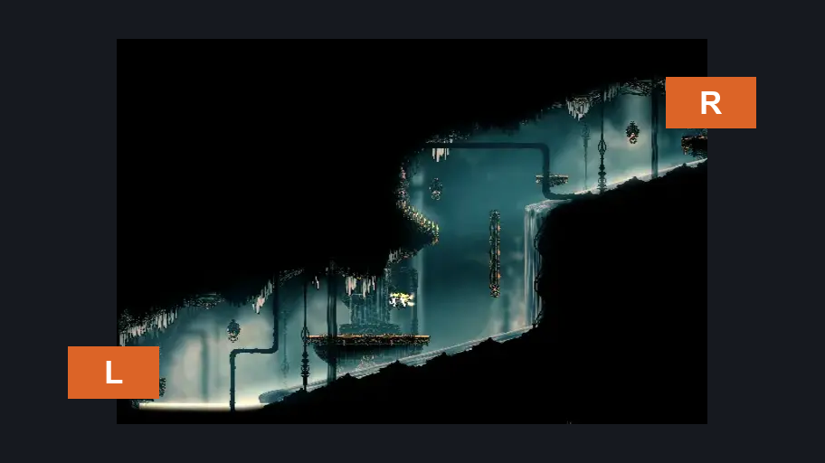
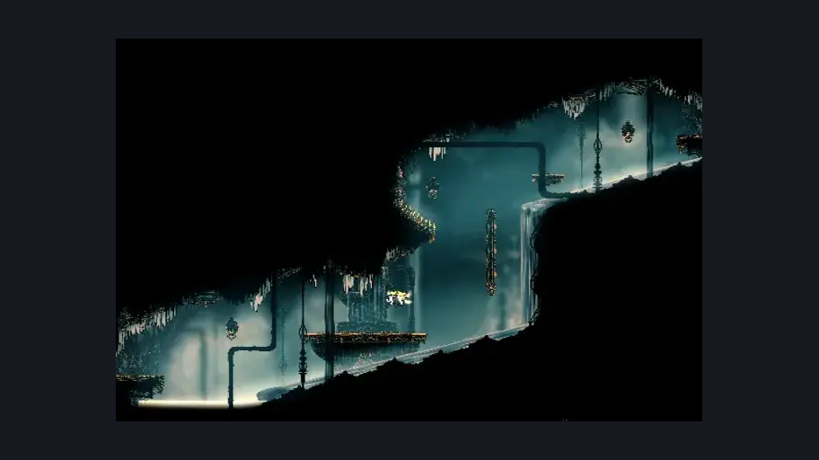

# High Halls Big Slide (Hang_13)

**Game ID:** Hang_13

**Contributors:** samupo

## Subrooms

No subrooms defined.

## Room Transitions

| Alias | Name | From subroom | Destination | Destination alias | Requirements | TODO | Verification | Annotated | Notes |
| --- | --- | --- | --- | --- | --- | --- | --- | --- | --- |
| R | right1 |  | [High Halls Big Shaft (Hang_08)](high-halls-big-shaft.md) | TL | clawline AND (ledge grab OR faydown cloak OR dash) |  | Verified | ✓ |  |
| L | left1 |  | [High Halls Shaft Bottom (Hang_03)](high-halls-shaft-bottom.md) | TR | (swim AND ledge grab) OR (clawline AND dash) OR drifter's cloak |  | Verified | ✓ |  |

## Subroom Connections

No subroom connections defined.

## Check Locations

| No. | Check | Subroom | Requirements | TODO | Verification | Location Type | Annotated | Notes |
| --- | --- | --- | --- | --- | --- | --- | --- | --- |
| 1 | import enemies |  |  | TODO | Needs verification |  |  |  |

## Room Images

### Connections

### Checks

### Scene

