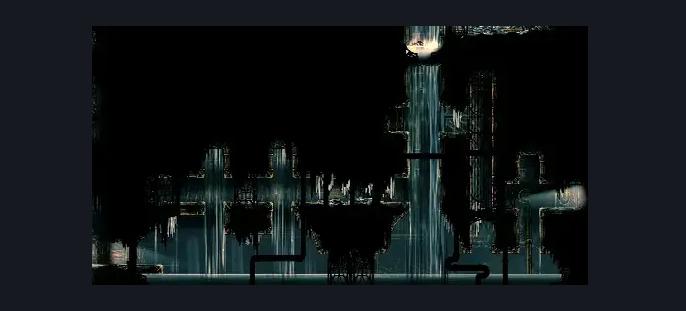
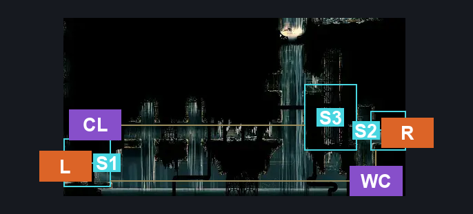
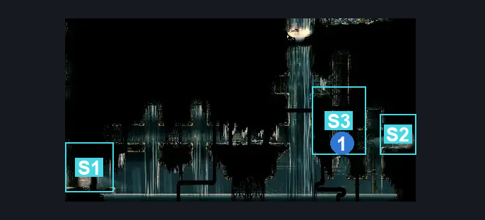

# High Halls Flooded Room (Hang_10)

**Game ID:** Hang_10

**Contributors:** samupo, herounit

## Subrooms

| No. | Subroom | Annotated |
| --- | --- | --- |
| S1 | left exit area | ✓ |
| S2 | right exit area | ✓ |
| S3 | relic spot | ✓ |

## Room Transitions

| Alias | Name | From subroom | Destination | Destination alias | Requirements | TODO | Verification | Annotated | Notes |
| --- | --- | --- | --- | --- | --- | --- | --- | --- | --- |
| L | left1 | left exit area | [High Halls Shaft Bottom (Hang_03)](high-halls-shaft-bottom.md) | BR | clear left exit blockade |  | Verified | ✓ |  |
| R | right1 | right exit area | [High Halls Big Shaft (Hang_08)](high-halls-big-shaft.md) | SL | none |  | Verified | ✓ |  |

## Subroom Connections

| Alias | Name | Source | Destination | Requirements | TODO | Verification | Annotated | Notes |
| --- | --- | --- | --- | --- | --- | --- | --- | --- |
| CL | climb | left exit area | relic spot | ( faydown AND cling grip ) OR ( swim AND easy enemy pogo AND cling grip  ) OR ( swim AND easy enemy pogo AND faydown AND ledge grab ) |  | Verified | ✓ |  |
| CL | climb | relic spot | left exit area | silk soar AND swim |  | Verified | ✓ |  |
| WC | water crossing | left exit area | right exit area | swim |  | Verified | ✓ |  |
| WC | water crossing | right exit area | left exit area | swim |  | Verified | ✓ |  |

## Check Locations

| No. | Check | Subroom | Requirements | TODO | Verification | Location Type | Annotated | Notes |
| --- | --- | --- | --- | --- | --- | --- | --- | --- |
| 1 | relic psalm cylinder high halls | relic spot | none |  | Verified | collectible | ✓ |  |
| 2 | left exit blockade | left exit area | break wall left |  | Verified | blockade |  |  |

## Notes

this room needs swimming requirements added to cross it - at least two subrooms

## Room Images

### Scene

### Connections

### Checks

