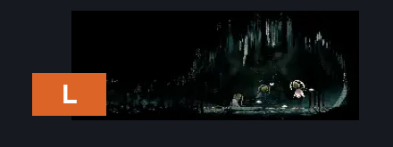
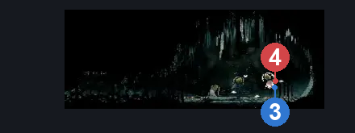
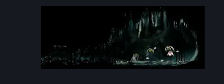

# High Halls Sentinel Graveyard (Hang_17b)

**Game ID:** Hang_17b

## Subrooms

No subrooms defined.

## Room Transitions

| Alias | Name | From subroom | Destination | Destination alias | Requirements | TODO | Verification | Annotated | Notes |
| --- | --- | --- | --- | --- | --- | --- | --- | --- | --- |
| L | left1 |  | [High Halls Big Shaft (Hang_08)](high-halls-big-shaft.md) | R | none |  | Verified | ✓ | gate on the other side has no influence on this exit |

## Subroom Connections

No subroom connections defined.

## Check Locations

| No. | Check | Subroom | Requirements | TODO | Verification | Location Type | Annotated | Notes |
| --- | --- | --- | --- | --- | --- | --- | --- | --- |
| 1 | Second Sentinel Boss Fight |  | none | TODO | Verified | boss |  | normally would be `complete THE Final Audience Wish Promised` but team cherry did nothing to protect the boss fight from starting without the wish - not ideal for entrance rando, and might need to be patched |
| 2 | Final Audience Wish Granted |  | complete THE Final Audience Wish Promised  AND defeat Second Sentinel Boss Fight |  | Verified | event |  | assuming this becomes impossible if the boss is defeated before the wish is accepted |
| 3 | Reserve Bind |  | complete Final Audience Wish Granted |  | Verified | collectible | ✓ |  |
| 4 | Song Knight 1 |  |  |  |  | enemy | ✓ |  |

## Room Images

### Connections

### Checks

### Scene

