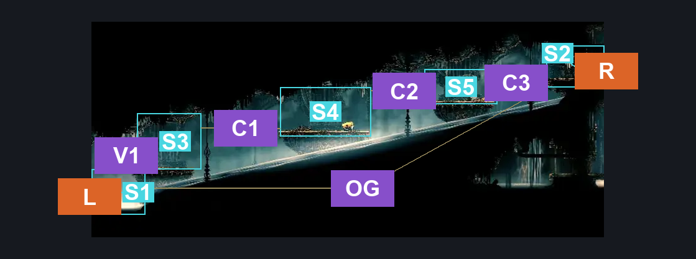
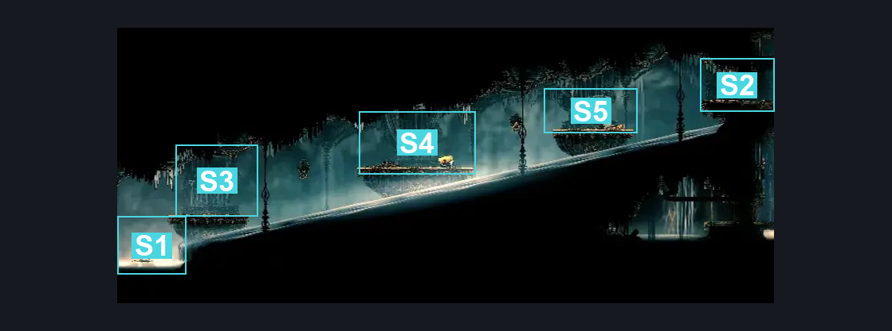
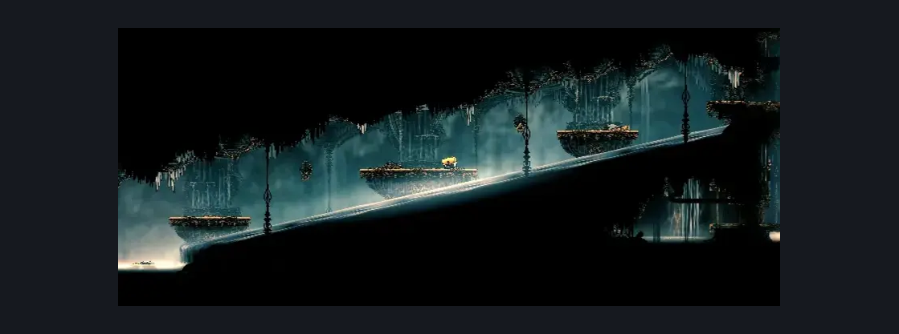

# High Halls Small Slide (Hang_02)

**Game ID:** Hang_02

**Contributors:** samupo

## Subrooms

| No. | Subroom | Annotated |
| --- | --- | --- |
| S1 | left exit | ✓ |
| S2 | right exit | ✓ |
| S3 | left platform | ✓ |
| S4 | center platform | ✓ |
| S5 | right platform | ✓ |

## Room Transitions

| Alias | Name | From subroom | Destination | Destination alias | Requirements | TODO | Verification | Annotated | Notes |
| --- | --- | --- | --- | --- | --- | --- | --- | --- | --- |
| R | right1 | right exit | [High Halls Shaft Bottom (Hang_03)](high-halls-shaft-bottom.md) | ML | none |  | Verified | ✓ |  |
| L | left1 | left exit | [High Halls Entrance (Hang_01)](../choral-chambers/high-halls-entrance.md) | TP | none |  | Verified | ✓ |  |

## Subroom Connections

| Alias | Name | Source | Destination | Requirements | TODO | Verification | Annotated | Notes |
| --- | --- | --- | --- | --- | --- | --- | --- | --- |
| V1 | vertical 1 | left exit | left platform | invalid | TODO | Needs verification | ✓ | placeholder until can map it - original logic is in OG connection |
| V1 | vertical 1 | left platform | left exit | invalid | TODO | Needs verification | ✓ | placeholder until can map it - original logic is in OG connection |
| C1 | crossing 1 | left platform | center platform | invalid | TODO | Needs verification | ✓ | placeholder until can map it - original logic is in OG connection |
| C1 | crossing 1 | center platform | left platform | invalid | TODO | Needs verification | ✓ | placeholder until can map it - original logic is in OG connection |
| C2 | crossing 2 | center platform | right platform | invalid | TODO | Needs verification | ✓ | placeholder until can map it - original logic is in OG connection |
| C2 | crossing 2 | right platform | center platform | invalid | TODO | Needs verification | ✓ | placeholder until can map it - original logic is in OG connection |
| C3 | crossing 3 | right platform | right exit | invalid | TODO | Needs verification | ✓ | placeholder until can map it - original logic is in OG connection |
| C3 | crossing 3 | right exit | right platform | invalid | TODO | Needs verification | ✓ | placeholder until can map it - original logic is in OG connection |
| OG | original requirements | left exit | right exit | clawline OR (faydown cloak AND dash AND ledge grab) |  | Verified | ✓ | delete after remapped |
| OG | original requirements | right exit | left exit | (ledge grab OR clawline OR cling grip OR faydown cloak) AND swim |  | Verified | ✓ | delete after remapped |

## Check Locations

| No. | Check | Subroom | Requirements | TODO | Verification | Location Type | Annotated | Notes |
| --- | --- | --- | --- | --- | --- | --- | --- | --- |
| 1 | Second Sentinel Encounter | center platform | act 3 AND complete THE second sentinel activation | TODO | Needs verification | event |  | need to verify this is the correct platform |
| 2 | import enemies |  |  | TODO | Needs verification |  |  |  |

## Room Images

### Connections

### Checks

### Scene

