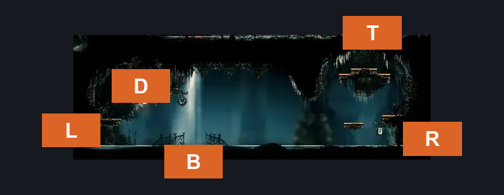
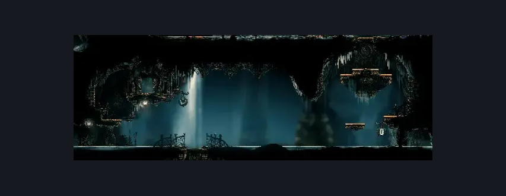

# High Halls Vault (Hang_06)

**Game ID:** Hang_06

**Contributors:** samupo

## Subrooms

No subrooms defined.

## Room Transitions

| Alias | Name | From subroom | Destination | Destination alias | Requirements | TODO | Verification | Annotated | Notes |
| --- | --- | --- | --- | --- | --- | --- | --- | --- | --- |
| D | door1 |  | TODO |  | (ledge grab OR faydown cloak OR silk soar) AND have Simple Key Rosary Bank | TODO |  | ✓ |  |
| L | left1 |  | [High Halls Arena (Hang_04)](high-halls-arena.md) | R | none |  | Verified | ✓ |  |
| B | bot1 |  | [High Halls Corridor (Hang_07)](../choral-chambers/high-halls-corridor.md) | T | none |  | Verified | ✓ | One way lever (opens from this side) |
| R | right1 |  | [High Halls Ventrica (Hang_06b)](high-halls-ventrica.md) | L | none |  | Verified | ✓ |  |
| T | top1 |  | [High Halls Big Shaft (Hang_08)](high-halls-big-shaft.md) | B | cling grip OR (faydown cloak AND ledge grab) OR silk soar |  | Verified | ✓ |  |

## Subroom Connections

No subroom connections defined.

## Check Locations

No check locations defined.

## Room Images

### Connections

### Checks

### Scene

