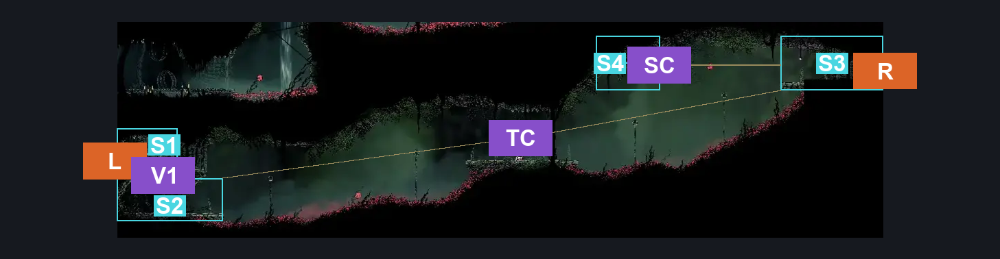
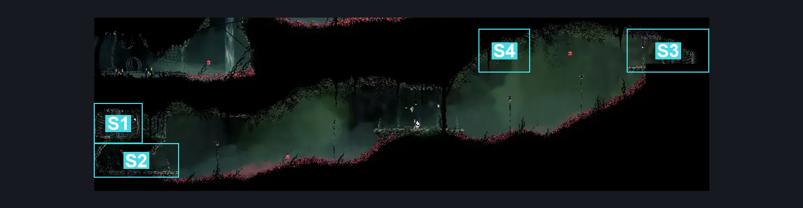
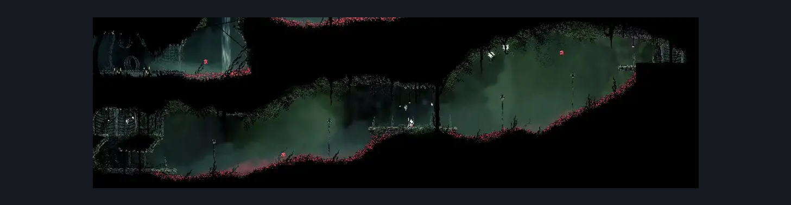

# Hunter's March Deep Entrance (Ant_09)

**Game ID:** Ant_09

**Contributors:** herounit

## Subrooms

| No. | Subroom | Annotated |
| --- | --- | --- |
| S1 | left exit area | ✓ |
| S2 | below left exit | ✓ |
| S3 | right exit area | ✓ |
| S4 | free silk | ✓ |

## Room Transitions

| Alias | Name | From subroom | Destination | Destination alias | Requirements | TODO | Verification | Annotated | Notes |
| --- | --- | --- | --- | --- | --- | --- | --- | --- | --- |
| L | left1 | left exit area | [Hunter's March Statue (Ant_05c)](hunter-s-march-statue.md) | R | none |  | Verified | ✓ |  |
| R | right1 | right exit area | [Far Fields Upper Shaft (Bone_East_11)](../far-fields/far-fields-upper-shaft.md) | L | none |  | Verified | ✓ |  |

## Subroom Connections

| Alias | Name | Source | Destination | Requirements | TODO | Verification | Annotated | Notes |
| --- | --- | --- | --- | --- | --- | --- | --- | --- |
| V1 | vertical access | below left exit | left exit area | silk soar OR cling grip OR ( faydown cloak AND ledge grab ) |  | Verified | ✓ |  |
| V1 | vertical access | left exit area | below left exit | none (falling) |  | Verified | ✓ |  |
| TC | thorn crossing | below left exit | right exit area | clawline x 4 AND silkhearts x 1 AND faydown cloak |  | Verified | ✓ |  |
| TC | thorn crossing | right exit area | below left exit | ( clawline x 4 AND faydown cloak AND silkhearts x 1 ) OR ( clawline x 5 AND silkhearts x 2 ) |  | Verified | ✓ |  |
| SC | silk collection | right exit area | free silk | clawline x 2 |  | Verified | ✓ |  |
| SC | silk collection | free silk | right exit area | clawline x 2 |  | Verified | ✓ |  |

## Check Locations

| No. | Check | Subroom | Requirements | TODO | Verification | Location Type | Annotated | Notes |
| --- | --- | --- | --- | --- | --- | --- | --- | --- |
| 1 | free silk | free silk | none |  | Verified | resource |  | not yet randomized |
| 2 | import enemies |  |  | TODO | Needs verification |  |  |  |

## Room Images

### Connections

### Checks

### Scene

