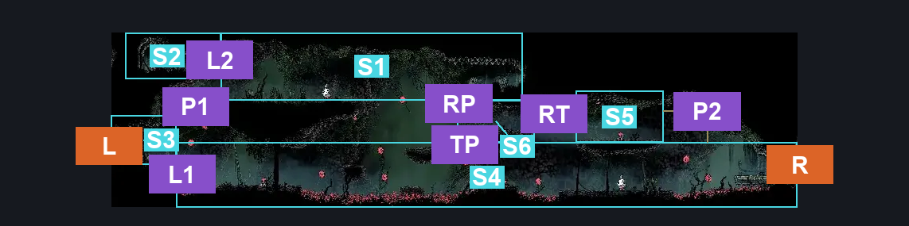
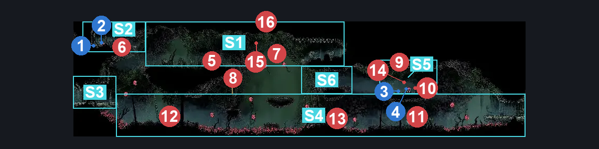
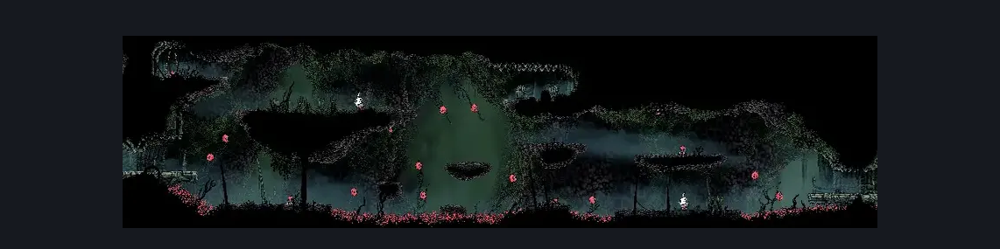

# Hunter's March Early Pathway West (Ant_04_left)

**Game ID:** Ant_04_left

**Contributors:** herounit

## Subrooms

| No. | Subroom | Annotated |
| --- | --- | --- |
| S1 | upper left platforms | ✓ |
| S2 | upper left alcove | ✓ |
| S3 | left exit area | ✓ |
| S4 | lower floor | ✓ |
| S5 | upper right platforms | ✓ |
| S6 | trapped platform | ✓ |

## Room Transitions

| Alias | Name | From subroom | Destination | Destination alias | Requirements | TODO | Verification | Annotated | Notes |
| --- | --- | --- | --- | --- | --- | --- | --- | --- | --- |
| L | left1 | left exit area | [Hunter's March Pogo Intro (Ant_03)](hunter-s-march-pogo-intro.md) | R | none |  | Verified | ✓ |  |
| R | right1 | lower floor | [Hunter's March Map Shop (Ant_04_mid)](hunter-s-march-map-shop.md) | L | none |  | Verified | ✓ |  |

## Subroom Connections

| Alias | Name | Source | Destination | Requirements | TODO | Verification | Annotated | Notes |
| --- | --- | --- | --- | --- | --- | --- | --- | --- |
| P1 | pogo 1 | left exit area | upper left platforms | silk soar OR faydown cloak OR easy shaman pogo OR easy wanderer pogo OR easy reaper pogo OR ledge grab |  | Verified | ✓ |  |
| P1 | pogo 1 | upper left platforms | left exit area | none (falling) |  | Verified | ✓ |  |
| L1 | ledge grab 1 | lower floor | left exit area | ledge grab OR silk soar OR faydown cloak OR clawline OR easy shaman pogo |  | Verified | ✓ |  |
| L1 | ledge grab 1 | left exit area | lower floor | none (falling) |  | Verified | ✓ |  |
| L2 | ledge grab 2 | upper left platforms | upper left alcove | ledge grab OR faydown cloak OR silk soar OR easy shaman pogo |  | Verified | ✓ |  |
| L2 | ledge grab 2 | upper left alcove | upper left platforms | none (falling) |  | Verified | ✓ |  |
| RP | run jump left and pogo | trapped platform | upper left platforms | run |  | Verified | ✓ | a little tight to be able to pogo off the fruit, but not that bad |
| TP | to trapped platform | lower floor | trapped platform | ledge grab OR cling grip OR run OR dash OR easy shaman pogo OR easy beast pogo OR easy architect charge OR easy wanderer charge OR faydown OR silk soar OR clawline OR sharpdart OR scuttlebrace |  | Verified | ✓ |  |
| P2 | pogo 2 | lower floor | upper right platforms | ledge grab OR cling grip OR faydown OR silk soar OR clawline OR sharpdart OR scuttlebrace OR easy wanderer pogo OR easy reaper pogo OR easy beast pogo OR easy shaman pogo |  | Verified | ✓ |  |
| P2 | pogo 2 | upper right platforms | lower floor | none (falling) |  | Verified | ✓ |  |
| RT | right trapped crossing | upper right platforms | trapped platform | run OR dash OR faydown OR clawline  OR sharp dart OR scuttlebrace OR easy beast pogo OR easy architect charge |  | Verified | ✓ |  |
| RT | right trapped crossing | trapped platform | upper right platforms | dash OR drifters OR faydown OR clawline OR sharpdart OR scuttlebrace  OR ( ( ledge grab OR cling grip ) AND ( run OR easy hunter pogo OR easy beast pogo OR easy architect charge ) ) |  | Verified | ✓ |  |

## Check Locations

| No. | Check | Subroom | Requirements | TODO | Verification | Location Type | Annotated | Notes |
| --- | --- | --- | --- | --- | --- | --- | --- | --- |
| 1 | rosary cache hunters march 1 | upper left alcove | none |  | Verified | collectible | ✓ | get there fast - the ants will eat them (v0.4.2) |
| 2 | rosary cache hunters march 2 | upper left alcove | none |  | Verified | collectible | ✓ | get there fast - the ants will eat them (v0.4.2) |
| 3 | rosary cache hunters march 3 | upper right platforms | none |  | Verified | collectible | ✓ |  |
| 4 | rosary necklace hunters march | upper right platforms | none |  | Verified | collectible | ✓ | ants eat them before you can collect (v0.4.2) |
| 5 | Skarr Stalker 1 | upper left platforms | None |  | Verified | enemy | ✓ |  |
| 6 | Skarrlid 1 | upper left alcove | None |  | Verified | enemy | ✓ |  |
| 7 | Spear Skarr 1 | upper left platforms | None |  | Verified | enemy | ✓ |  |
| 8 | Skarrwing 1 | lower floor | Normal World Spawn |  | Verified | enemy | ✓ |  |
| 9 | Skarrwing 2 | upper right platforms | Normal World Spawn |  | Verified | enemy | ✓ |  |
| 10 | Skarr Scout 1 | upper right platforms | Normal World Spawn |  | Verified | enemy | ✓ |  |
| 11 | Skarr Stalker 2 | lower floor | Normal World Spawn |  | Verified | enemy | ✓ |  |
| 12 | Skarr Scout 2 | lower floor | Normal World Spawn |  | Verified | enemy | ✓ |  |
| 13 | Skarrlid 2 | lower floor | Normal World Spawn |  | Verified | enemy | ✓ |  |
| 14 | Skarrwing 3 | upper right platforms | Black Thread World Spawn |  | Verified | enemy | ✓ |  |
| 15 | Void Mass 1 | upper left platforms | Black Thread World Spawn |  | Verified | enemy | ✓ |  |
| 16 | Spear Skarr 2 | upper left platforms | Black Thread World Spawn |  | Verified | enemy | ✓ |  |

## Room Images

### Connections

### Checks

### Scene

