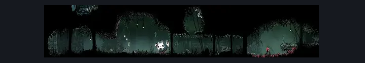
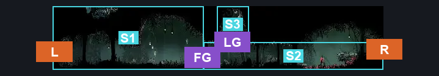
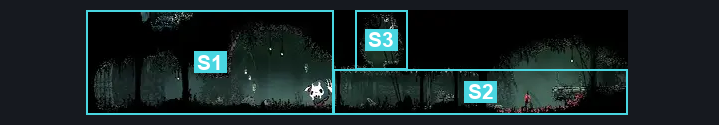

# Hunter's March Entrance (Ant_02)

**Game ID:** Ant_02

**Contributors:** herounit

## Subrooms

| No. | Subroom | Annotated |
| --- | --- | --- |
| S1 | before door | ✓ |
| S2 | after door | ✓ |
| S3 | checks alcove | ✓ |

## Room Transitions

| Alias | Name | From subroom | Destination | Destination alias | Requirements | TODO | Verification | Annotated | Notes |
| --- | --- | --- | --- | --- | --- | --- | --- | --- | --- |
| L | left1 | before door | [The Marrow Jail Pathway (Bone_08)](../the-marrow/the-marrow-jail-pathway.md) | MR | none |  | Verified | ✓ |  |
| R | right1 | after door | [Hunter's March Pogo Intro (Ant_03)](hunter-s-march-pogo-intro.md) | L | none |  | Verified | ✓ |  |

## Subroom Connections

| Alias | Name | Source | Destination | Requirements | TODO | Verification | Annotated | Notes |
| --- | --- | --- | --- | --- | --- | --- | --- | --- |
| FG | fight grunt | before door | after door | defeat grunt fight |  | Verified | ✓ |  |
| FG | fight grunt | after door | before door | defeat grunt fight |  | Verified | ✓ |  |
| LG | ledge grab | after door | checks alcove | ledge grab OR faydown cloak OR silk soar |  | Verified | ✓ |  |
| LG | ledge grab | checks alcove | after door | none (falling) |  | Verified | ✓ |  |

## Check Locations

| No. | Check | Subroom | Requirements | TODO | Verification | Location Type | Annotated | Notes |
| --- | --- | --- | --- | --- | --- | --- | --- | --- |
| 1 | shell shard cache hunter's march 1 | checks alcove | none |  | Verified | collectible |  | MARKED AS ??? ON TRACKER |
| 2 | shell shard cache hunter's march 2 | checks alcove | none |  | Verified | collectible |  | MARKED AS ??? ON TRACKER |
| 3 | grunt fight | before door | none |  | Verified | miniboss |  |  |

## Room Images

### Scene

### Connections

### Checks

