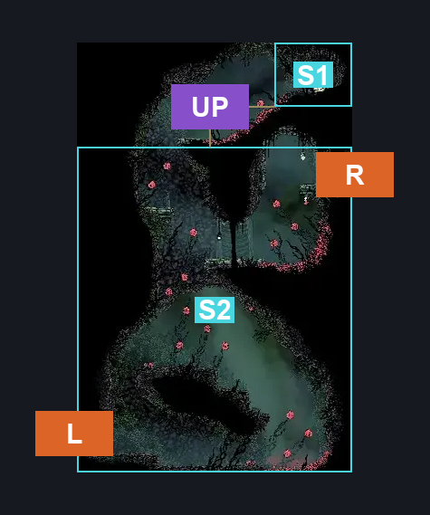
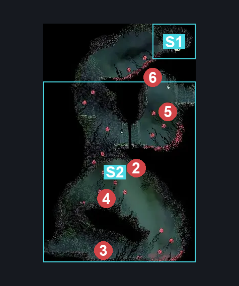
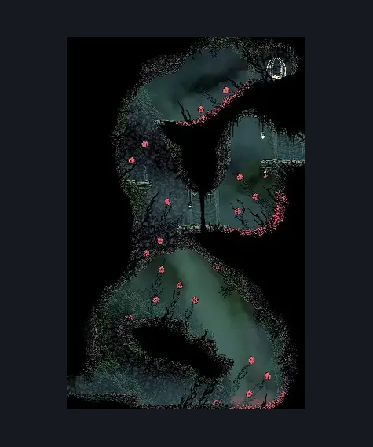

# Hunter's March Pogo Intro (Ant_03)

**Game ID:** Ant_03

**Contributors:** herounit

## Subrooms

| No. | Subroom | Annotated |
| --- | --- | --- |
| S1 | flea rescue area | ✓ |
| S2 | main area | ✓ |

## Room Transitions

| Alias | Name | From subroom | Destination | Destination alias | Requirements | TODO | Verification | Annotated | Notes |
| --- | --- | --- | --- | --- | --- | --- | --- | --- | --- |
| L | left2 | main area | [Hunter's March Entrance (Ant_02)](hunter-s-march-entrance.md) | R | none |  | Verified | ✓ |  |
| R | right3 | main area | [Hunter's March Early Pathway West (Ant_04_left)](hunter-s-march-early-pathway-west.md) | L | none |  | Verified | ✓ |  |

## Subroom Connections

| Alias | Name | Source | Destination | Requirements | TODO | Verification | Annotated | Notes |
| --- | --- | --- | --- | --- | --- | --- | --- | --- |
| UP | upper pogo | main area | flea rescue area | ledge grab OR scuttlebrace OR easy shaman pogo OR easy reaper pogo OR easy wanderer pogo OR faydown cloak OR silk soar |  | Verified | ✓ |  |
| UP | upper pogo | flea rescue area | main area | none (falling) |  | Verified | ✓ |  |

## Check Locations

| No. | Check | Subroom | Requirements | TODO | Verification | Location Type | Annotated | Notes |
| --- | --- | --- | --- | --- | --- | --- | --- | --- |
| 1 | flea rescue | flea rescue area | break vines right |  | Verified | collectible |  |  |
| 2 | Skarrwing 1 |  |  |  |  | enemy | ✓ |  |
| 3 | Skarrlid 1 |  |  |  |  | enemy | ✓ |  |
| 4 | Skarrlid 2 |  | Normal World Spawn |  |  | enemy | ✓ |  |
| 5 | Skarrwing 2 |  | Normal World Spawn |  |  | enemy | ✓ |  |
| 6 | Skarrwing 3 |  | Black Thread World Spawn |  |  | enemy | ✓ |  |

## Room Images

### Connections

### Checks

### Scene

