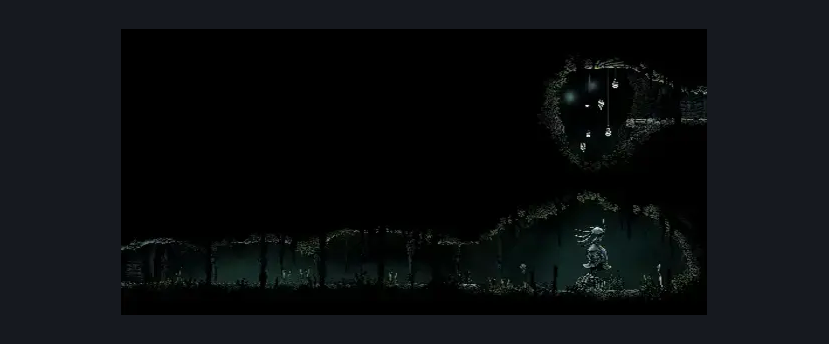
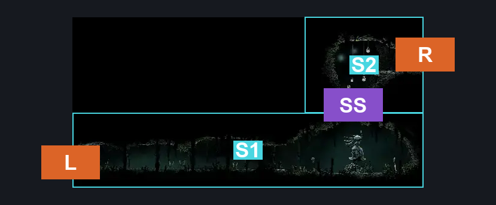
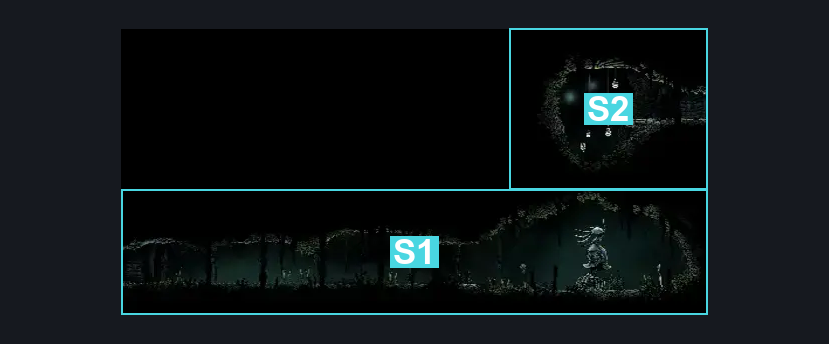

# Hunter's March Statue (Ant_05c)

**Game ID:** Ant_05c

**Contributors:** herounit

## Subrooms

| No. | Subroom | Annotated |
| --- | --- | --- |
| S1 | statue area | ✓ |
| S2 | right exit area | ✓ |

## Room Transitions

| Alias | Name | From subroom | Destination | Destination alias | Requirements | TODO | Verification | Annotated | Notes |
| --- | --- | --- | --- | --- | --- | --- | --- | --- | --- |
| L | left1 | statue area | [Hunter's March Shaft (Ant_14)](hunter-s-march-shaft.md) | UR | none |  | Verified | ✓ |  |
| R | right1 | right exit area | [Hunter's March Deep Entrance (Ant_09)](hunter-s-march-deep-entrance.md) | L | none |  | Verified | ✓ |  |

## Subroom Connections

| Alias | Name | Source | Destination | Requirements | TODO | Verification | Annotated | Notes |
| --- | --- | --- | --- | --- | --- | --- | --- | --- |
| SS | silk soar spot | statue area | right exit area | silk soar |  | Verified | ✓ |  |
| SS | silk soar spot | right exit area | statue area | none (falling) |  | Verified | ✓ |  |

## Check Locations

No check locations defined.

## Room Images

### Scene

### Connections

### Checks

