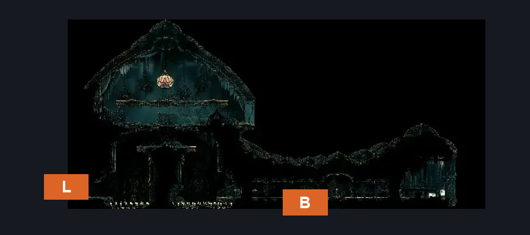
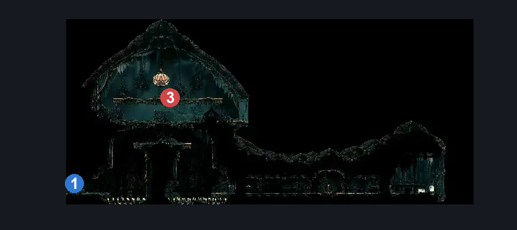
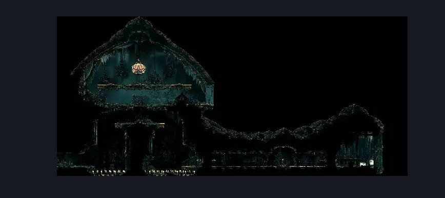

# BEEG flea (Arborium_08)

**Game ID:** Arborium_08

**Contributors:** heric

## Subrooms

| No. | Subroom | Annotated |
| --- | --- | --- |
| S1 | volt |  |
| S2 | left |  |

## Room Transitions

| Alias | Name | From subroom | Destination | Destination alias | Requirements | TODO | Verification | Annotated | Notes |
| --- | --- | --- | --- | --- | --- | --- | --- | --- | --- |
| B | bot1 | volt | [Memorium Voltnest (Arborium_07)](memorium-voltnest.md) | T | nada |  | Verified | ✓ |  |
| L | left1 | left | [Memorium Start Shaft (Arborium_01)](memorium-start-shaft.md) | T | nada |  | Verified | ✓ |  |

## Subroom Connections

| Alias | Name | Source | Destination | Requirements | TODO | Verification | Annotated | Notes |
| --- | --- | --- | --- | --- | --- | --- | --- | --- |
| vl | volt left | volt | left | cling grip OR silk soar |  | Verified |  |  |
| vl | volt left | left | volt | cling grip OR (silk soar AND silkhearts x 1) |  | Verified |  |  |

## Check Locations

| No. | Check | Subroom | Requirements | TODO | Verification | Location Type | Annotated | Notes |
| --- | --- | --- | --- | --- | --- | --- | --- | --- |
| 1 | Big flea wall | left | nada |  | Verified | blockade | ✓ | custom name |
| 2 | Flea: Memorium - Huge Flea | left | cling grip OR (silk soar AND silkhearts x 1) OR (easy scuttlebrace AND clawline AND silkhearts x 1 AND (ledge grab OR faydown cloak OR medium shaman pogo)) |  | Verified | collectible |  | technically should be a subroom so silkhearts arent needed one way |

## Room Images

### Connections

### Checks

### Scene

