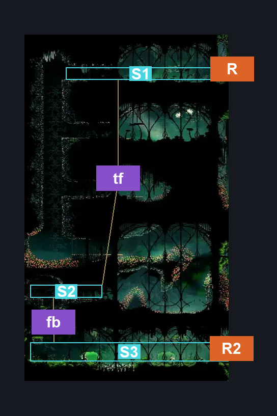
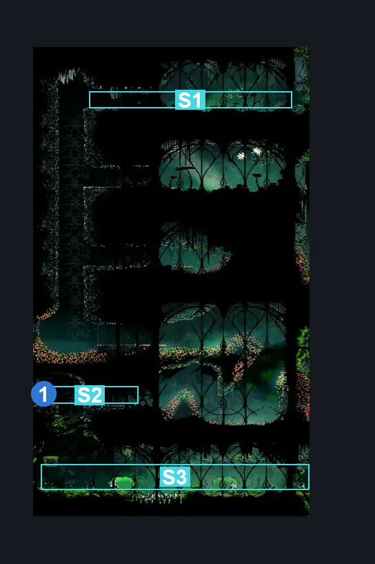
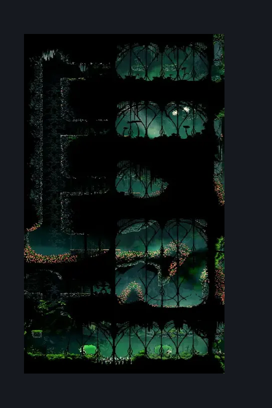

# Memorium Mossy (Arborium_09)

**Game ID:** Arborium_09

**Contributors:** heric

## Subrooms

| No. | Subroom | Annotated |
| --- | --- | --- |
| S1 | Top | ✓ |
| S2 | Fragment | ✓ |
| S3 | Bottom | ✓ |

## Room Transitions

| Alias | Name | From subroom | Destination | Destination alias | Requirements | TODO | Verification | Annotated | Notes |
| --- | --- | --- | --- | --- | --- | --- | --- | --- | --- |
| R | topish shaft | Top | [Memorium Start Shaft (Arborium_01)](memorium-start-shaft.md) | ML | nada |  | Verified | ✓ |  |
| R2 | bottom shaft | Bottom | [Memorium Start Shaft (Arborium_01)](memorium-start-shaft.md) | BL | nada |  | Verified | ✓ |  |

## Subroom Connections

| Alias | Name | Source | Destination | Requirements | TODO | Verification | Annotated | Notes |
| --- | --- | --- | --- | --- | --- | --- | --- | --- |
| tf | top/fragment | Top | Fragment | clawline AND faydown cloak AND dash AND cling grip AND drifter's cloak |  | Verified | ✓ | clawline AND faydown cloak AND precise movement OR dash AND faydown cloak AND cling grip AND (precise movement OR drifter's cloak) with precise movement clause |
| fb | fragment/bottom | Fragment | Bottom | nada |  | Verified | ✓ |  |
| fb | fragment/bottom | Bottom | Fragment | silk soar OR cling grip OR (faydown cloak AND ledge grab AND easy shaman pogo) OR(easy scuttlebrace AND (faydown cloak OR ledge grab OR easy shaman pogo OR easy architect pogo OR easy wanderer pogo OR easy reaper pogo OR medium hunter pogo OR easy beast pogo)) |  | Verified | ✓ | Room is blind unless dark stuff is removed |

## Check Locations

| No. | Check | Subroom | Requirements | TODO | Verification | Location Type | Annotated | Notes |
| --- | --- | --- | --- | --- | --- | --- | --- | --- |
| 1 | Memorium - Spool Fragment | Fragment | none |  | Verified | collectible | ✓ |  |
| 2 | Memorium Mossy wall | Bottom | none |  | Verified | blockade |  | custom name |

## Room Images

### Connections

### Checks

### Scene

