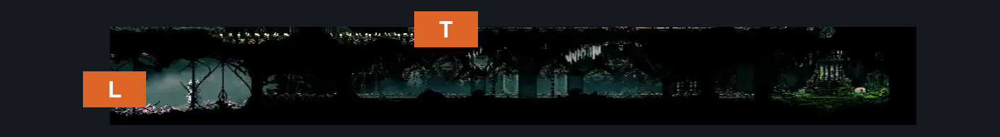
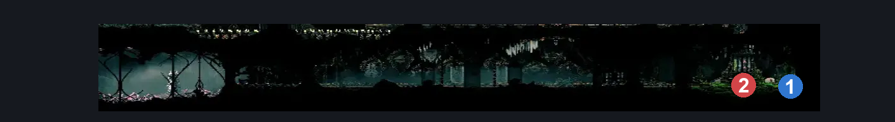
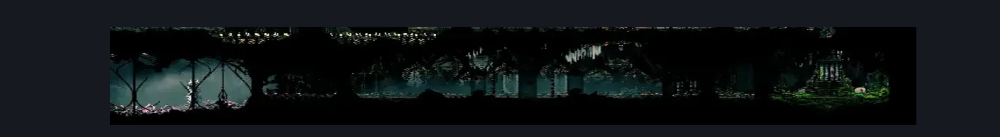

# Memorium Voltnest (Arborium_07)

**Game ID:** Arborium_07

**Contributors:** heric

## Subrooms

| No. | Subroom | Annotated |
| --- | --- | --- |
| S1 | left |  |
| S2 | Memorium stuff |  |

## Room Transitions

| Alias | Name | From subroom | Destination | Destination alias | Requirements | TODO | Verification | Annotated | Notes |
| --- | --- | --- | --- | --- | --- | --- | --- | --- | --- |
| L | left1 | left | [Memorium Start Shaft (Arborium_01)](memorium-start-shaft.md) | VN | nada |  | Verified | ✓ |  |
| T | top1 | Memorium stuff | [BEEG flea (Arborium_08)](beeg-flea.md) | b | (silk soar AND silkhearts x 1) OR ledge grab OR faydown cloak OR cling grip |  | Verified | ✓ |  |

## Subroom Connections

| Alias | Name | Source | Destination | Requirements | TODO | Verification | Annotated | Notes |
| --- | --- | --- | --- | --- | --- | --- | --- | --- |
| LM | memorium volt back and forth | left | Memorium stuff | (clawline AND silkhearts x 1 AND (spike pogo OR dash OR silkhearts x 2 OR drifter's cloak OR faydown cloak)) OR (cling grip AND run) OR (drifters AND (spike pogo OR faydown cloak)) OR (faydown cloak AND (run OR spike pogo)) OR (run AND spike pogo) OR easy beast pogo |  | Verified |  | OR (easy damage boost AND clawline AND silkhearts x 1) can be added once damage boosts are added |
| LM | memorium volt back and forth | Memorium stuff | left | cling grip OR (clawline AND silkhearts x 1) OR medium hunter pogo OR medium reaper pogo OR (faydown cloak AND spike pogo) OR easy beast pogo OR medium architect pogo OR (spike pogo AND faydown cloak) OR run OR drifters |  | Verified |  |  |

## Check Locations

| No. | Check | Subroom | Requirements | TODO | Verification | Location Type | Annotated | Notes |
| --- | --- | --- | --- | --- | --- | --- | --- | --- |
| 1 | Voltvessels | Memorium stuff | complete Memoria gauntlet |  | Verified | collectible | ✓ |  |
| 2 | Memoria gauntlet | Memorium stuff | nada |  | Verified | gauntlet | ✓ | custom name |

## Notes

you can do some scuttlebrace things but its rng nonsense thats not reasonable for anyone to figure out

farsight isnt randoed yet but from "Memorium stuff" needs nada

## Room Images

### Connections

### Checks

### Scene

