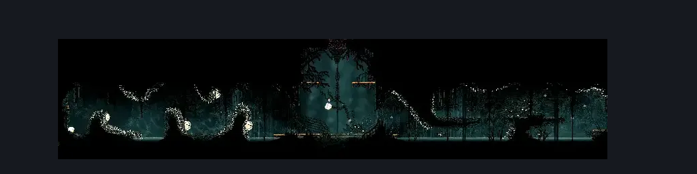
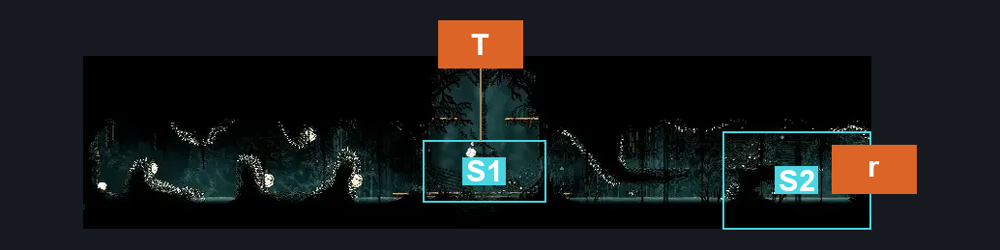
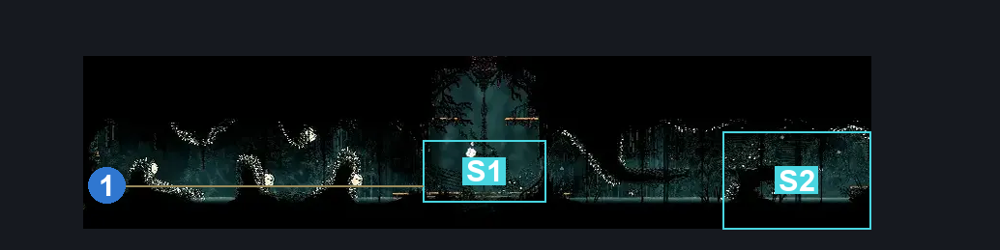

# Memorium water room (Arborium_05)

**Game ID:** Arborium_05

**Contributors:** heric

## Subrooms

| No. | Subroom | Annotated |
| --- | --- | --- |
| S1 | Center | ✓ |
| S2 | right side | ✓ |

## Room Transitions

| Alias | Name | From subroom | Destination | Destination alias | Requirements | TODO | Verification | Annotated | Notes |
| --- | --- | --- | --- | --- | --- | --- | --- | --- | --- |
| T | top1 | Center | [Memorium Karak (Arborium_06)](memorium-karak.md) | B | silk soar OR (faydown cloak AND break wall up) |  | Verified | ✓ |  |
| r | right1 | right side | [Seed Shooty Memorium (Arborium_03)](seed-shooty-memorium.md) | T | none |  | Verified | ✓ |  |

## Subroom Connections

| Alias | Name | Source | Destination | Requirements | TODO | Verification | Annotated | Notes |
| --- | --- | --- | --- | --- | --- | --- | --- | --- |
| sw | swim | right side | Center | swim |  | Verified |  | no requirments avialable to list it as but "(hard clawline AND (cling grip OR ledge grab))" |
| 2 | 2 | Center | right side | swim AND (easy enemy pogo OR faydown cloak OR ledge grab OR cling grip) |  | Verified |  |  |

## Check Locations

| No. | Check | Subroom | Requirements | TODO | Verification | Location Type | Annotated | Notes |
| --- | --- | --- | --- | --- | --- | --- | --- | --- |
| 1 | Memorium - Memory Locket | Center | (faydown cloak AND (clawline OR medium beast pogo OR (dash AND (swim OR easy enemy pogo)))) OR (faydown cloak AND (swim OR cling grip) AND((easy architect pogo OR  easy shaman pogo OR medium witch pogo OR easy beast pogo OR easy reaper pogo OR easy hunter pogo OR (easy needle strike stall (wanderers))))) |  | Verified | collectible | ✓ |  |
| 2 | Water karak ceiling | Center | silksoar OR (faydown cloak AND break wall up) |  | Verified | blockade |  | one way thingy |

## Room Images

### Scene

### Connections

### Checks

