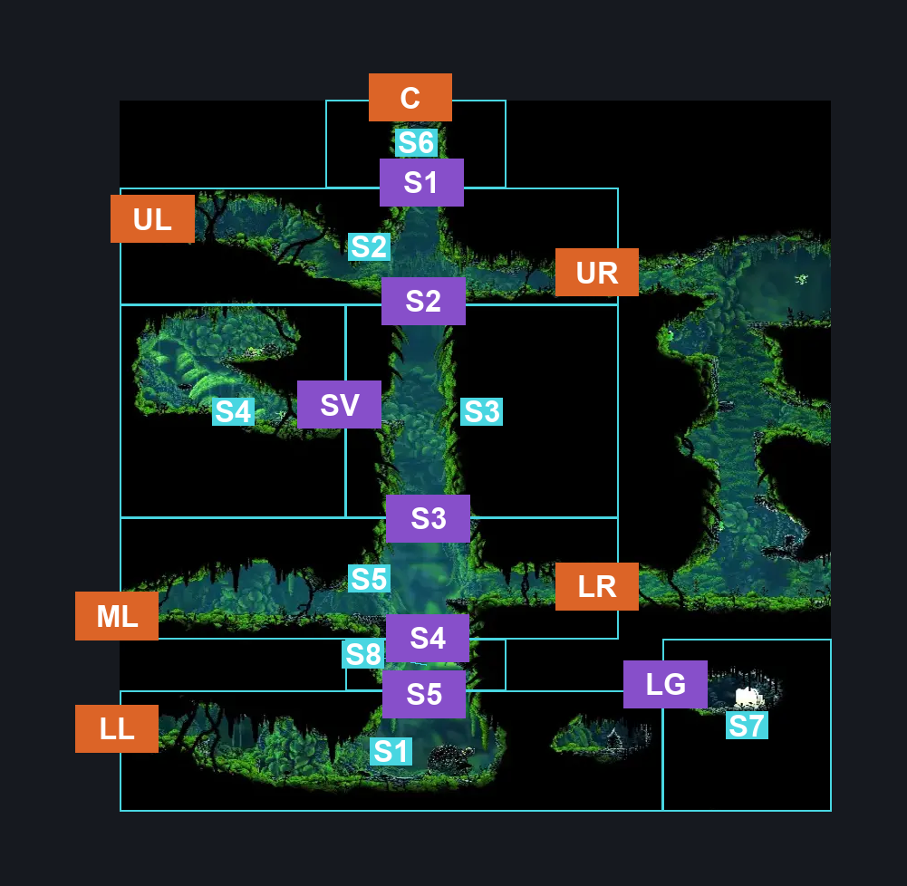
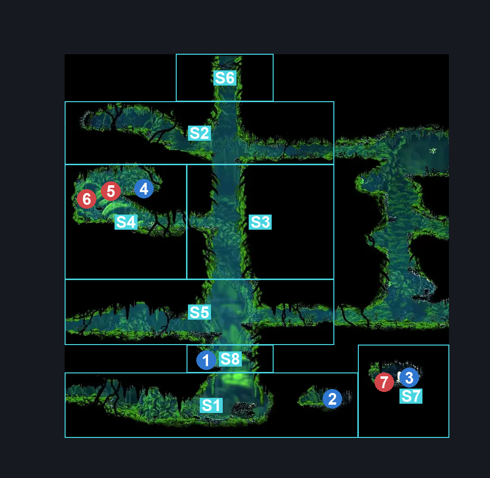
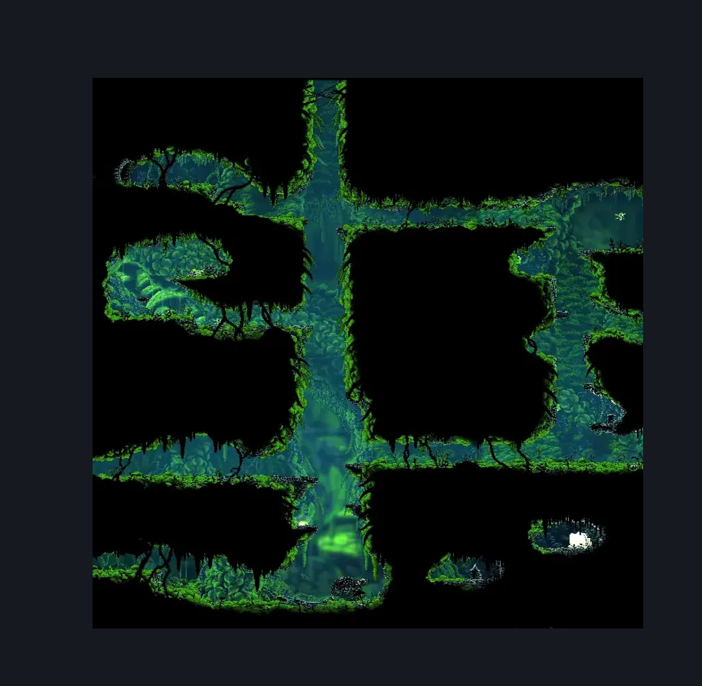

# Moss Grotto Center (Tut_01)

**Game ID:** Tut_01

**Contributors:** herounit, super epicguy

## Subrooms

| No. | Subroom | Annotated |
| --- | --- | --- |
| S1 | rock bottom | ✓ |
| S2 | upper crossing | ✓ |
| S3 | center shaft | ✓ |
| S4 | side room | ✓ |
| S5 | lower crossing | ✓ |
| S6 | up and away | ✓ |
| S7 | beast alcove | ✓ |
| S8 | dead ledge | ✓ |

## Room Transitions

| Alias | Name | From subroom | Destination | Destination alias | Requirements | TODO | Verification | Annotated | Notes |
| --- | --- | --- | --- | --- | --- | --- | --- | --- | --- |
| LL | lower left | rock bottom | [Moss Grotto West (Tut_02)](moss-grotto-west.md) | LR | break vines left |  | Verified | ✓ |  |
| ML | middle left | lower crossing | [Moss Grotto West (Tut_02)](moss-grotto-west.md) | UR | none |  | Verified | ✓ |  |
| UL | upper left | upper crossing | [Ruined Chapel (Tut_03)](ruined-chapel.md) | R | break vines left |  | Verified | ✓ |  |
| LR | lower right | lower crossing | [Moss Grotto East (Tut_01b)](moss-grotto-east.md) | LL | none |  | Verified | ✓ |  |
| UR | upper right | upper crossing | [Moss Grotto East (Tut_01b)](moss-grotto-east.md) | UL | none |  | Verified | ✓ |  |
| C | ceiling | up and away | [Bone Bottom Town (Bonetown)](../bone-bottom/bone-bottom-town.md) | RF | complete reach bone bottom IN bone bottom town |  | Verified | ✓ | there is a loading zone blocker that only goes away once you've reached bone bottom once |

## Subroom Connections

| Alias | Name | Source | Destination | Requirements | TODO | Verification | Annotated | Notes |
| --- | --- | --- | --- | --- | --- | --- | --- | --- |
| S1 | shaft 1 | upper crossing | up and away | silk soar  OR scuttlebrace  OR ( cling grip AND ( easy shaman crest pogo OR easy heal stall OR faydown cloak OR run OR dash OR sharpdart OR clawline ) ) |  | Verified | ✓ | Easy skip is a heal boost or a reversed slash boost with Shaman's |
| S1 | shaft 1 | up and away | upper crossing | none (falling) |  | Verified | ✓ |  |
| S2 | shaft 2 | center shaft | upper crossing | silk soar OR cling grip OR scuttlebrace |  | Verified | ✓ |  |
| S2 | shaft 2 | upper crossing | center shaft | none (falling) |  | Verified | ✓ |  |
| SV | side room vines | center shaft | side room | break vines left |  | Verified | ✓ |  |
| SV | side room vines | side room | center shaft | break vines right |  | Verified | ✓ |  |
| S3 | shaft 3 | lower crossing | center shaft | silk soar OR cling grip OR ( easy scuttlebrace AND dash AND ( sharpdart OR clawline OR faydown cloak ) ) |  | Verified | ✓ |  |
| S3 | shaft 3 | center shaft | lower crossing | none (falling) |  | Verified | ✓ |  |
| S4 | shaft 4 | dead ledge | lower crossing | ledge grab  OR faydown cloak  OR silk soar  OR scuttlebrace  OR ( cling grip AND ( dash OR clawline ) ) |  | Verified | ✓ |  |
| S4 | shaft 4 | lower crossing | dead ledge | none (falling) |  | Verified | ✓ |  |
| S5 | shaft 5 | rock bottom | dead ledge | silk soar OR ( cling grip AND faydown cloak )  OR ( easy scuttlebrace AND dash AND faydown cloak AND ( ( drifters cloak AND ledge grab ) OR clawline OR sharpdart ) ) |  | Verified | ✓ |  |
| S5 | shaft 5 | dead ledge | rock bottom | none (falling) |  | Verified | ✓ |  |
| LG | ledge grab 1 | rock bottom | beast alcove | ledge grab OR faydown cloak OR silk soar OR cling grip OR scuttlebrace |  | Verified | ✓ |  |
| LG | ledge grab 1 | beast alcove | rock bottom | none (falling) |  | Verified | ✓ |  |

## Check Locations

| No. | Check | Subroom | Requirements | TODO | Verification | Location Type | Annotated | Notes |
| --- | --- | --- | --- | --- | --- | --- | --- | --- |
| 1 | moss grotto frayed rosary string | dead ledge | none |  | Verified | collectible | ✓ |  |
| 2 | moss grotto shell shard cache 1 | rock bottom | none |  | Verified | collectible | ✓ |  |
| 3 | moss grotto beast shard | beast alcove | none |  | Verified | collectible | ✓ |  |
| 4 | moss grotto rosary chest | side room | none |  | Verified | collectible | ✓ |  |
| 5 | Mossmir 1 | side room | None |  | Verified | enemy | ✓ | need to check if dead |
| 6 | Mossmir 2 | side room | None |  | Verified | enemy | ✓ |  |
| 7 | Marrowmaw 1 | beast alcove | Normal World Spawn |  | Verified | enemy | ✓ |  |

## Notes

renamed from "moss grotto west" - was mistakenly marked as same room as west room
not having the west part as part of this area causes the graph to be more complex

## Room Images

### Connections

### Checks

### Scene

