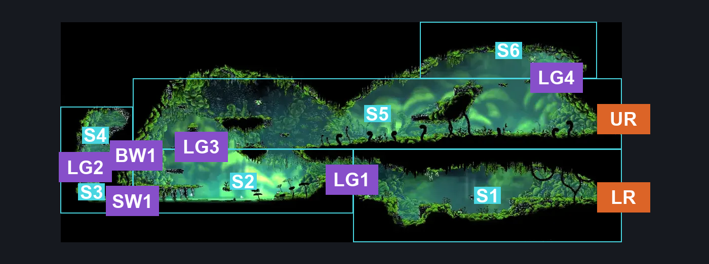
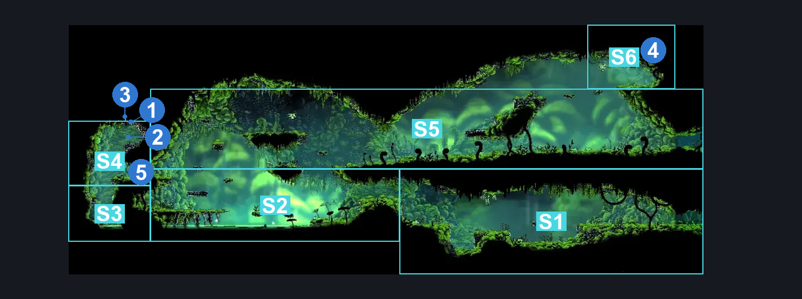
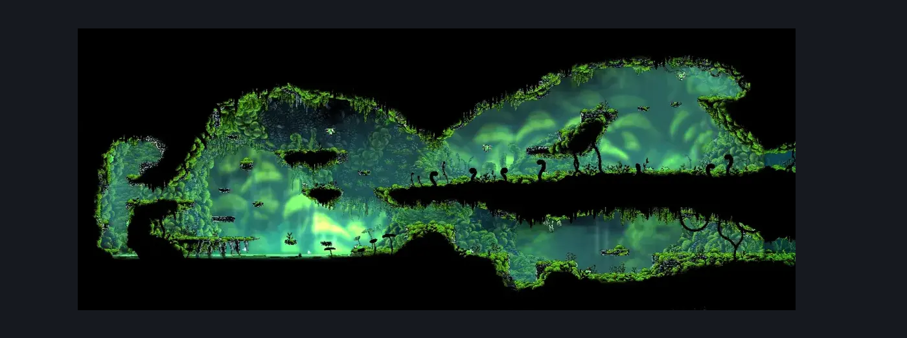

# Moss Grotto West (Tut_02)

**Game ID:** Tut_02

**Contributors:** herounit

## Subrooms

| No. | Subroom | Annotated |
| --- | --- | --- |
| S1 | lower right exit area | ✓ |
| S2 | the pond | ✓ |
| S3 | the backroom floor | ✓ |
| S4 | the backroom cache | ✓ |
| S5 | upper level | ✓ |
| S6 | mossberry platform | ✓ |

## Room Transitions

| Alias | Name | From subroom | Destination | Destination alias | Requirements | TODO | Verification | Annotated | Notes |
| --- | --- | --- | --- | --- | --- | --- | --- | --- | --- |
| UR | upper right | upper level | [Moss Grotto Center (Tut_01)](moss-grotto-center.md) | ML | none |  | Verified | ✓ | asdf |
| LR | lower right | lower right exit area | [Moss Grotto Center (Tut_01)](moss-grotto-center.md) | LL | break vines right |  | Verified | ✓ |  |

## Subroom Connections

| Alias | Name | Source | Destination | Requirements | TODO | Verification | Annotated | Notes |
| --- | --- | --- | --- | --- | --- | --- | --- | --- |
| LG1 | first ledge grab | lower right exit area | the pond | ledge grab OR cling grip OR scuttlebrace OR faydown cloak OR silk soar |  | Verified | ✓ |  |
| LG1 | first ledge grab | the pond | lower right exit area | none (falling) |  | Verified | ✓ |  |
| SW1 | first swim | the pond | the backroom floor | swim |  | Verified | ✓ |  |
| SW1 | first swim | the backroom floor | the pond | swim |  | Verified | ✓ |  |
| LG2 | ledge grab 2 | the backroom floor | the backroom cache | ledge grab OR cling grip OR faydown cloak OR silk soar |  | Verified | ✓ |  |
| LG2 | ledge grab 2 | the backroom cache | the backroom floor | none (falling) |  | Verified | ✓ |  |
| BW1 | breakable wall 1 | the backroom cache | the pond | clear one-way breakable wall |  | Verified | ✓ |  |
| BW1 | breakable wall 1 | the pond | the backroom cache | clear one-way breakable wall |  | Verified | ✓ |  |
| LG3 | ledge grab 3 | the pond | upper level | ledge grab OR run OR dash OR drifters OR faydown OR easy beast pogo OR cling grip OR silk soar OR clawline OR sharpdart OR scuttlebrace |  | Verified | ✓ |  |
| LG3 | ledge grab 3 | upper level | the pond | none (falling) |  | Verified | ✓ |  |
| LG4 | ledge grab 4 | upper level | mossberry platform | ledge grab OR faydown OR cling grip OR silk soar |  | Verified | ✓ |  |
| LG4 | ledge grab 4 | mossberry platform | upper level | none (falling) |  | Verified | ✓ |  |

## Check Locations

| No. | Check | Subroom | Requirements | TODO | Verification | Location Type | Annotated | Notes |
| --- | --- | --- | --- | --- | --- | --- | --- | --- |
| 1 | shell shard cache moss grotto 5 | the backroom cache | none |  | Verified | collectible | ✓ |  |
| 2 | shell shard cache moss grotto 6 | the backroom cache | none |  | Verified | collectible | ✓ |  |
| 3 | shell shard cache moss grotto 7 | the backroom cache | none |  | Verified | collectible | ✓ |  |
| 4 | moss grotto west mossberry | mossberry platform | none |  | Verified | collectible | ✓ |  |
| 5 | one-way breakable wall | the backroom cache | break wall right |  | Verified | blockade | ✓ |  |

## Notes

somehow missed this being its own room before

## Room Images

### Connections

### Checks

### Scene

