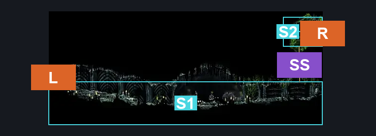
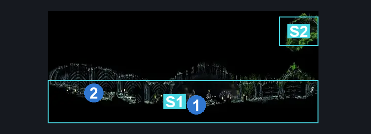
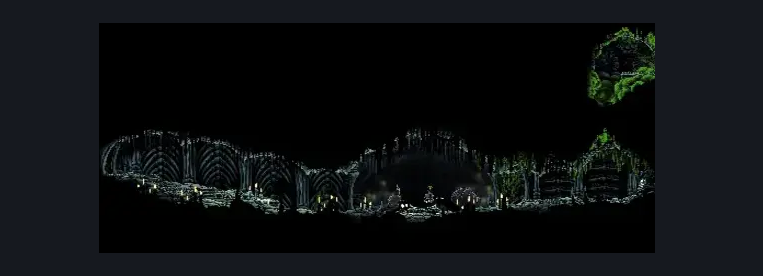

# Ruined Chapel Interior (Tut_04)

**Game ID:** Tut_04

**Contributors:** herounit

## Subrooms

| No. | Subroom | Annotated |
| --- | --- | --- |
| S1 | ritual chamber | ✓ |
| S2 | crest exit | ✓ |

## Room Transitions

| Alias | Name | From subroom | Destination | Destination alias | Requirements | TODO | Verification | Annotated | Notes |
| --- | --- | --- | --- | --- | --- | --- | --- | --- | --- |
| L | left1 | ritual chamber | [Ruined Chapel (Tut_03)](ruined-chapel.md) | CD | none |  | Verified | ✓ |  |
| R | right1 | crest exit | [Ruined Chapel Crest Chamber (Tut_05)](ruined-chapel-crest-chamber.md) | L | none |  | Verified | ✓ |  |

## Subroom Connections

| Alias | Name | Source | Destination | Requirements | TODO | Verification | Annotated | Notes |
| --- | --- | --- | --- | --- | --- | --- | --- | --- |
| SS | silk soar spot | ritual chamber | crest exit | silk soar |  | Verified | ✓ |  |
| SS | silk soar spot | crest exit | ritual chamber | silk soar |  | Verified | ✓ |  |

## Check Locations

| No. | Check | Subroom | Requirements | TODO | Verification | Location Type | Annotated | Notes |
| --- | --- | --- | --- | --- | --- | --- | --- | --- |
| 1 | RestBench | ritual chamber | none |  | Verified | bench | ✓ |  |
| 2 | churchkeeper_rosary | ritual chamber | none |  | Verified | collectible | ✓ | discarded robes from ruined chapel caretaker |

## Notes

**UNABLE TO ACCESS IN LOGIC AUDIT MODE**

## Room Images

### Connections

### Checks

### Scene

