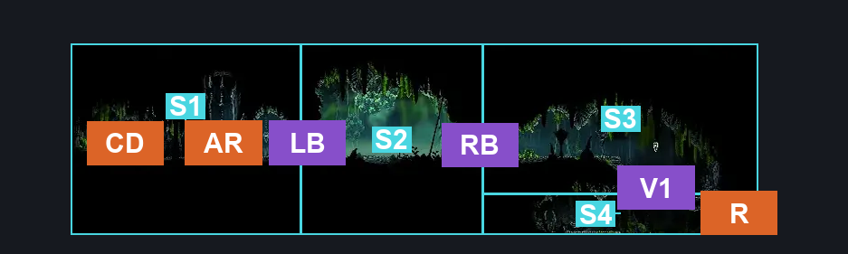
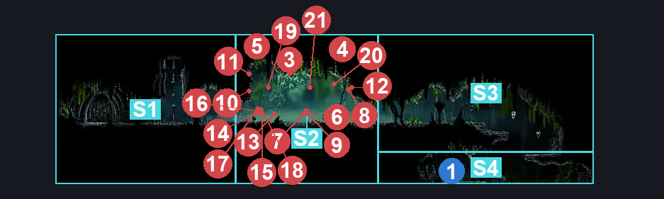
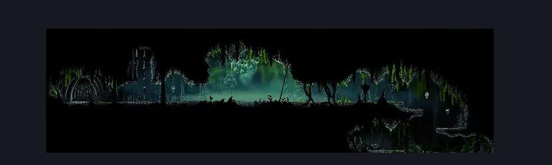

# Ruined Chapel (Tut_03)

**Game ID:** Tut_03

**Contributors:** herounit

## Subrooms

| No. | Subroom | Annotated |
| --- | --- | --- |
| S1 | chapel | ✓ |
| S2 | boss arena | ✓ |
| S3 | bench passage | ✓ |
| S4 | bench spot | ✓ |

## Room Transitions

| Alias | Name | From subroom | Destination | Destination alias | Requirements | TODO | Verification | Annotated | Notes |
| --- | --- | --- | --- | --- | --- | --- | --- | --- | --- |
| R | right | bench spot | [Moss Grotto Center (Tut_01)](moss-grotto-center.md) | UL | none |  | Verified | ✓ |  |
| AR | ascend rope | chapel | [Bone Bottom Town (Bonetown)](../bone-bottom/bone-bottom-town.md) | DR | none |  | Verified | ✓ |  |
| CD | chapel door | chapel | [Ruined Chapel Interior (Tut_04)](ruined-chapel-interior.md) | L | Act 3 |  | Verified | ✓ |  |

## Subroom Connections

| Alias | Name | Source | Destination | Requirements | TODO | Verification | Annotated | Notes |
| --- | --- | --- | --- | --- | --- | --- | --- | --- |
| RB | right boss entrance | bench passage | boss arena | break vines left (starts fight) |  | Verified | ✓ |  |
| RB | right boss entrance | boss arena | bench passage | complete moss mother boss fight |  | Verified | ✓ |  |
| LB | left boss entrance | chapel | boss arena | none (starts fight) |  | Verified | ✓ |  |
| LB | left boss entrance | boss arena | chapel | complete moss mother boss fight |  | Verified | ✓ |  |
| V1 | ledge grab | bench spot | bench passage | ledge grab OR faydown OR silk soar OR cling grip |  | Verified | ✓ |  |
| V1 | ledge grab | bench passage | bench spot | none (falling) |  | Verified | ✓ |  |

## Check Locations

| No. | Check | Subroom | Requirements | TODO | Verification | Location Type | Annotated | Notes |
| --- | --- | --- | --- | --- | --- | --- | --- | --- |
| 1 | bench | bench spot | none |  | Verified | bench | ✓ |  |
| 2 | Mister Mushroom Meeting Moss Grotto | boss arena | complete THE Passing of the Age Wish Promised AND Needolin |  | Verified | event |  |  |
| 3 | moss mother boss fight | boss arena | Normal World Spawn |  | Verified | boss | ✓ |  |
| 4 | Mossgrub Summon 0 | boss arena | Normal World Spawn AND Invalid |  | Verified | enemy | ✓ | boss summon - could be missed |
| 5 | Mossgrub Summon 1 | boss arena | Normal World Spawn AND Invalid |  | Verified | enemy | ✓ | boss summon - could be missed |
| 6 | MossBone Cocoon 0 | boss arena | Normal World Spawn |  | Verified | enemy | ✓ |  |
| 7 | MossBone Cocoon 1 | boss arena | Normal World Spawn |  | Verified | enemy | ✓ |  |
| 8 | MossBone Cocoon 2 | boss arena | Normal World Spawn |  | Verified | enemy | ✓ |  |
| 9 | MossBone Cocoon 3 | boss arena | Normal World Spawn |  | Verified | enemy | ✓ |  |
| 10 | MossBone Cocoon 4 | boss arena | Normal World Spawn |  | Verified | enemy | ✓ |  |
| 11 | MossBone Cocoon 5 | boss arena | Normal World Spawn |  | Verified | enemy | ✓ |  |
| 12 | MossBone Cocoon 6 | boss arena | Normal World Spawn |  | Verified | enemy | ✓ |  |
| 13 | MossBone Cocoon 7 | boss arena | Normal World Spawn |  | Verified | enemy | ✓ |  |
| 14 | MossBone Cocoon 8 | boss arena | Normal World Spawn |  | Verified | enemy | ✓ |  |
| 15 | MossBone Cocoon 9 | boss arena | Normal World Spawn |  | Verified | enemy | ✓ |  |
| 16 | MossBone Cocoon 10 | boss arena | Normal World Spawn |  | Verified | enemy | ✓ |  |
| 17 | MossBone Cocoon 11 | boss arena | Normal World Spawn |  | Verified | enemy | ✓ |  |
| 18 | MossBone Cocoon 12 | boss arena | Normal World Spawn |  | Verified | enemy | ✓ |  |
| 19 | MossBone Cocoon 13 | boss arena | Normal World Spawn |  | Verified | enemy | ✓ |  |
| 20 | MossBone Cocoon 14 | boss arena | Normal World Spawn |  | Verified | enemy | ✓ |  |
| 21 | MossBone Cocoon 15 | boss arena | Normal World Spawn |  | Verified | enemy | ✓ |  |

## Notes

ROOM BUG: fighting moss mother without breaking the vines on the right side of the arena (by approaching from the left), you get locked into the arena with darkness still covering the area.

Ascend rope AND the ceiling are valid exits - but I believe they take you to the same bot1 exit on the other side.

## Room Images

### Connections

### Checks

### Scene

