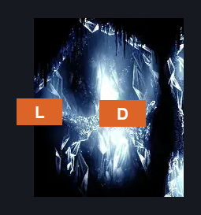
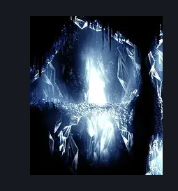

# Brightvein Entrance (Peak_06b)

**Game ID:** Peak_06b

**Contributors:** Pyxl

## Subrooms

No subrooms defined.

## Room Transitions

| Alias | Name | From subroom | Destination | Destination alias | Requirements | TODO | Verification | Annotated | Notes |
| --- | --- | --- | --- | --- | --- | --- | --- | --- | --- |
| L | left1 |  | [Mount Fay Magnetite Outcropping (Peak_05e)](mount-fay-magnetite-outcropping.md) | UR | None |  | Verified | ✓ |  |
| D | door1 |  | [Brightvein (Peak_06)](brightvein.md) | L | None |  | Verified | ✓ |  |

## Subroom Connections

No subroom connections defined.

## Check Locations

No check locations defined.

## Room Images

### Connections

### Checks

### Scene

