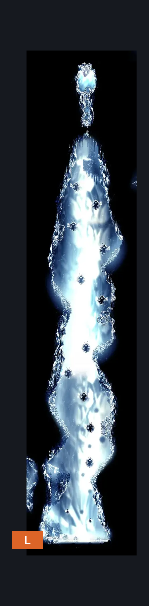
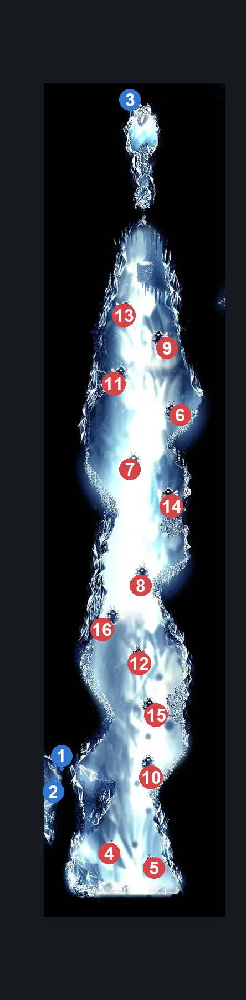
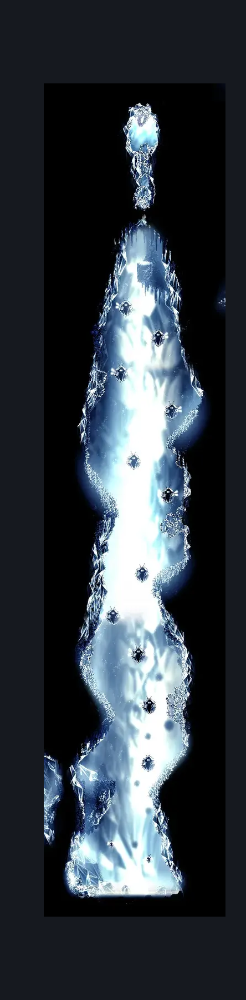

# Brightvein (Peak_06)

**Game ID:** Peak_06

**Contributors:** Pyxl

## Subrooms

No subrooms defined.

## Room Transitions

| Alias | Name | From subroom | Destination | Destination alias | Requirements | TODO | Verification | Annotated | Notes |
| --- | --- | --- | --- | --- | --- | --- | --- | --- | --- |
| L | left1 |  | [Brightvein Entrance (Peak_06b)](brightvein-entrance.md) | D | None |  | Verified | ✓ |  |

## Subroom Connections

No subroom connections defined.

## Check Locations

| No. | Check | Subroom | Requirements | TODO | Verification | Location Type | Annotated | Notes |
| --- | --- | --- | --- | --- | --- | --- | --- | --- |
| 1 | Mount Fay - Shell Shard Cache #3 |  | silk Soar OR ( clawline AND cling grip ) |  | Verified | resource | ✓ |  |
| 2 | Mount Fay - Shell Shard Cache #4 |  | Silk Soar OR ( Clawline AND Cling Grip ) |  | Verified | resource | ✓ |  |
| 3 | Brightvein - Maskshard |  | Silk Soar AND Clawline AND Cling Grip AND Faydown Cloak |  | Verified | collectible | ✓ |  |
| 4 | Mnemonid 1 |  |  |  |  | enemy | ✓ |  |
| 5 | Mnemonid 2 |  |  |  |  | enemy | ✓ |  |
| 6 | Mnemonord 1 |  |  |  |  | enemy | ✓ |  |
| 7 | Mnemonord 2 |  |  |  |  | enemy | ✓ |  |
| 8 | Mnemonord 3 |  |  |  |  | enemy | ✓ |  |
| 9 | Mnemonord 4 |  |  |  |  | enemy | ✓ |  |
| 10 | Mnemonord 5 |  |  |  |  | enemy | ✓ |  |
| 11 | Mnemonord 6 |  |  |  |  | enemy | ✓ |  |
| 12 | Mnemonord 7 |  |  |  |  | enemy | ✓ |  |
| 13 | Mnemonord 8 |  |  |  |  | enemy | ✓ |  |
| 14 | Mnemonord 9 |  |  |  |  | enemy | ✓ |  |
| 15 | Mnemonord 10 |  |  |  |  | enemy | ✓ |  |
| 16 | Mnemonord 11 |  |  |  |  | enemy | ✓ |  |

## Room Images

### Connections

### Checks

### Scene

