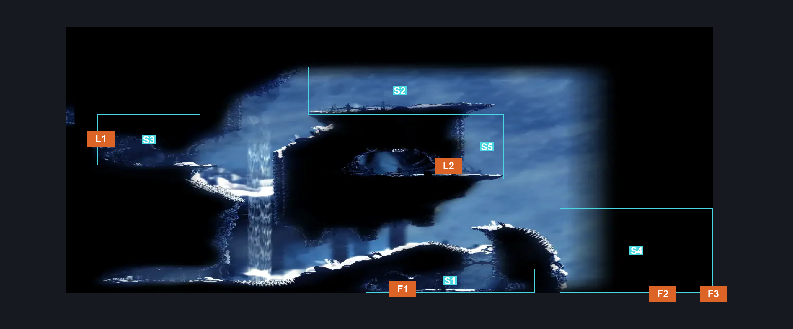
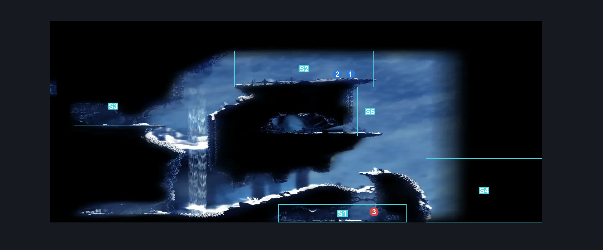
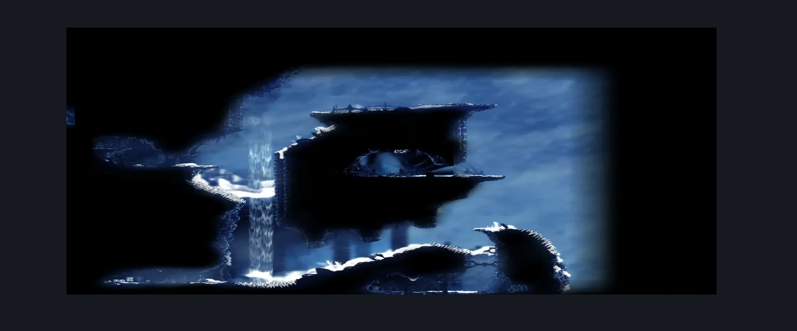

# FayForn (Peak_08b)

**Game ID:** Peak_08b

**Contributors:** Pyxl

## Subrooms

| No. | Subroom | Annotated |
| --- | --- | --- |
| S1 | Lower Entrance | ✓ |
| S2 | Fayforn | ✓ |
| S3 | Left Exit | ✓ |
| S4 | Drop | ✓ |
| S5 | Bench Entrance | ✓ |

## Room Transitions

| Alias | Name | From subroom | Destination | Destination alias | Requirements | TODO | Verification | Annotated | Notes |
| --- | --- | --- | --- | --- | --- | --- | --- | --- | --- |
| L2 | left2 | Bench Entrance | [Mount Fay Peak Bench (Peak_12)](mount-fay-peak-bench.md) | R | None |  | Verified | ✓ |  |
| F3 | bot6 | Drop | [Mount Fay Right Side Middle Room (Peak_07)](mount-fay-right-side-middle-room.md) | C3 | None |  | Verified | ✓ |  |
| L1 | left1 | Left Exit | [Mount Fay Upper Slope (Peak_08)](mount-fay-upper-slope.md) | R | Silk Soar OR Faydown Cloak |  | Verified | ✓ |  |
| F1 | bot4 | Lower Entrance | [Mount Fay Right Side Middle Room (Peak_07)](mount-fay-right-side-middle-room.md) | C1 | None |  | Verified | ✓ |  |
| F2 | bot5 | Drop | [Mount Fay Right Side Middle Room (Peak_07)](mount-fay-right-side-middle-room.md) | C2 | None |  | Verified | ✓ |  |

## Subroom Connections

| Alias | Name | Source | Destination | Requirements | TODO | Verification | Annotated | Notes |
| --- | --- | --- | --- | --- | --- | --- | --- | --- |
| WT | Wind Tunnel Acsent | Lower Entrance | Fayforn | Drifters Cloak AND ( Cling Grip OR Scuttlebrace OR Silk Soar ) |  | Verified | ✓ |  |
| WT2 | Wind TUnnel 2 | Lower Entrance | Left Exit | Drifters Cloak AND ( Cling Grip OR Scuttlebrace OR Silk Soar ) |  | Verified | ✓ |  |
| DR1 | Drop 1 | Fayforn | Bench Entrance | None |  | Verified | ✓ |  |
| DR1 | Drop 1 | Bench Entrance | Fayforn | Silk Soar OR ( Cling Grip AND Faydown Cloak ) |  | Verified | ✓ |  |
| DR2 | Drop 2 | Bench Entrance | Drop | None |  | Verified | ✓ |  |
| CR | Crossing | Left Exit | Fayforn | Drifters Cloak |  | Verified | ✓ |  |
| CR | Crossing | Fayforn | Left Exit | Dash OR Sprint OR Drifters Cloak OR Faydown Cloak OR Clawline OR Sharpdart OR Easy Beast Crest Pogo |  | Verified | ✓ |  |

## Check Locations

| No. | Check | Subroom | Requirements | TODO | Verification | Location Type | Annotated | Notes |
| --- | --- | --- | --- | --- | --- | --- | --- | --- |
| 1 | Faydown Cloak | Fayforn | Needolin |  | Verified | collectible | ✓ |  |
| 2 | Mister Mushroom Meeting Mount Fay | Fayforn | after THE Mister Mushroom Meeting The Slab |  | Verified | event | ✓ | needolin not required - he's talking to the fayforn |
| 3 | Weaver Servitor Broken 1 |  |  |  |  | enemy | ✓ |  |

## Room Images

### Connections

### Checks

### Scene

