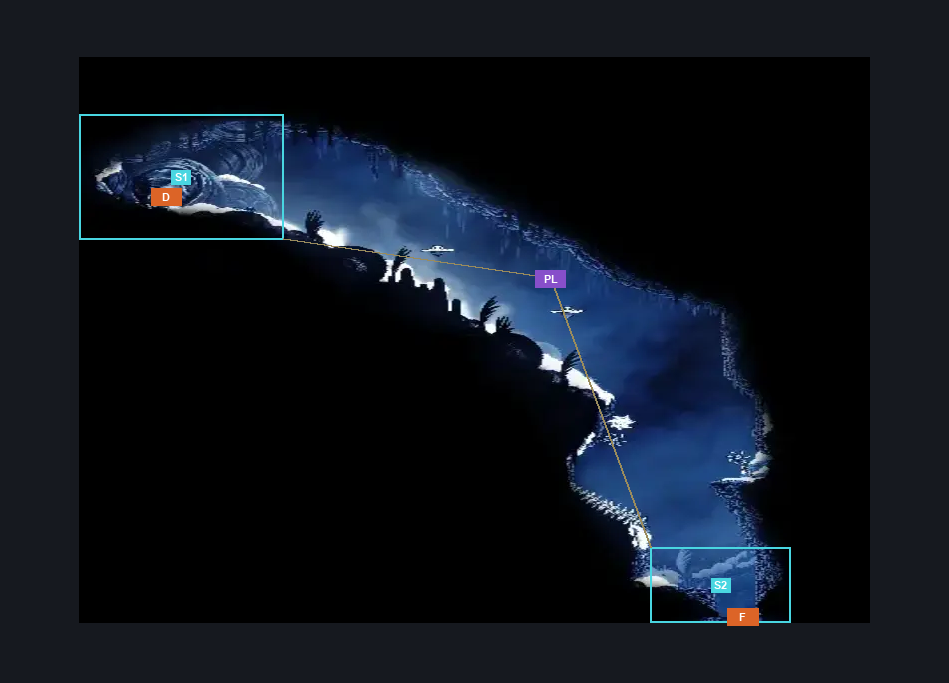
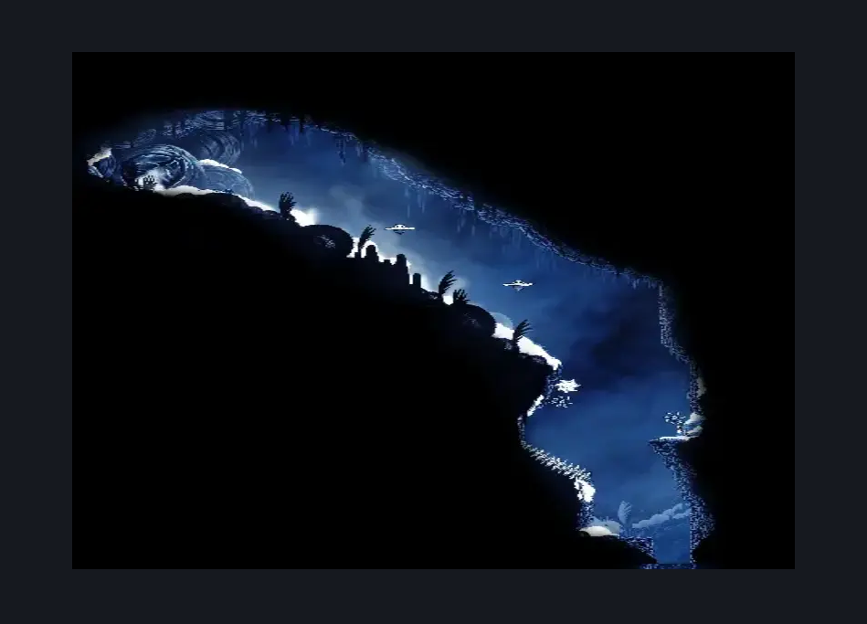

# Mask Maker Passage (Peak_05d)

**Game ID:** Peak_05d

**Contributors:** Pyxl

## Subrooms

| No. | Subroom | Annotated |
| --- | --- | --- |
| S1 | Mask Maker Hut | ✓ |
| S2 | Exit | ✓ |

## Room Transitions

| Alias | Name | From subroom | Destination | Destination alias | Requirements | TODO | Verification | Annotated | Notes |
| --- | --- | --- | --- | --- | --- | --- | --- | --- | --- |
| F | bot1 | Exit | [Mount Fay Upper Slope (Peak_08)](mount-fay-upper-slope.md) | C | None |  | Verified | ✓ |  |
| D | door1 | Mask Maker Hut | [Mask Maker (Peak_Mask_Maker)](mask-maker.md) | R | None |  | Verified | ✓ |  |

## Subroom Connections

| Alias | Name | Source | Destination | Requirements | TODO | Verification | Annotated | Notes |
| --- | --- | --- | --- | --- | --- | --- | --- | --- |
| PL | Platforming | Exit | Mask Maker Hut | Cling Grip AND Faydown Cloak |  | Verified | ✓ |  |
| PL | Platforming | Mask Maker Hut | Exit | None |  | Verified | ✓ |  |

## Check Locations

| No. | Check | Subroom | Requirements | TODO | Verification | Location Type | Annotated | Notes |
| --- | --- | --- | --- | --- | --- | --- | --- | --- |
| 1 | Driftlin 1 |  |  |  |  | enemy | ✓ |  |
| 2 | Driftlin 2 |  |  |  |  | enemy | ✓ |  |

## Room Images

### Connections

### Checks

### Scene

