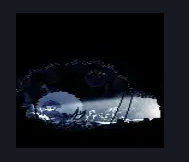

# Mask Maker (Peak_Mask_Maker)

**Game ID:** Peak_Mask_Maker

**Contributors:** Pxyl

## Subrooms

No subrooms defined.

## Room Transitions

| Alias | Name | From subroom | Destination | Destination alias | Requirements | TODO | Verification | Annotated | Notes |
| --- | --- | --- | --- | --- | --- | --- | --- | --- | --- |
| R | right1 |  | [Mask Maker Passage (Peak_05d)](mask-maker-passage.md) | D | None |  | Verified | ✓ |  |

## Subroom Connections

No subroom connections defined.

## Check Locations

No check locations defined.

## Room Images

### Connections

### Checks

### Scene

