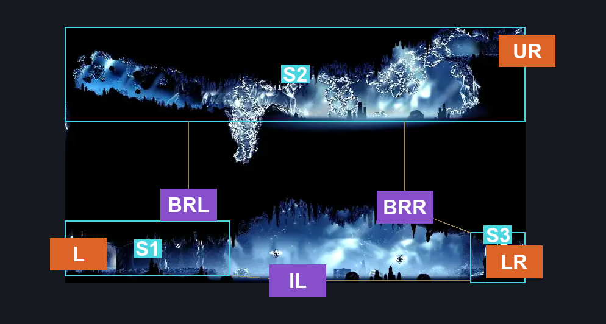
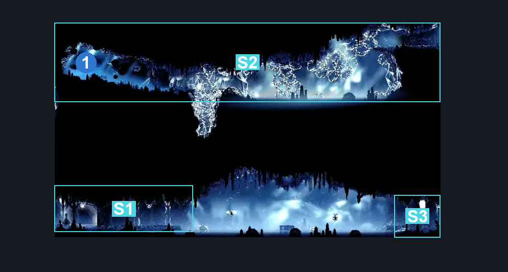
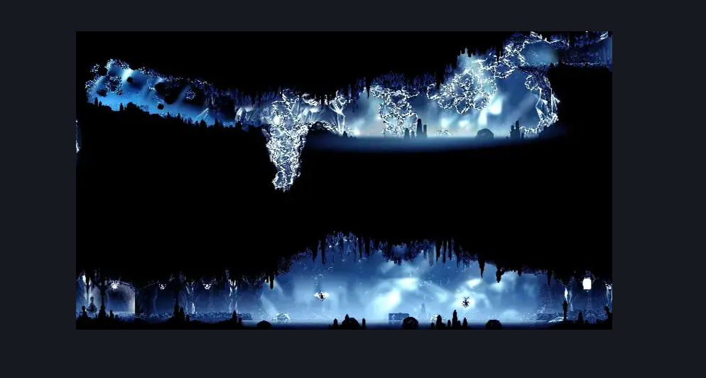

# Mount Fay Magnetite Outcropping (Peak_05e)

**Game ID:** Peak_05e

**Contributors:** Pyxl

## Subrooms

| No. | Subroom | Annotated |
| --- | --- | --- |
| S1 | Left Exit | ✓ |
| S2 | Brightvein | ✓ |
| S3 | Right Exit | ✓ |

## Room Transitions

| Alias | Name | From subroom | Destination | Destination alias | Requirements | TODO | Verification | Annotated | Notes |
| --- | --- | --- | --- | --- | --- | --- | --- | --- | --- |
| UR | right2 | Brightvein | [Brightvein Entrance (Peak_06b)](brightvein-entrance.md) | L | Faydown Cloak OR Clawline OR Dash |  | Verified | ✓ |  |
| LR | right1 | Right Exit | [Mount Fay Shakra (Peak_02)](mount-fay-shakra.md) | UL | None |  | Verified | ✓ |  |
| L | left1 | Left Exit | [Mount Fay Frozen Flea (Peak_05c)](mount-fay-frozen-flea.md) | R | None |  | Verified | ✓ |  |

## Subroom Connections

| Alias | Name | Source | Destination | Requirements | TODO | Verification | Annotated | Notes |
| --- | --- | --- | --- | --- | --- | --- | --- | --- |
| IL | Ice Lake | Right Exit | Left Exit | Swim OR Sprint OR Clawline OR Faydown Cloak OR ( Drifters Cloak AND Dash ) OR Sharpdart |  | Verified | ✓ |  |
| IL | Ice Lake | Left Exit | Right Exit | Swim OR Sprint OR Clawline OR Faydown Cloak OR ( Drifters Cloak AND Dash ) OR Sharpdart |  | Verified | ✓ |  |
| BRL | Brightvein Left | Brightvein | Left Exit | Drifters Cloak OR Dash OR Clawline OR Faydown Cloak OR Sharpdart OR Swim |  | Verified | ✓ |  |
| BRL | Brightvein Left | Left Exit | Brightvein | Silk Soar AND ( Swim OR Clawline OR Faydown Cloak OR ( Dash AND Drifters Cloak ) ) |  | Verified | ✓ |  |
| BRR | Brightvein Right | Right Exit | Brightvein | Silk Soar AND ( Swim OR Clawline OR Faydown Cloak OR ( Dash AND Drifters Cloak ) ) |  | Verified | ✓ |  |
| BRR | Brightvein Right | Brightvein | Right Exit | Drifters Cloak OR Dash OR Clawline OR Faydown Cloak OR Sharpdart OR Swim |  | Verified | ✓ |  |

## Check Locations

| No. | Check | Subroom | Requirements | TODO | Verification | Location Type | Annotated | Notes |
| --- | --- | --- | --- | --- | --- | --- | --- | --- |
| 1 | Magnetite Outcrop | Brightvein | None |  | Verified | lore | ✓ | Lore thingy not included rn |

## Room Images

### Connections

### Checks

### Scene

