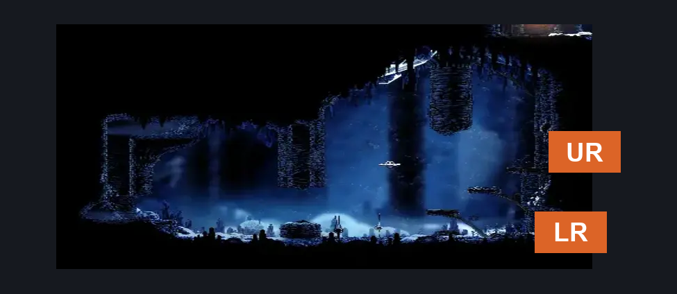
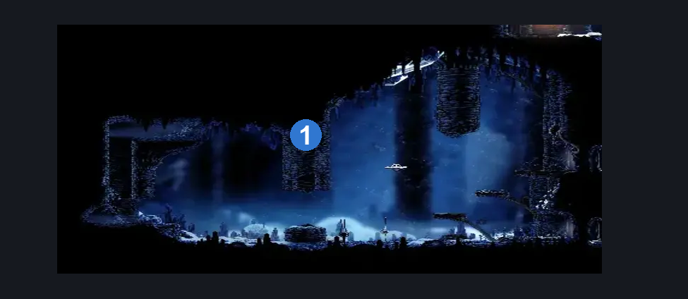
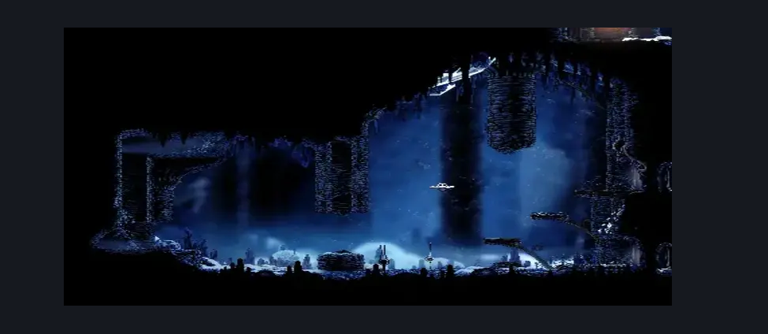

# Mount Fay Mask Shard (Peak_04c)

**Game ID:** Peak_04c

**Contributors:** Pyxl

## Subrooms

No subrooms defined.

## Room Transitions

| Alias | Name | From subroom | Destination | Destination alias | Requirements | TODO | Verification | Annotated | Notes |
| --- | --- | --- | --- | --- | --- | --- | --- | --- | --- |
| LR | right2 |  | [Mount Fay Bench Toll (Bellway_Peak)](mount-fay-bench-toll.md) | LL | None |  | Verified | ✓ |  |
| UR | right1 |  | [Mount Fay Bench Toll (Bellway_Peak)](mount-fay-bench-toll.md) | UL | None |  | Verified | ✓ |  |

## Subroom Connections

No subroom connections defined.

## Check Locations

| No. | Check | Subroom | Requirements | TODO | Verification | Location Type | Annotated | Notes |
| --- | --- | --- | --- | --- | --- | --- | --- | --- |
| 1 | Mount Fay - Mask Shard |  | Silk Soar OR ( Faydown Cloak AND ( Cling Grip OR Scuttlebrace ) ) |  | Verified | collectible | ✓ |  |

## Room Images

### Connections

### Checks

### Scene

