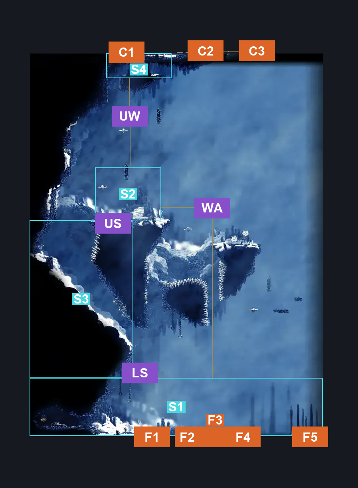
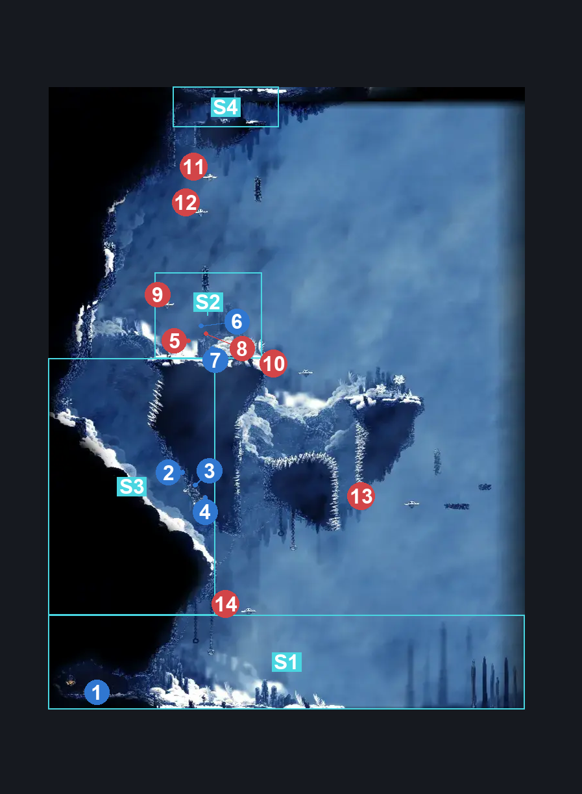
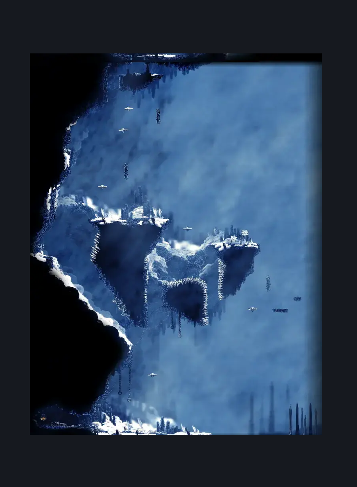

# Mount Fay Right Side Middle Room (Peak_07)

**Game ID:** Peak_07

**Contributors:** Pyxl

## Subrooms

| No. | Subroom | Annotated |
| --- | --- | --- |
| S1 | Bottom | ✓ |
| S2 | Pinstress Arena | ✓ |
| S3 | Shell Shard Slope | ✓ |
| S4 | Top | ✓ |

## Room Transitions

| Alias | Name | From subroom | Destination | Destination alias | Requirements | TODO | Verification | Annotated | Notes |
| --- | --- | --- | --- | --- | --- | --- | --- | --- | --- |
| C2 | top2 | Top | [FayForn (Peak_08b)](fayforn.md) | F2 | Silk Soar |  | Verified | ✓ |  |
| F5 | bot5 | Bottom | [Mount Fay Entrance (Peak_01)](mount-fay-entrance.md) | DU | INVALID |  | Verified | ✓ | Doesnt Have an inverse |
| C3 | top3 | Top | [FayForn (Peak_08b)](fayforn.md) | F3 | Silk Soar |  | Verified | ✓ |  |
| F1 | bot1 | Bottom | [Mount Fay Entrance (Peak_01)](mount-fay-entrance.md) | C1 | None |  | Verified | ✓ |  |
| C1 | top1 | Top | [FayForn (Peak_08b)](fayforn.md) | F1 | None |  | Verified | ✓ |  |
| F2 | bot2 | Bottom | [Mount Fay Entrance (Peak_01)](mount-fay-entrance.md) | C2 | None |  | Verified | ✓ |  |
| F4 | bot4 | Bottom | [Mount Fay Entrance (Peak_01)](mount-fay-entrance.md) | C4 | None |  | Verified | ✓ |  |
| F3 | bot3 | Bottom | [Mount Fay Entrance (Peak_01)](mount-fay-entrance.md) | C3 | None |  | Verified | ✓ |  |

## Subroom Connections

| Alias | Name | Source | Destination | Requirements | TODO | Verification | Annotated | Notes |
| --- | --- | --- | --- | --- | --- | --- | --- | --- |
| WA | Wall | Bottom | Pinstress Arena | Silk Soar OR ( Cling Grip AND ( ( Faydown Cloak AND Enemy Pogo AND Spike Pogo ) OR ( Clawline AND Enemy Pogo ) OR ( Hard Reaper crest Pogo AND Dash AND Sprint AND Drifters Cloak AND Hard Flea Brew Stall AND Hard Heal Stall ) ) ) |  | Verified | ✓ |  |
| WA | Wall | Pinstress Arena | Bottom | None |  | Verified | ✓ |  |
| LS | Lower Slope | Bottom | Shell Shard Slope | Silk SOar OR ( cling Grip AND ( Faydown Cloak OR Clawline OR ( Dash AND Drifters Cloak AND Easy Reaper Crest Pogo ) ) ) |  | Verified | ✓ |  |
| LS | Lower Slope | Shell Shard Slope | Bottom | None |  | Verified | ✓ |  |
| US | Upper Slope | Pinstress Arena | Shell Shard Slope | None |  | Verified | ✓ |  |
| US | Upper Slope | Shell Shard Slope | Pinstress Arena | Faydown Cloak AND Cling Grip AND  Proficient Movement  AND Spike Pogo |  | Verified | ✓ |  |
| UW | Upper Wall | Pinstress Arena | Top | Silk Soar OR ( Cling Grip AND ( ( Clawline OR Faydown Cloak ) OR ( Dash AND Drifters Cloak AND Sharpdart ) ) ) |  | Verified | ✓ |  |
| UW | Upper Wall | Top | Pinstress Arena | None |  | Verified | ✓ |  |

## Check Locations

| No. | Check | Subroom | Requirements | TODO | Verification | Location Type | Annotated | Notes |
| --- | --- | --- | --- | --- | --- | --- | --- | --- |
| 1 | Mount Fay Warm Bench | Bottom | None |  | Verified | bench | ✓ |  |
| 2 | Mount Fay - Shell Shard Cache #5 | Shell Shard Slope | None |  | Verified | resource | ✓ |  |
| 3 | Mount Fay - Shell Shard Cache #6 | Shell Shard Slope | None |  | Verified | resource | ✓ |  |
| 4 | Mount Fay - Shell Shard Cache #7 | Shell Shard Slope | None |  | Verified | resource | ✓ |  |
| 5 | Pinstress Boss Fight | Pinstress Arena | complete Fatal Resolve Wish Promised IN Windy Pinstress Room OR (  complete Fatal Resolve Wish Promised IN Bellhart Wish Wall AND complete Read Pinstress Note IN Windy Pinstress Room ) |  | Verified | boss | ✓ | confirmed that you need to read the note if you start from the wish wall |
| 6 | Fatal Resolve Wish Granted | Pinstress Arena | defeat Pinstress Boss Fight |  | Verified | event | ✓ |  |
| 7 | Pin Badge | Pinstress Arena | complete Pinstress Boss Fight |  | Verified | collectible | ✓ |  |

## Room Images

### Connections

### Checks

### Scene

