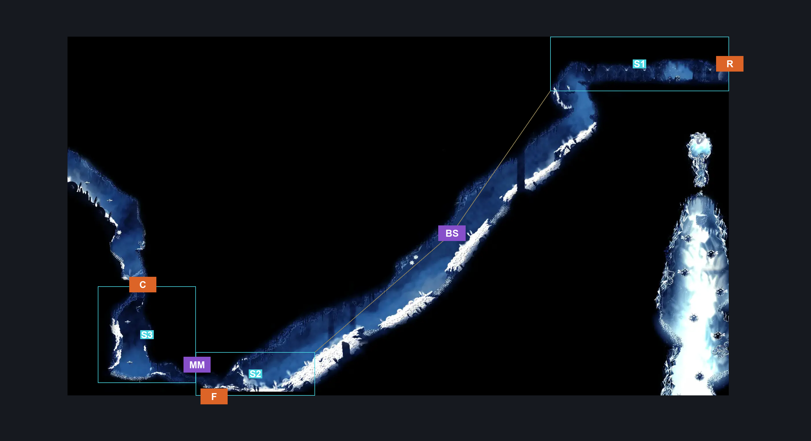
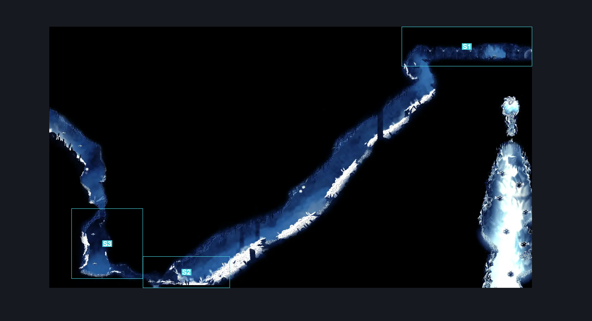

# Mount Fay Upper Slope (Peak_08)

**Game ID:** Peak_08

**Contributors:** Pyxl

## Subrooms

| No. | Subroom | Annotated |
| --- | --- | --- |
| S1 | Upper Entrance | ✓ |
| S2 | Lower Exit | ✓ |
| S3 | Mask Maker Path | ✓ |

## Room Transitions

| Alias | Name | From subroom | Destination | Destination alias | Requirements | TODO | Verification | Annotated | Notes |
| --- | --- | --- | --- | --- | --- | --- | --- | --- | --- |
| F | bot1 | Lower Exit | [Mount Fay Lower Slope (Peak_05)](mount-fay-lower-slope.md) | C | None |  | Verified | ✓ |  |
| C | top1 | Mask Maker Path | [Mask Maker Passage (Peak_05d)](mask-maker-passage.md) | F | Cling Grip OR Scuttlebrace OR Faydown Cloak OR Silk Soar |  | Verified | ✓ |  |
| R | right1 | Upper Entrance | [FayForn (Peak_08b)](fayforn.md) | L1 | None |  | Verified | ✓ |  |

## Subroom Connections

| Alias | Name | Source | Destination | Requirements | TODO | Verification | Annotated | Notes |
| --- | --- | --- | --- | --- | --- | --- | --- | --- |
| BS | Big Slide | Upper Entrance | Lower Exit | None |  | Verified | ✓ | One Way Slide |
| MM | Mask Maker Path | Lower Exit | Mask Maker Path | Enemy Pogo AND Cling Grip AND Faydown Cloak |  | Verified | ✓ |  |
| MM | Mask Maker Path | Mask Maker Path | Lower Exit | None |  | Verified | ✓ |  |

## Check Locations

No check locations defined.

## Room Images

### Connections

### Checks

### Scene

