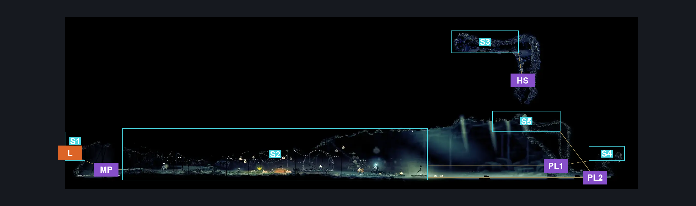
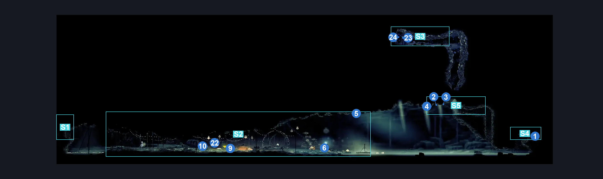
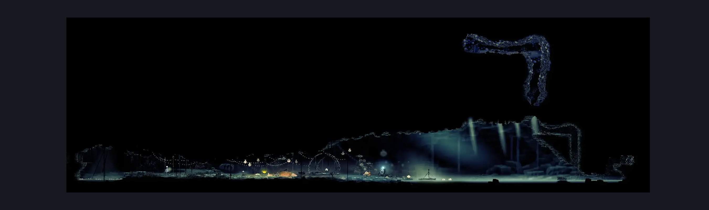

# Fleatopia (Aqueduct_05)

**Game ID:** Aqueduct_05

**Contributors:** Pyxl

## Subrooms

| No. | Subroom | Annotated |
| --- | --- | --- |
| S1 | Entrance | ✓ |
| S2 | Fleatopia | ✓ |
| S3 | The Herald | ✓ |
| S4 | Craftmetal | ✓ |
| S5 | Upper Ledge | ✓ |

## Room Transitions

| Alias | Name | From subroom | Destination | Destination alias | Requirements | TODO | Verification | Annotated | Notes |
| --- | --- | --- | --- | --- | --- | --- | --- | --- | --- |
| L | left1 | Entrance | [Putrified Ducts Lower Bridge Room (Aqueduct_03)](putrified-ducts-lower-bridge-room.md) | R | None |  | Verified | ✓ |  |

## Subroom Connections

| Alias | Name | Source | Destination | Requirements | TODO | Verification | Annotated | Notes |
| --- | --- | --- | --- | --- | --- | --- | --- | --- |
| MP | Maggot Puddle | Entrance | Fleatopia | Swim OR Clawline OR Drifters Cloak OR ( Sprint AND Dash ) OR Sharpdart |  | Verified | ✓ |  |
| MP | Maggot Puddle | Fleatopia | Entrance | ( Swim AND Cling Grip ) OR ( Faydown cloak AND ( Clawline OR ( Sprint AND Dash ) ) ) |  | Verified | ✓ |  |
| PL1 | Pale Lake1 | Fleatopia | Craftmetal | Swim AND Faydown Cloak AND ( Cling Grip OR Scuttlebrace ) |  | Verified | ✓ |  |
| PL1 | Pale Lake1 | Craftmetal | Fleatopia | Swim |  | Verified | ✓ |  |
| PL2 | Pale Lake2 | Fleatopia | Upper Ledge | Swim AND ( Cling Grip OR Scuttlebrace ) |  | Verified | ✓ |  |
| PL2 | Pale Lake2 | Upper Ledge | Fleatopia | Clawline OR ( Drifters Cloak AND Sprint AND Faydown Cloak ) |  | Verified | ✓ |  |
| HS | Hidden Shaft | Upper Ledge | The Herald | Silk Soar |  | Verified | ✓ |  |
| HS | Hidden Shaft | The Herald | Upper Ledge | None |  | Verified | ✓ |  |

## Check Locations

| No. | Check | Subroom | Requirements | TODO | Verification | Location Type | Annotated | Notes |
| --- | --- | --- | --- | --- | --- | --- | --- | --- |
| 1 | Putrified Ducts - Craft Metal | Craftmetal | None |  | Verified | collectible | ✓ |  |
| 2 | Putrified Ducts - Shell Shard Cache #9 | Upper Ledge | Faydown Cloak OR Clawline OR ( Sprint AND Dash ) OR SharpDart |  | Verified | resource | ✓ |  |
| 3 | Putrified Ducts - Shell Shard Cache #10 | Upper Ledge | Faydown Cloak OR Clawline OR ( Sprint AND Dash ) OR SharpDart |  | Verified | resource | ✓ |  |
| 4 | Putrified Ducts - Shell Shard Cache #11 | Upper Ledge | Faydown Cloak OR Clawline OR ( Sprint AND Dash ) OR SharpDart |  | Verified | resource | ✓ |  |
| 5 | Putrified Ducts - Shell Shard Cache #8 | Fleatopia | Silk Soar |  | Verified | resource | ✓ |  |
| 6 | Putrified Ducts - White Lake Waver Sign | Fleatopia | Needolin |  | Verified | lore | ✓ | Missable / no check |
| 7 | Resting Site: Putrified Ducts | Upper Ledge | complete THE A Vassal Lost Wish Promised |  | Verified | event |  |  |
| 8 | Ecstasy of the End Wish Promised | Fleatopia | act 3 AND after THE flea caravan move to fleatopia AND silk soar AND have egg of flealia |  | Verified | event |  | one of two places to accept this wish  spreadsheet flag is vague, so using wiki requirements |
| 9 | Ecstasy of the End Wish Granted | Fleatopia | complete Ecstasy of the End Wish Promised AND complete Flea Juggle High Score AND complete Flea Dodge High Score AND after Flea Bounce High Score |  | Verified | event | ✓ |  |
| 10 | Pale Oil | Fleatopia | complete Ecstasy of the End Wish Granted |  | Verified | collectible | ✓ |  |
| 11 | Fleatopia - Tool Pouch | Fleatopia | fleas 22 |  | Verified | collectible |  |  |
| 12 | Egg of Flealia | Fleatopia | fleas 30 |  | Verified | collectible |  | All fleas |
| 13 | Reached Pale Lake | Fleatopia | none |  | Verified | logic-point |  |  |
| 14 | Festival of the Flea | Fleatopia | complete Ecstasy of the End Wish Promised |  | Verified | logic-point |  |  |
| 15 | Flea Juggle High Score | Fleatopia | after Festival of the Flea | TODO | Verified | event |  | these probably need movement requirements |
| 16 | Flea Dodge High Score | Fleatopia | after Festival of the Flea | TODO | Verified | event |  | these probably need movement requirements |
| 17 | Flea Bounce High Score | Fleatopia | after Festival of the Flea | TODO | Verified | event |  | these probably need movement requirements |
| 18 | Seth Joins Festival of the Flea | Fleatopia | complete THE Ecstasy of the End Wish Granted AND (  after THE Seth Meeting Grand Gate OR ( after THE Seth Meeting Shellwood AND have Everbloom ) ) |  | Verified | logic-point |  | reflects the skipped grand gate meeting if you have everbloom |
| 19 | Flea Juggle Beat Seth Score | Fleatopia | after Seth Joins Festival of the Flea | TODO | Verified | event |  | these probably need movement requirements |
| 20 | Flea Dodge Beat Seth Score | Fleatopia | after Seth Joins Festival of the Flea | TODO | Verified | event |  | these probably need movement requirements |
| 21 | Flea Bounce Beat Seth Score | Fleatopia | after Seth Joins Festival of the Flea | TODO | Verified | event |  | these probably need movement requirements |
| 22 | Gaurdians Memento | Fleatopia | complete Flea Juggle Beat Seth Score AND complete Flea Dodge Beat Seth Score AND after Flea Bounce Beat Seth Score |  | Verified | collectible | ✓ |  |
| 23 | Passing Of The Age Lore Tablet | The Herald | Act 3 |  | Verified | lore | ✓ |  |
| 24 | Passing Of The Age Wish Promised | The Herald | after Passing Of The Age Lore Tablet |  | Verified | event | ✓ | Reading the lore tablet starts the wish. |

## Room Images

### Connections

### Checks

### Scene

