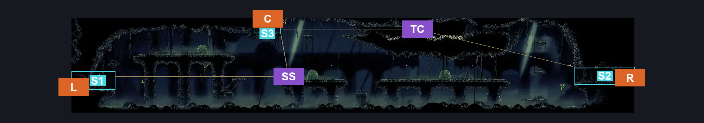
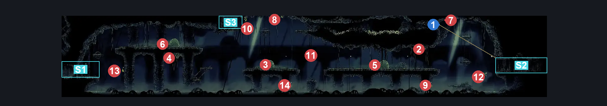
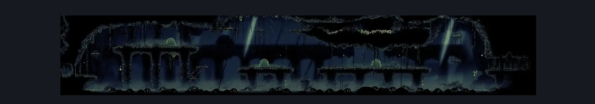

# Putrified Ducts Lower Bridge Room (Aqueduct_03)

**Game ID:** Aqueduct_03

**Contributors:** Pyxl

## Subrooms

| No. | Subroom | Annotated |
| --- | --- | --- |
| S1 | Left Exit | ✓ |
| S2 | Right Exit | ✓ |
| S3 | Ceiling Exit | ✓ |

## Room Transitions

| Alias | Name | From subroom | Destination | Destination alias | Requirements | TODO | Verification | Annotated | Notes |
| --- | --- | --- | --- | --- | --- | --- | --- | --- | --- |
| R | right1 | Right Exit | [Fleatopia (Aqueduct_05)](fleatopia.md) | L | None |  | Verified | ✓ |  |
| L | left1 | Left Exit | [Putrified Ducts Tall Room (Aqueduct_02)](putrified-ducts-tall-room.md) | LR | None |  | Verified | ✓ |  |
| C | top1 | Ceiling Exit | [Putrified Ducts Path To Vog (Aqueduct_06)](putrified-ducts-path-to-vog.md) | F | Faydown Cloak OR Cling Grip OR Silk Soar OR Scuttlebrace |  | Verified | ✓ |  |

## Subroom Connections

| Alias | Name | Source | Destination | Requirements | TODO | Verification | Annotated | Notes |
| --- | --- | --- | --- | --- | --- | --- | --- | --- |
| AB | Across The Bridges | Left Exit | Right Exit | ( Cling Grip AND ( Clawline OR Faydown Cloak ) ) OR ( Silk Soar AND ( Drifters Cloak OR Clawline ) ) |  | Verified |  |  |
| AB | Across The Bridges | Right Exit | Left Exit | ( Cling Grip AND Clawline )  OR ( Silk Soar AND ( Drifters Cloak OR Clawline ) ) |  | Verified |  |  |
| TC | Ceiling Tunnel | Right Exit | Ceiling Exit | ( Silk Soar AND ( Faydown Cloak OR Sprint OR Dash OR Cling Grip OR Clawline OR Drifters Cloak OR Faydown Cloak OR Sharpdart ) ) OR ( Faydown Cloak AND ( Dash OR Clawline OR Sharpdart OR easy Beast Crest pogo OR Drifters Cloak ) ) OR ( Cling Grip AND Clawline ) |  | Verified | ✓ |  |
| TC | Ceiling Tunnel | Ceiling Exit | Right Exit | Sprint OR Clawline OR Faydown Cloak OR ( Silk Soar AND ( Dash OR Drifters Cloak OR Cling Grip ) ) |  | Verified | ✓ |  |
| SS | Silk Soar Up | Left Exit | Ceiling Exit | Silk Soar AND ( Drifters cloak OR Faydown Cloak OR Clawline ) |  | Verified | ✓ |  |
| SS | Silk Soar Up | Ceiling Exit | Left Exit | Drifters Cloak OR Clawline OR ( Swim AND Faydown Cloak ) OR ( Silk Soar AND ( Dash OR Sharpdart ) ) |  | Verified | ✓ |  |

## Check Locations

| No. | Check | Subroom | Requirements | TODO | Verification | Location Type | Annotated | Notes |
| --- | --- | --- | --- | --- | --- | --- | --- | --- |
| 1 | Breakable Wall | Right Exit | Faydown Cloak OR ( Cling Grip AND Clawline ) OR ( Silk Soar AND ( Drifters Cloak OR Dash OR Cling Grip OR Clawline OR Sharpdart OR Sprint ) ) |  | Verified | blockade | ✓ |  |
| 2 | Barnak 1 |  |  |  |  | enemy | ✓ |  |
| 3 | Ductsucker 1 |  |  |  |  | enemy | ✓ |  |
| 4 | Barnak 2 |  |  |  |  | enemy | ✓ |  |
| 5 | Ductsucker 2 |  |  |  |  | enemy | ✓ |  |
| 6 | Ductsucker 3 |  |  |  |  | enemy | ✓ |  |
| 7 | Barnak 3 |  |  |  |  | enemy | ✓ |  |
| 8 | Barnak 4 |  |  |  |  | enemy | ✓ |  |
| 9 | Spit Squit 1 |  |  |  |  | enemy | ✓ |  |
| 10 | Spit Squit 2 |  |  |  |  | enemy | ✓ |  |
| 11 | Spit Squit 3 |  |  |  |  | enemy | ✓ |  |
| 12 | Spit Squit 4 |  |  |  |  | enemy | ✓ |  |
| 13 | Spit Squit 5 |  |  |  |  | enemy | ✓ |  |
| 14 | Spit Squit 6 |  |  |  |  | enemy | ✓ |  |

## Room Images

### Connections

### Checks

### Scene

