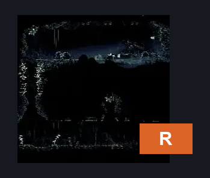
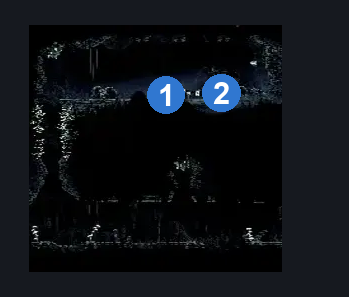
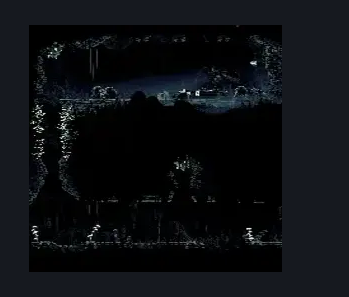

# Putrified Ducts Map Room (Aqueduct_07)

**Game ID:** Aqueduct_07

**Contributors:** Pyxl

## Subrooms

No subrooms defined.

## Room Transitions

| Alias | Name | From subroom | Destination | Destination alias | Requirements | TODO | Verification | Annotated | Notes |
| --- | --- | --- | --- | --- | --- | --- | --- | --- | --- |
| R | right1 |  | [Putrified Ducts Tall Room (Aqueduct_02)](putrified-ducts-tall-room.md) | ML | None |  | Verified | ✓ |  |

## Subroom Connections

No subroom connections defined.

## Check Locations

| No. | Check | Subroom | Requirements | TODO | Verification | Location Type | Annotated | Notes |
| --- | --- | --- | --- | --- | --- | --- | --- | --- |
| 1 | Putrified Ducts - thread memory Map Room |  | Needolin |  | Verified | lore | ✓ |  |
| 2 | Putrified Ducts - Map Pickup |  | None |  | Verified | collectible | ✓ |  |

## Room Images

### Connections

### Checks

### Scene

