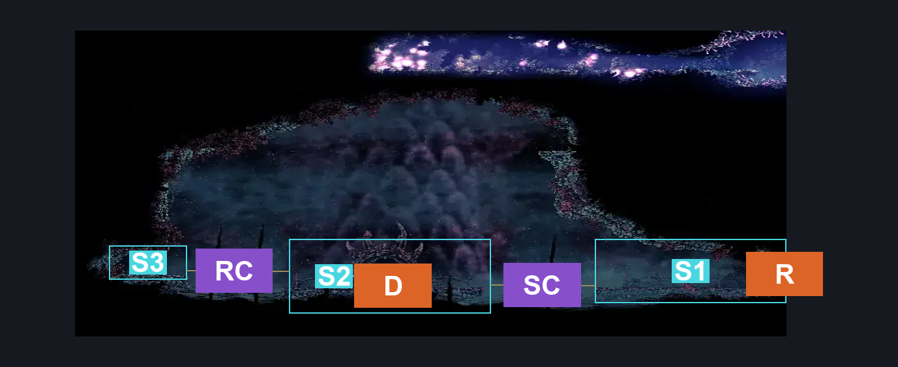
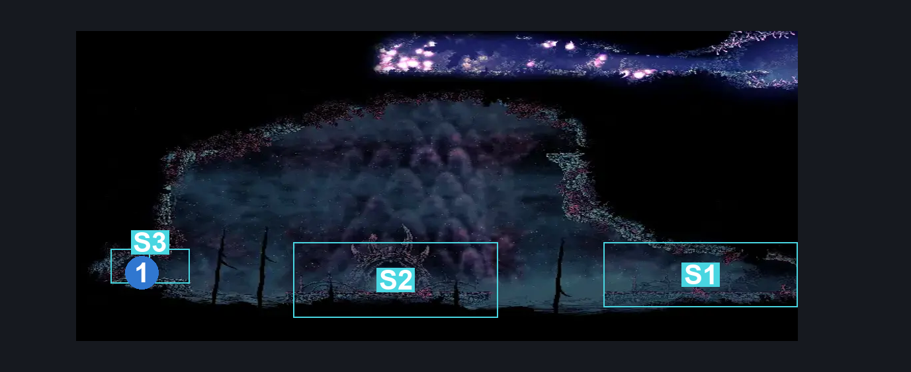
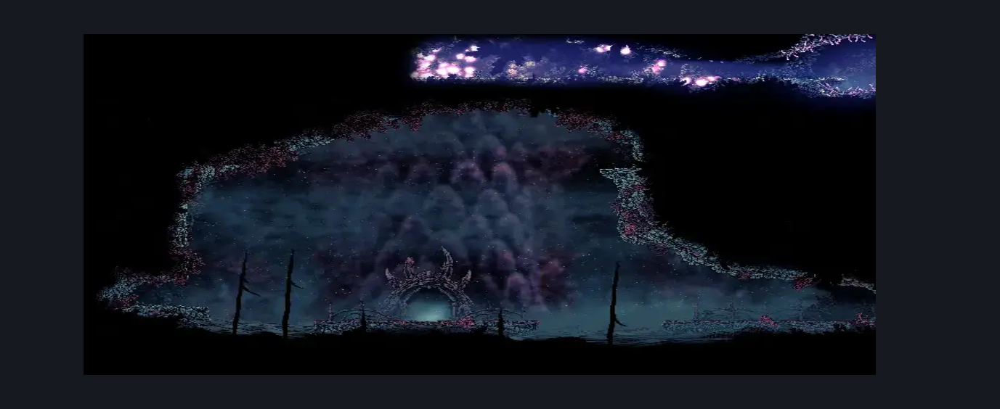

# Coral Tower Entrance (Coral_28)

**Game ID:** Coral_28

**Contributors:** Pxyl

## Subrooms

| No. | Subroom | Annotated |
| --- | --- | --- |
| S1 | Exit | ✓ |
| S2 | Door | ✓ |
| S3 | Resting Site Ledge | ✓ |

## Room Transitions

| Alias | Name | From subroom | Destination | Destination alias | Requirements | TODO | Verification | Annotated | Notes |
| --- | --- | --- | --- | --- | --- | --- | --- | --- | --- |
| R | right1 | Exit | [Sands of Karak Upper Left Long Room (Coral_27)](sands-of-karak-upper-left-long-room.md) | L | None |  | Verified | ✓ |  |
| D | door1 | Door | [Coral Tower (Coral_Tower_01)](coral-tower.md) | L | None |  | Verified | ✓ |  |

## Subroom Connections

| Alias | Name | Source | Destination | Requirements | TODO | Verification | Annotated | Notes |
| --- | --- | --- | --- | --- | --- | --- | --- | --- |
| SC | Sandcarver Pit | Door | Exit | Clawline OR Sharpdart OR Drifters Cloak OR ( Sprint AND ( Dash OR Faydown Cloak OR easy Beast Crest pogo ) ) OR  ( Faydown Cloak AND ( easy Beast Crest pogo OR easy Hunter Crest pogo OR easy Architect Crest pogo OR easy Shaman Crest pogo ( Wanderer Crest AND Needle strike ) ) ) |  | Verified | ✓ |  |
| SC | Sandcarver Pit | Exit | Door | Clawline OR Sharpdart OR ( Sprint AND ( Dash OR Faydown Cloak OR Drifters Cloak OR easy Beast Crest pogo OR easy Architect Crest pogo ) )  OR ( Sprint AND ( easy Shaman Crest pogo OR easy Hunter crest pogo OR medium Heal stall OR ( easy Wanderer Crest pogo AND easy Needle Strike stall AND Ledge Grab ) ) ) OR ( Dash AND ( easy Reaper Crest pogo OR easy Beast Crest pogo OR Faydown Cloak OR Drifters Cloak OR ( easy Architect Crest pogo AND ( Ledge Grab OR easy Needle Strike stall ) ) ) ) OR ( Faydown Cloak AND ( easy Beast Crest pogo OR easy Architect Crest pogo OR medium Shaman Crest pogo OR easy Hunter Crest pogo OR Drifters Cloak OR ( easy Reaper Crest pogo AND Ledge Grab ) OR ( easy Wanderer Crest pogo AND easy Needle strike stall ) ) ) OR ( Drifters Cloak AND ( easy Beast Crest pogo OR easy Architect Crest pogo OR easy Shaman Crest pogo OR easy Wanderer Crest pogo OR medium Heal Stall OR Ledge Grab OR Silk Soar OR ( easy Reaper Crest pogo AND easy Needle Strike stall ) ) ) OR ( Silk Soar AND ( easy Beast Crest pogo OR easy Architect Crest pogo ) ) |  | Verified | ✓ |  |
| RC | Resting Site Crossing | Door | Resting Site Ledge | Sprint AND ( ( Dash OR Drifters Cloak OR Faydown Cloak OR easy Beast Crest pogo ) OR Clawline OR ( Silk soar AND Ledge Grab ) ) |  | Verified | ✓ |  |
| RC | Resting Site Crossing | Resting Site Ledge | Door | Sprint AND ( ( Dash OR Drifters Cloak OR Faydown Cloak OR easy Beast Crest pogo ) OR Clawline OR ( Silk soar AND Ledge Grab ) ) |  | Verified | ✓ |  |

## Check Locations

| No. | Check | Subroom | Requirements | TODO | Verification | Location Type | Annotated | Notes |
| --- | --- | --- | --- | --- | --- | --- | --- | --- |
| 1 | Resting Site: Sands of Karak | Resting Site Ledge | prereq THE A Vassal Lost Wish Promised |  | Verified | event | ✓ | Not Included for the better |
| 2 | import enemies |  |  | TODO | Needs verification |  |  |  |

## Room Images

### Connections

### Checks

### Scene

