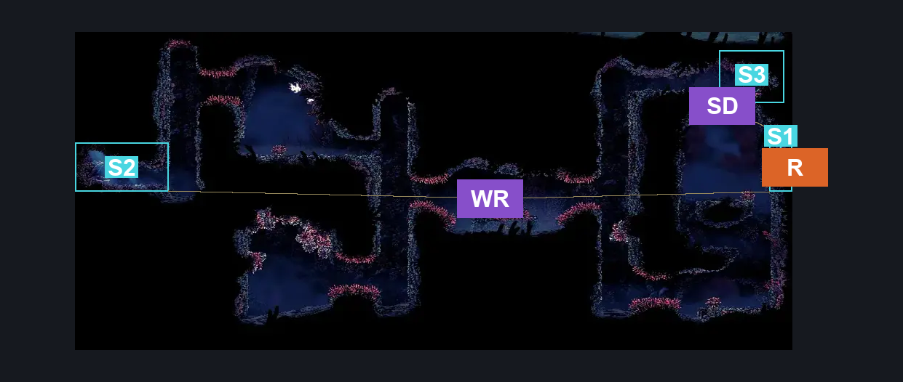
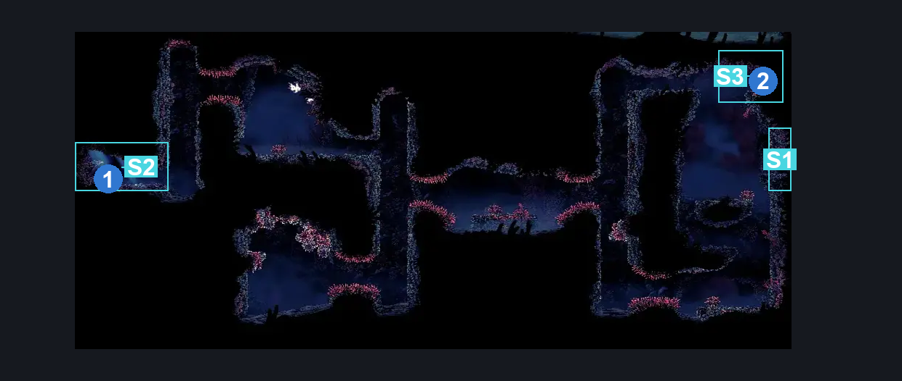
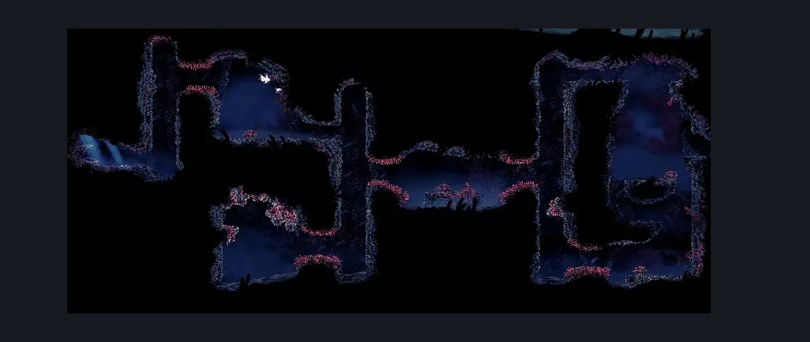

# Crustnut (Coral_41)

**Game ID:** Coral_41

**Contributors:** Pyxl

## Subrooms

| No. | Subroom | Annotated |
| --- | --- | --- |
| S1 | Start | ✓ |
| S2 | End | ✓ |
| S3 | Shard Platform | ✓ |

## Room Transitions

| Alias | Name | From subroom | Destination | Destination alias | Requirements | TODO | Verification | Annotated | Notes |
| --- | --- | --- | --- | --- | --- | --- | --- | --- | --- |
| R | right1 | Start | [Sands of Karak Tall Centre Room (Coral_35b)](sands-of-karak-tall-centre-room.md) | UML | None |  | Verified | ✓ |  |

## Subroom Connections

| Alias | Name | Source | Destination | Requirements | TODO | Verification | Annotated | Notes |
| --- | --- | --- | --- | --- | --- | --- | --- | --- |
| WR | Whole Room | Start | End | Cling grip AND ( ( Clawline OR Sharpdart OR ( Dash AND ( Drifters Cloak OR easy Beast Crest pogo ) ) ) OR ( easy Beast crest pogo AND Faydown Cloak AND easy Needle Strike stall ) ) |  | Verified | ✓ |  |
| WR | Whole Room | End | Start | Cling grip AND ( ( Clawline OR Sharpdart OR ( Dash AND ( Drifters Cloak OR easy Beast Crest pogo ) ) ) OR ( easy Beast crest pogo AND Faydown Cloak AND easy Needle Strike stall) ) |  | Verified | ✓ |  |
| SD | Shard Detour | Start | Shard Platform | Silk Soar OR ( ( Dash AND Scuttlebrace ) AND ( Clawline OR Sharpdart ) ) OR ( Cling grip AND ( Dash OR Clawline OR Sharpdart OR easy Beast Crest pogo OR Faydown Cloak OR Drifters Cloak ) ) |  | Verified | ✓ |  |
| SD | Shard Detour | Shard Platform | Start | None |  | Verified | ✓ |  |

## Check Locations

| No. | Check | Subroom | Requirements | TODO | Verification | Location Type | Annotated | Notes |
| --- | --- | --- | --- | --- | --- | --- | --- | --- |
| 1 | Crustnut | End | None |  | Verified | collectible | ✓ |  |
| 2 | Shard Cache: Sands of Karak #11 | Shard Platform | None |  | Verified | resource | ✓ |  |
| 3 | import enemies |  |  | TODO | Needs verification |  |  |  |

## Room Images

### Connections

### Checks

### Scene

