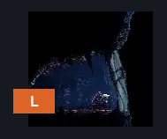
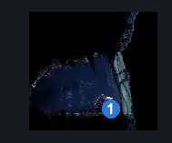
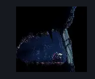

# Sands of Karak Bellshrine (Bellshrine_Coral)

**Game ID:** Bellshrine_Coral

**Contributors:** Pyxl

## Subrooms

No subrooms defined.

## Room Transitions

| Alias | Name | From subroom | Destination | Destination alias | Requirements | TODO | Verification | Annotated | Notes |
| --- | --- | --- | --- | --- | --- | --- | --- | --- | --- |
| L | left1 |  | [Sands of Karak Elevator to Blasted Steps (Coral_38)](sands-of-karak-elevator-to-blasted-steps.md) | R | None |  | Verified | ✓ |  |

## Subroom Connections

No subroom connections defined.

## Check Locations

| No. | Check | Subroom | Requirements | TODO | Verification | Location Type | Annotated | Notes |
| --- | --- | --- | --- | --- | --- | --- | --- | --- |
| 1 | Simple key: Sands of Karak east bench |  | None |  | Verified | collectible | ✓ |  |

## Room Images

### Connections

### Checks

### Scene

